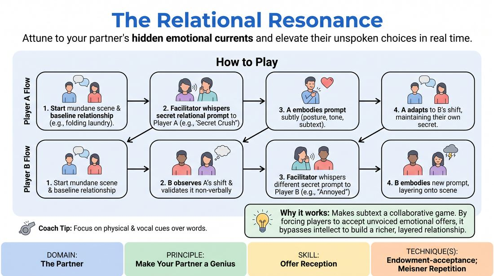

# Subtextual Resonance

{ .game-hero }

> Attune to your partner's hidden emotional currents and elevate their unspoken choices in real time.

## Overview
Two players improvise a mundane, everyday scene while a facilitator periodically whispers secret relational prompts to each of them. The challenge is not to guess the secret, but to keenly observe, accept, and amplify the partner's shifting physical and emotional subtext. This creates a rich, layered relationship where both players actively make each other look brilliant through deep non-verbal attunement.

## What It Trains
- **Domain:** D2 — The Partner
- **Principle(s):** Yes, And; Make Your Partner a Genius; Assume Competence
- **Skill(s):** Emotional Fluidity; Active Listening; Status Modulation; Single-Partner Empathy & Mirroring; Offer Reception; Active Gifting
- **Technique(s):** Meisner Repetition; Last Word Response; Status Seesaw; Mirror exercise; Emotional-echo drills; Endowment-acceptance; Endowment-gifting drills; Give them the answer
- **Focus:** connection

**Objective:** To develop advanced offer reception and endowment-acceptance by training players to detect, validate, and physically support their partner's subtle, unvoiced relational shifts.

## At a Glance
| Aspect | Detail |
|---|---|
| Players | 3+ (ideal 6-12) |
| Time | ~10 min |
| Complexity | 3/5 |
| Skill level | competent |
| Energy | medium |
| Physicality | low |
| Modality | in_person |
| Space | minimal |
| Props | pre-written list of relational prompts |
| Audience | not required |

## Setup
An in-person playing space with two active players standing center stage, while the rest of the group observes as active listeners. The facilitator needs a pre-written list of relational prompts (such as 'you desperately seek their approval', 'you view them as fragile', or 'you are hiding a joyful secret').

## How to Play
1. Position two players on stage to begin a simple, low-stakes scene in a neutral setting, such as waiting for a bus or folding laundry.
2. Instruct the players to establish a baseline relationship with normal, everyday dialogue and physical actions.
3. After about thirty seconds, the facilitator quietly approaches Player A and whispers a secret relational prompt from the pre-written list.
4. Player A must immediately but subtly embody this prompt through physical adjustments, vocal tone, and subtextual choices without explicitly stating the prompt.
5. Player B must actively observe Player A's shift, accept this new endowment, and adjust their own behavior to validate and elevate Player A's unspoken dynamic.
6. After another thirty seconds, the facilitator whispers a different relational prompt to Player B, who must now layer this new dynamic onto the scene.
7. Player A must now detect Player B's new shift and adapt, maintaining their own secret prompt while validating and supporting Player B's new behavior.
8. Continue rotating whispered prompts every thirty to forty-five seconds, allowing the scene's emotional landscape to organically evolve before calling freeze.

## Facilitation Notes
- Coaching Cue: 'Don't name it, play it.' Remind players to avoid verbally identifying the prompt (e.g., saying 'Why are you acting so superior?'). Instead, they should accept the endowment by adjusting their own status or emotional state to match.
- Pitfall: Players becoming too broad or cartoonish with their prompts. Fix: Side-coach them to dial the physical expression down to a realistic level, focusing on micro-expressions and vocal tension rather than grand gestures.
- Coaching Cue: 'Make them right.' If a partner misinterprets a prompt, the active player should accept the partner's interpretation as the new truth of the scene, prioritizing connection over accuracy.
- Pitfall: The scene stalling because players are overthinking the secret prompts. Fix: Encourage continuous physical action or object work to ground the players in the physical space while they process the shifts.

## Variations
- Silent Resonance: Run the entire scene without any spoken dialogue, forcing players to rely entirely on physical mirroring, eye contact, and spatial relationships to communicate and accept the prompts.
- Status Seesaw: Specifically tailor all whispered prompts to high or low status shifts, training players to dynamically modulate their power dynamics in real time.

## Debrief
- How did it feel to have your partner immediately validate a subtle shift in your behavior before you even spoke?
- What physical or vocal cues did you notice that tipped you off to your partner's new relational prompt?
- How did you handle the challenge of maintaining your own secret prompt while simultaneously supporting your partner's shifting dynamic?

## Safety & Inclusion
Since this game relies on close physical observation and whispered instructions, ensure players are comfortable with the facilitator briefly entering their personal space to whisper. Establish a non-verbal signal (like a raised hand) if a player needs to pause or adjust physical proximity.

## Why It Works
This game works because it operationalizes the principle of 'making your partner a genius' by turning subtext into a collaborative game. By forcing players to accept and build upon unvoiced physical and emotional offers, it bypasses intellectual plotting and anchors the scene in authentic, moment-to-moment relational truth.
