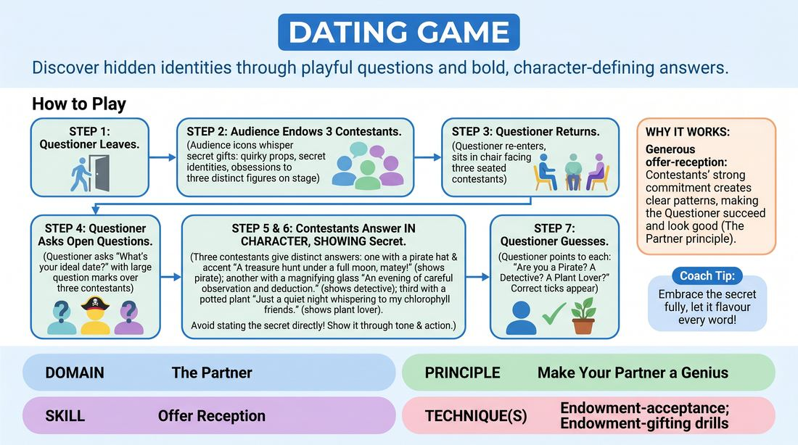

# The Dating Panel

{ .game-hero }

> Discover hidden identities through playful questions and bold, character-defining answers.

## Overview
One player acts as a hopeful dater seeking a match among three mysterious contestants. The audience secretly endows the three contestants with bizarre quirks, secret identities, or specific obsessions, which they must reveal through their answers without stating them directly.

## What It Trains
- **Domain:** D2 — The Partner
- **Principle(s):** Make Your Partner a Genius; Yes, And; Commit 100%; Play for the Back Row
- **Skill(s):** Offer Reception; Active Gifting; Unfiltered Spontaneity; Stage Presence & Clarity
- **Technique(s):** Endowment-acceptance; Endowment-gifting drills; Make the choice readable
- **Focus:** comedy_game

**Objective:** To practice receiving and fully committing to external endowments while making your partner look brilliant by giving clear, playable clues.

## Setup
Four chairs are arranged on stage: three facing forward for the contestants, and one angled for the questioner. One player leaves the room while the audience brainstorms distinct, comedic endowments for the other three.

## How to Play
1. Select one player to be the Questioner and have them temporarily leave the performance space so they cannot hear the audience.
2. Ask the audience to provide a unique, specific endowment for each of the remaining three Contestants.
3. Invite the Questioner back into the room to sit in their designated chair, facing the three Contestants.
4. The Questioner asks three open-ended questions, addressing all three contestants with each question.
5. Each Contestant answers the questions in character, fully accepting and embodying their secret endowment through their tone, physical choices, and subtext.
6. Contestants must avoid saying their endowment directly, instead showing it through their reactions and perspective.
7. After all three questions have been answered, the Questioner attempts to guess the specific endowment of each Contestant.

## Facilitation Notes
- Encourage players to play for the back row by magnifying their physical and vocal choices rather than keeping them internal.
- If a contestant is too subtle, side-coach them to make their next answer twice as obvious.
- Remind contestants that their goal is to help the questioner guess, not to stump them; make your partner look like a genius.
- Ensure the questioner asks open-ended questions that allow for creative, character-driven responses.

## Variations
- Relationship Twist: The contestants have secret relationships to each other that they must hint at.
- Physical Endowment: The endowments must be physical limitations or sensory quirks rather than psychological ones.

## Debrief
- How did it feel to receive a specific endowment and immediately have to justify it through dating advice?
- What strategies did the contestants use to make their clues obvious without giving the game away?
- How does committing 100% to a bizarre trait actually help your partner succeed in guessing it?

## Safety & Inclusion
Ensure audience suggestions are respectful and do not mock real-world marginalized groups, physical disabilities, or mental health conditions.

## Why It Works
This game highlights the principle of making your partner look good. By fully committing to the endowment, the contestants provide clear, readable patterns that allow the questioner to succeed, demonstrating that generous offer-reception is key to collaborative comedy.
