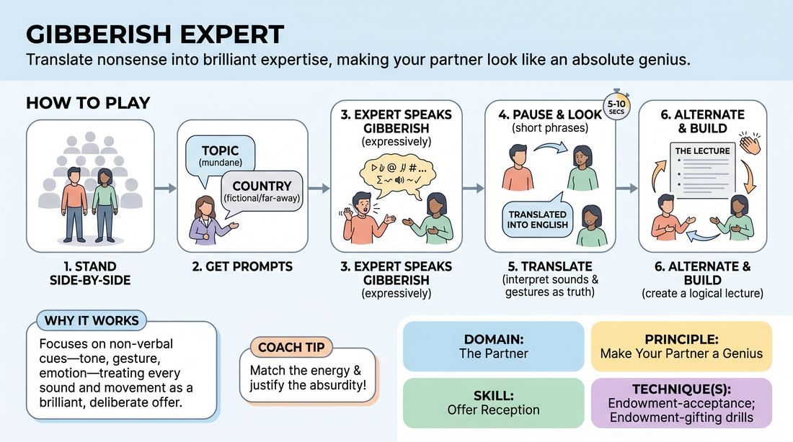

# The Gibberish Translator

{ .game-hero }

> Translate nonsense into brilliant expertise, making your partner look like an absolute genius.

## Overview
A high-energy, collaborative game where one player acts as a world-renowned expert speaking in an invented gibberish language, while a second player acts as their translator. Together, they deliver a cohesive, informative lecture based on a random, mundane topic, turning nonsense sounds and physical gestures into profound insights.

## What It Trains
- **Domain:** D2 — The Partner
- **Principle(s):** Make Your Partner a Genius; Yes, And; The First Thought Is a Gift; The Audience Is the Final Scene Partner
- **Skill(s):** Active Listening; Offer Reception; Active Gifting; Vocal Craft; Stage Presence & Clarity
- **Technique(s):** Endowment-acceptance; Endowment-gifting drills; Gibberish; Make the choice readable
- **Focus:** comedy_game

**Objective:** To develop deep active listening, physical endowment, and the ability to accept and elevate a partner's offers instantly, demonstrating that meaning is co-created through physical commitment and vocal tone.

## Setup
Two players stand side-by-side facing the group. No props are needed. The facilitator or audience provides a highly specific, mundane topic (e.g., 'the history of the paperclip' or 'how to train a pet snail'). One player is designated as the Expert, and the other as the Translator.

## How to Play
1. The Expert and the Translator stand side-by-side, addressing the audience as a unified presentation team.
2. The facilitator prompts the audience for a highly specific, mundane topic of expertise and a fictional or non-existent country of origin for the Expert.
3. The Expert begins the lecture by speaking passionately in gibberish (nonsense words), using expressive hand gestures, facial expressions, and vocal inflections to convey a clear attitude or subtext.
4. The Expert speaks in short, digestible phrases (about 5-10 seconds), then pauses and looks expectantly at the Translator.
5. The Translator immediately translates the gibberish into English, treating the Expert's physical gestures, tone, and sounds as absolute truth and translating them into highly specific, brilliant facts about the topic.
6. The Translator must match the emotional intensity of the Expert, justifying why a certain gesture or sound meant what it did (e.g., if the Expert pointed aggressively, the Translator might say, 'And that is why we must never, ever touch the blue wire!').
7. The players alternate back and forth, building on the established information to deliver a structured, logical, and hilarious presentation with a clear beginning, middle, and conclusion.

## Facilitation Notes
- Coaching cue: 'Translate the emotion, not just the sounds!' Encourage the translator to look at the expert's body language and facial expressions for clues.
- Coaching cue: 'Keep it short!' Remind the Expert to speak in brief sentences so the Translator isn't overwhelmed with too much nonsense to translate at once.
- Pitfall: The Translator simply repeats what they planned to say regardless of the Expert's physical offers. Fix: Pause the game and ask the Translator to describe the Expert's last physical gesture before translating.
- Pitfall: The Expert speaks in English or uses recognizable real words. Fix: Remind them to commit fully to pure nonsense sounds, relying entirely on tone and physicality to convey meaning.

## Variations
- Three-Way Panel: Introduce a third player as an interviewer who asks specific questions from the audience, which the Expert answers in gibberish and the Translator translates.
- Physical Demonstration: The Expert demonstrates a physical task (using object work) while speaking gibberish, and the Translator explains the steps of this complex, imaginary process.
- Emotional Shift: The facilitator calls out different emotions (e.g., 'grief', 'extreme joy', 'suspicion') that the Expert must immediately adopt in their gibberish, which the Translator must justify in the translation.

## Debrief
- How did paying attention to your partner's physical posture and vocal tone help you invent the translation?
- What did it feel like to have your nonsense sounds 'endowed' with brilliant meaning by your partner?
- How does this game illustrate the principle of 'making your partner look like a genius'?

## Safety & Inclusion
Ensure that the 'foreign language' spoken by the Expert is entirely made-up gibberish and does not mock, caricature, or mimic real-world languages, accents, or cultures. Focus on abstract sounds, emotional delivery, and physical gestures rather than linguistic stereotypes.

## Why It Works
This game works because it strips away literal language, forcing players to rely on the non-verbal elements of communication: tone, tempo, gesture, and emotion. By treating every nonsense sound and physical movement as a deliberate, brilliant offer, the Translator practices ultimate endowment-acceptance, proving that trust and commitment can make any absurd premise feel cohesive and intelligent.
