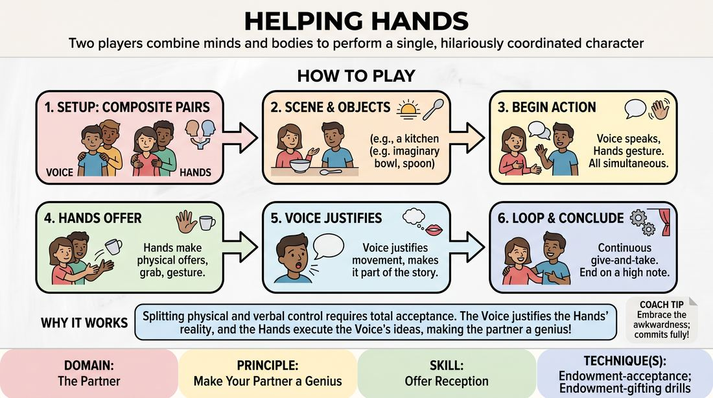

# Helping Hands

{ .game-hero }

> Two players combine minds and bodies to perform a single, hilariously coordinated character.

## Overview
A classic four-player scene where two composite characters are created. For each character, one player provides the voice and facial expressions while standing in front, and a second player stands closely behind them, threading their arms through to act as the character's hands. The resulting scene is a masterclass in physical justification, active gifting, and mutual support.

## What It Trains
- **Domain:** D2 — The Partner
- **Principle(s):** Make Your Partner a Genius; Yes, And; Show, Don't Tell
- **Skill(s):** Offer Reception; Active Gifting; Physicality & Space Work; Justification
- **Technique(s):** Endowment-acceptance; Endowment-gifting drills; Object work; Justify the absurd
- **Focus:** comedy_game

**Objective:** To develop rapid endowment-acceptance and physical justification by forcing players to instantly adapt to and validate physical offers they do not control.

## Setup
Four players divide into two pairs. In each pair, Player A stands in front with their hands clasped behind their back. Player B stands directly behind Player A, slipping their arms under Player A's armpits so their hands are positioned where Player A's hands would naturally be. The two composite characters face each other in a clear performance space.

## How to Play
1. Form two pairs of players, with each pair setting up in the front-to-back composite character stance.
2. Establish a simple, action-oriented scenario or location to give the hands immediate objects to interact with.
3. Begin the scene. The front players (the Voices) speak and control the facial expressions, while the rear players (the Hands) control all physical gestures and object work.
4. The Hands must actively make physical offers by gesturing, picking up imaginary items, or interacting with the other character.
5. The Voices must instantly justify whatever the Hands are doing, integrating the physical movements into their dialogue.
6. Conversely, the Voices can make verbal offers that the Hands must immediately execute.
7. Maintain a continuous loop of give-and-take, ensuring neither the Voice nor the Hands completely dominate the choices.
8. Conclude the scene after a clear comedic climax or when both composite characters have successfully navigated a shared physical task.

## Facilitation Notes
- Side-coach the Hands to keep their movements deliberate and clear. Fast, chaotic flailing makes it impossible for the Voice to justify.
- Encourage the Voices to look down at their own hands frequently to see what they are doing, rather than ignoring them.
- Pitfall: The Voice ignores the physical actions of the Hands. Fix: Pause the scene and ask the Voice to narrate exactly what their hand is currently holding or doing.
- Pitfall: The Hands try to fight the Voice's spoken commands. Fix: Remind the rear players that their job is to make the front player look like a genius by instantly executing their spoken desires.

## Variations
- Blind Hands: The player providing the hands closes their eyes, forcing them to rely entirely on the Voice's verbal cues and physical touch.
- Single-Hand Split: Instead of one player providing both hands, two different players stand behind the Voice, each providing exactly one arm, requiring three-way coordination.
- The Expert Interview: One composite character is an expert demonstrating a complex physical task while the other is an interviewer.

## Debrief
- How did it feel to have your physical actions completely out of your control? How did you build trust?
- What strategies did the Voices use to successfully justify unexpected physical movements?
- How did the Hands balance making active physical offers with listening to the Voice's spoken narrative?

## Safety & Inclusion
Because this game requires close physical proximity and contact, players must establish boundaries before beginning. Ensure the rear player is comfortable standing close behind the front player, and explicitly agree on touch boundaries. Players can opt to stand slightly further back or use physical props to extend hands if close physical contact is uncomfortable.

## Why It Works
This game perfectly embodies 'Make Your Partner a Genius' by splitting the physical and verbal components of a character. The Voice cannot succeed without accepting the physical reality created by the Hands, and the Hands cannot succeed without listening to the Voice's justification. It forces players into a state of hyper-presence where every accidental movement becomes a brilliant, intentional choice.
