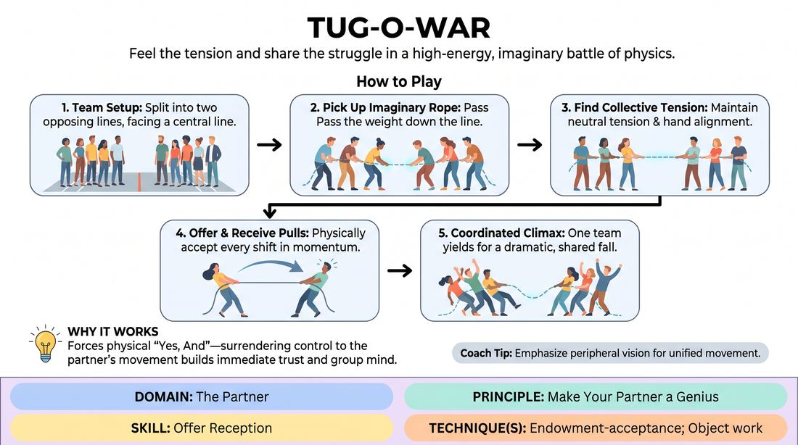

# The Invisible Rope

{ .game-hero }

> Feel the tension and share the struggle in a high-energy, imaginary battle of physics.

## Overview
Players split into two opposing teams to engage in a classic tug-of-war match using a completely imaginary rope. The magic of the game lies in the physical commitment of both sides to maintain the rope's consistent length, tension, and position, culminating in a coordinated, dramatic victory and defeat.

## What It Trains
- **Domain:** D2 — The Partner
- **Principle(s):** Make Your Partner a Genius; Yes, And; Commit 100%; Group Mind
- **Skill(s):** Offer Reception; Physicality & Space Work; Peripheral Awareness
- **Technique(s):** Endowment-acceptance; Object work; Weight & resistance mime
- **Focus:** skill_drill

**Objective:** To develop physical endowment-acceptance and peripheral awareness by treating the partner's physical movements as absolute reality.

## At a Glance
| Aspect | Detail |
|---|---|
| Players | 2+ (ideal 8-20) |
| Time | ~5 min |
| Complexity | 2/5 |
| Skill level | novice |
| Energy | high |
| Physicality | high |
| Modality | in_person |
| Space | large_open |
| Props | none |
| Audience | not required |

## Setup
Clear a large open space. Divide the group into two equal teams facing each other in two parallel lines, leaving about ten to fifteen feet of empty space between the lead players of each line.

## How to Play
1. Divide the players into two opposing teams and line them up single-file, facing each other across a central line.
2. The facilitator establishes the existence of a heavy, thick, imaginary rope lying on the floor between the two teams.
3. On the facilitator's signal, the lead players "pick up" the rope, passing the physical sensation of its weight and thickness down their respective lines until every player is holding it.
4. Players must establish a collective "neutral" tension, keeping their hands aligned to define the rope's exact path through space without letting it stretch, shrink, or sag.
5. As play begins, Team A initiates a pull; Team B must immediately receive this physical offer by leaning forward, sliding their feet, or showing the strain of being pulled.
6. Team B then counters with their own pull, and Team A must instantly accept and physicalize that shift in momentum.
7. Players must use peripheral vision to ensure their teammates' hand placements and body angles match the collective movement of the rope.
8. The game concludes when one team decides to "make their partners look like geniuses" by gracefully yielding to a massive pull, losing their footing, and tumbling forward in a coordinated, safe, and dramatic defeat.

## Facilitation Notes
- Coaching cue: "Watch their hands! If their hands move forward, your hands must move forward by the exact same distance."
- Coaching cue: "Feel the weight. Don't just pull; react to the pull of the other side."
- Pitfall: The rope stretches like rubber because players aren't watching the other team. Fix: Pause the action and ask both teams to freeze, pointing out where the "rope" has bent or stretched, then resume with a focus on micro-movements.
- Pitfall: Nobody wants to lose, leading to an endless, static stalemate. Fix: Side-coach: "Who can make the other team look incredibly strong by losing spectacularly?"

## Variations
- One-on-One Duel: Two players face off, focusing on extreme precision and micro-movements of the rope.
- Heavy Weather: Introduce environmental hazards (e.g., the ground is muddy, icy, or the rope is covered in grease) to force different physical choices.
- The Multi-Way Tug: Three or four teams pull a multi-ended rope meeting at a central knot, requiring intense group mind and multi-directional awareness.

## Debrief
- How did you know when the other team was pulling? What physical cues did you rely on?
- What did it feel like to decide to lose? How did losing make the other team look great?
- How does keeping the "rope" consistent require you to prioritize your partner's movement over your own agenda?

## Safety & Inclusion
Ensure the floor is clear of tripping hazards. Remind players to physicalize the struggle safely without actually colliding with others or straining their muscles. Players with mobility limitations can participate from a seated position, anchoring the end of the rope with expressive upper-body work.

## Why It Works
It forces players to practice "Yes, And" physically. By accepting the physical endowment of the rope's tension, players must surrender their own physical control to the movements of their partners. This builds immediate trust, group mind, and the physical discipline needed for convincing object work.
