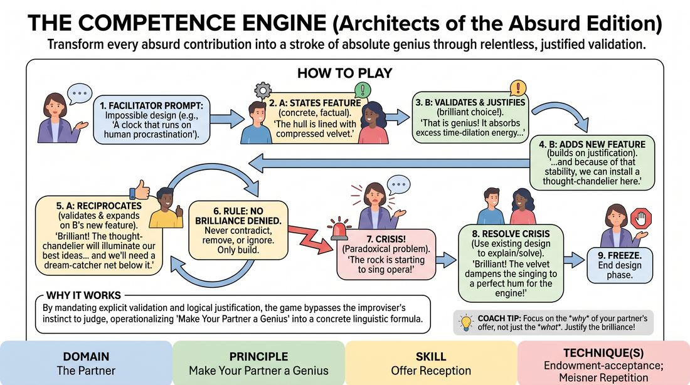

# Architects of Brilliance

{ .game-hero }

> Transform every absurd contribution into a stroke of absolute genius through relentless, justified validation.

## Overview
In this exercise, pairs collaboratively design an impossible, highly absurd invention or system. By operating under a strict loop of enthusiastic validation, logical justification, and creative expansion, players learn to treat every single offer from their partner as a masterstroke of design. The experience is fast-paced, intellectually stimulating, and deeply supportive, shifting players from a mindset of judgment to one of radical appreciation.

## What It Trains
- **Domain:** D2 — The Partner
- **Principle(s):** Yes, And; Make Your Partner a Genius; Assume Competence
- **Skill(s):** Active Listening; Status Modulation; Offer Reception; Active Gifting; Justification
- **Technique(s):** Meisner Repetition; Yes, And… sentence games; Endowment-acceptance; Endowment-gifting drills; Give them the answer; Justify the absurd
- **Focus:** skill_drill

**Objective:** To develop advanced offer reception and endowment-acceptance by training players to immediately validate their partner's ideas, discover the hidden logic within absurd offers, and elevate their partner's status to that of an absolute genius.

## At a Glance
| Aspect | Detail |
|---|---|
| Players | 2+ (ideal 2 (played in pairs)) |
| Time | ~10 min |
| Complexity | 3/5 |
| Skill level | advanced_beginner |
| Energy | medium |
| Physicality | low |
| Modality | in_person |
| Space | minimal |
| Props | none |
| Audience | not required |

## Setup
Players stand in pairs facing each other. The facilitator stands where they can observe all pairs. No props or special staging are required; minimal physical space is needed.

## How to Play
1. Divide the group into pairs standing face-to-face. The facilitator provides an absurd, impossible design prompt (e.g., 'A clock that runs on human procrastination' or 'A submarine designed to navigate through solid rock').
2. Partner A begins by stating one concrete, factual feature of the design (e.g., 'The hull is lined with highly compressed velvet').
3. Partner B must immediately respond by enthusiastically praising the offer and explaining exactly why it is a brilliant, necessary design choice (e.g., 'That is an absolute masterstroke! Lined with velvet, the hull will absorb the seismic vibrations of the rock, keeping the crew perfectly stable!').
4. In the same breath, Partner B adds a new, specific feature that builds directly on their own justification (e.g., '...and because of that stability, we can install a delicate crystal chandelier in the dining hall to maintain high morale!').
5. Partner A now takes the receiving role, applying the exact same two-part response: first, enthusiastically validating Partner B's chandelier addition and justifying its brilliance, then adding a new feature.
6. Throughout the build, players must adhere to the rule of 'No Brilliance Denied.' They cannot contradict, remove, or ignore any previously established features; every single element must coexist and integrate harmoniously.
7. After three to four rounds of building, the facilitator calls out a sudden, paradoxical crisis to the entire room (e.g., 'Crisis! The rock is starting to sing opera, which is shattering all glass!').
8. The pairs must immediately use the same loop to explain how their existing design perfectly anticipates, solves, or benefits from this crisis (e.g., 'Brilliant! The opera singing is exactly what we needed, because the velvet hull actually converts sound waves into propulsion energy!').
9. After resolving the crisis with one or two more exchanges, the facilitator calls freeze to end the design phase.

## Facilitation Notes
- Focus on the 'Why': Side-coach players who offer generic praise like 'That's great!' Push them to immediately follow up with the logical why. The magic of the game lies in the justification, which proves they listened and valued the offer.
- Avoid Self-Correction: Watch out for players who try to 'fix' their partner's weird ideas. Remind them to assume absolute competence: if their partner said it, it is the perfect choice for this machine.
- Manage Complexity: If pairs get bogged down trying to remember every single detail, coach them to focus on the emotional reality of their partnership rather than a perfect inventory check. The relationship of mutual support is more important than technical accuracy.
- Keep the Energy High: Encourage rapid-fire delivery. When players don't have time to overthink, their justifications become more delightfully absurd and intuitive.

## Variations
- The Physical Prototype: Have players physically mime the components of the machine as they describe them, requiring their partner to physically interact with or mirror the object work.
- The High-Stakes Pitch: Run the game with one pair performing on stage in front of the group, pitching their invention to a panel of 'investors' (the audience) who throw out the crises.
- Rapid Fire: Introduce a strict five-second time limit per response to force players to rely entirely on instinct and immediate acceptance.

## Debrief
- How did it feel to have your wildest, most absurd ideas immediately treated as strokes of absolute genius?
- What mental shifts occurred when you were forced to justify why an seemingly 'bad' or confusing idea was actually brilliant?
- How did the 'No Brilliance Denied' constraint change how you listened to your partner compared to a normal conversation?
- In what ways did this exercise make you feel more supported and willing to take creative risks?

## Safety & Inclusion
This game is low-physicality and highly collaborative, making it highly accessible. Ensure players are mindful of vocal strain if the room gets loud with multiple pairs speaking at once. If a player has cognitive or processing differences, allow them extra time to formulate their justifications without pressure.

## Why It Works
By mandating explicit validation and logical justification, the game bypasses the improviser's natural instinct to judge or correct. It operationalizes 'Make Your Partner a Genius' by turning it into a concrete linguistic formula. When players are forced to find the brilliance in an absurd offer, they build the cognitive muscle of radical acceptance, realizing that any offer can be made valuable through justification.
