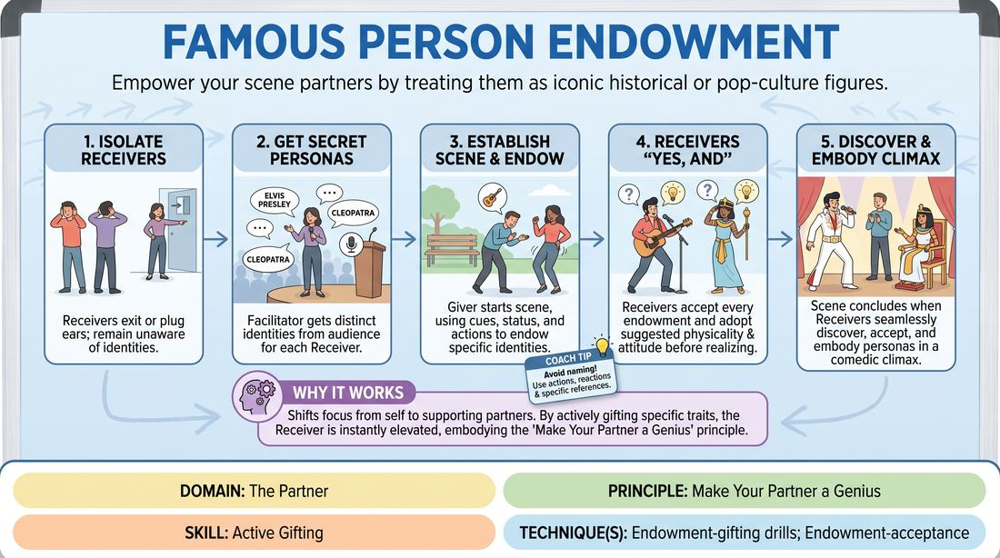

# Famous Persona Gifting

{ .game-hero }

> Empower your scene partners by treating them as iconic historical or pop-culture figures.

## Overview
In this scene-based endowment game, one player is given secret famous identities for their scene partners. While the other players start the scene completely unaware of who they are, the gifting player must treat them with the specific status, physical reactions, and dialogue cues appropriate to those famous figures until the partners discover and embody their identities.

## What It Trains
- **Domain:** D2 — The Partner
- **Principle(s):** Make Your Partner a Genius; Yes, And; Show, Don't Tell
- **Skill(s):** Active Gifting; Offer Reception; World-Building
- **Technique(s):** Endowment-gifting drills; Endowment-acceptance; Endowment chains
- **Focus:** mixed

**Objective:** To develop active gifting and endowment skills, training players to make their partners look brilliant by treating them with specific, high-stakes status and characteristics.

## At a Glance
| Aspect | Detail |
|---|---|
| Players | 3+ (ideal 3-5) |
| Time | ~10 min |
| Complexity | 3/5 |
| Skill level | competent |
| Energy | medium |
| Physicality | medium |
| Modality | in_person |
| Space | moderate |
| Props | none |
| Audience | required |

## Setup
An in-person stage space. One player is designated as the 'Giver' and remains on stage. The other 2 to 4 players (the 'Receivers') step out of earshot. The facilitator asks the audience for a well-known historical, fictional, or pop-culture figure for each of the Receivers.

## How to Play
1. Send the Receivers out of the room or have them plug their ears so they cannot hear the suggestions.
2. Obtain one distinct, highly recognizable famous persona from the audience for each of the waiting Receivers, ensuring the Giver memorizes who is assigned to whom.
3. Bring the Receivers back to the stage and establish a simple, everyday location and relationship for the scene (e.g., coworkers at a water cooler, neighbors gardening).
4. Begin the scene. The Giver must immediately begin endowing the Receivers with their secret identities using physical actions, status shifts, and verbal clues.
5. The Receivers must accept every endowment ('Yes, And') by adopting the physicalities, attitudes, and behaviors suggested by the Giver, even before they fully realize who they are playing.
6. The Giver should avoid simply stating the famous person's name; instead, they must show how they feel about the character, reference their famous achievements, or hand them iconic imaginary props.
7. Receivers should not break character to guess their identity out loud (e.g., avoiding 'Am I Cleopatra?'). Instead, they must seamlessly weave their realization into their performance.
8. The scene concludes once all Receivers have successfully discovered, accepted, and fully embodied their gifted personas in a satisfying comedic climax.

## Facilitation Notes
- Side-coach the Giver: 'Show, don't just tell! Instead of saying you are a detective, hand them a magnifying glass and act nervous about the clue they found.'
- Common Pitfall: The Giver turns the scene into a dry trivia quiz. Fix: Encourage the Giver to react with strong, genuine emotions to the celebrity's presence (e.g., starstruck, intimidated, motherly).
- Side-coach the Receivers: 'Accept the physical gifts immediately. If your partner treats you like you are wearing a heavy crown, adjust your posture and neck tension right away.'
- If a Receiver is struggling to guess, coach the Giver to offer a more direct, high-status clue or reference a famous associate of that character to trigger the realization.

## Variations
- Secret Phobias: Instead of famous people, the Giver endows the Receivers with specific, absurd phobias or obsessions that they must discover and play.
- Status Extremes: The Giver must endow one partner as an absolute royal monarch and the other as a lowly peasant, using physical space and eye contact to establish the dynamic.
- Blind Location: The Giver is also given a secret, unusual location by the audience, and must endow both the partners' identities and the environment simultaneously.

## Debrief
- How did it feel to be treated like a genius or a famous figure before you even knew who you were?
- What specific physical gifts (object work, eye contact, spatial distance) helped you figure out your identity fastest?
- Givers, how did focusing entirely on making your partners look distinct and important affect your own stage presence and anxiety?

## Safety & Inclusion
Ensure the chosen famous figures are widely known and respectful to portray. Instruct players to avoid caricatures that rely on offensive cultural, racial, or gender stereotypes, focusing instead on the figure's iconic actions, professions, or historical achievements.

## Why It Works
This game shifts the pressure of 'being funny' or 'inventing a character' away from the self. By forcing the Giver to actively gift specific traits, the Receivers are instantly supported and elevated. It perfectly embodies the principle of making your partner look good, as the Receiver's success relies entirely on the clarity and generosity of the Giver's endowments.
