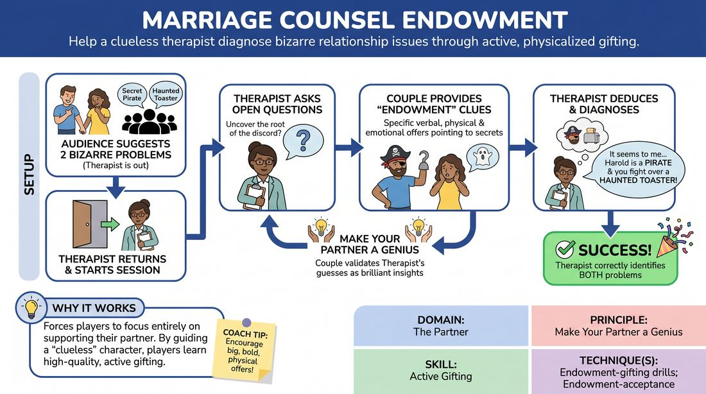

# Relationship Therapy Endowment

{ .game-hero }

> Help a clueless therapist diagnose bizarre relationship issues through active, physicalized gifting.

## Overview
In this comedic guessing game, one player steps into the role of a relationship counselor while two other players portray a couple harboring highly unusual, audience-generated marital problems. The couple must use physical and verbal endowments to guide the counselor to discover their exact issues without ever stating them directly. The scene ends when the therapist successfully diagnoses both partners' secret problems.

## What It Trains
- **Domain:** D2 — The Partner
- **Principle(s):** Make Your Partner a Genius; Yes, And; Show, Don't Tell
- **Skill(s):** Active Gifting; Active Listening; World-Building; Stage Presence & Clarity
- **Technique(s):** Endowment-gifting drills; Endowment-acceptance; Endowment chains; Make the choice readable
- **Focus:** comedy_game

**Objective:** To develop active gifting, physical endowment, and active listening by focusing entirely on making your scene partner look brilliant.

## At a Glance
| Aspect | Detail |
|---|---|
| Players | 3–4 (ideal 3-4) |
| Time | ~8 min |
| Complexity | 3/5 |
| Skill level | advanced_beginner |
| Energy | medium |
| Physicality | low |
| Modality | in_person |
| Space | minimal |
| Props | none |
| Audience | required |

## Setup
Arrange three chairs on stage: two close together for the couple, and one facing them for the therapist. One player (the Therapist) leaves the room so they cannot hear. The facilitator solicits two distinct, unusual relationship problems or secret quirks from the audience.

## How to Play
1. Designate one player as the Therapist and two players as the Couple, then send the Therapist out of earshot.
2. Obtain two distinct, unusual relationship problems or secret quirks from the audience (e.g., 'one is secretly a pirate' or 'they are fighting over a haunted toaster').
3. Bring the Therapist back into the room to begin the counseling session.
4. The Therapist initiates the session by asking open-ended questions to uncover the root of the couple's marital discord.
5. The Couple must respond by dropping increasingly specific verbal, physical, and emotional clues (endowments) that point directly to their secret problems.
6. The Couple must 'make their partner a genius' by treating the Therapist's random guesses or statements as brilliant insights, steering them closer to the truth.
7. The Therapist must actively listen, observe physical offers, and voice their deductions in character (e.g., 'It seems to me that you, Harold, have a deep-seated fear of...').
8. The game concludes once the Therapist successfully identifies both specific relationship problems.

## Facilitation Notes
- Side-coaching cue: 'Show, don't just tell! Use your body, your posture, and your imaginary environment to gift the information.'
- Common Pitfall: The couple makes the clues too obscure, leading to a stalled scene. Fix: Encourage the couple to escalate the obviousness of their gifts if the therapist is struggling.
- Common Pitfall: The therapist gets stuck in an interrogation loop of endless questions. Fix: Remind the therapist to make active declarations and observations rather than just interviewing.
- Side-coaching cue: 'Make your partner look smart! If they guess something close, yes-and it and build on it!'

## Variations
- The Silent Partner: One of the partners cannot speak and must communicate their issue entirely through physical endowment and mime, while the other partner translates or reacts.
- High Stakes: Add a strict three-minute timer to increase the urgency of the gifting and force bolder choices.
- The Assistant: A fourth player acts as the therapist's assistant, who can 'translate' or offer additional clues if the therapist is struggling.

## Debrief
- How did it feel to 'gift' information without giving it away instantly?
- Therapist, what specific physical or verbal clues helped you make your breakthrough?
- How does focusing on making your partner look like a genius change how you deliver information?

## Safety & Inclusion
Ensure relationship dynamics remain playful and comedic rather than touching on real-world trauma, domestic abuse, or sensitive personal topics. Establish boundaries on physical touch before the scene starts.

## Why It Works
This game forces players to move away from self-oriented play and focus entirely on supporting their partner. By structuring the game around a 'clueless' character who must be guided to success, players learn the value of high-quality, active gifting and physical endowment.
