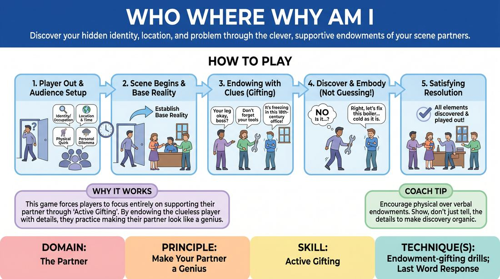

# Who, Where, and Why

{ .game-hero }

> Discover your hidden identity, location, and problem through the clever, supportive endowments of your scene partners.

## Overview
One player steps out of the room while the audience establishes their identity, location, physical quirk, and personal dilemma. Upon returning, the player enters a scene where their partners must subtly feed them these details through physical and verbal endowments. The goal is not to guess them like a trivia game, but to organically discover and embody them, making the clueless player look like a genius.

## What It Trains
- **Domain:** D2 — The Partner
- **Principle(s):** Yes, And; Make Your Partner a Genius; Base Reality First; The Audience Is the Final Scene Partner
- **Skill(s):** Active Listening; Offer Reception; Active Gifting; World-Building; Room Reading
- **Technique(s):** Last Word Response; Endowment-acceptance; Endowment-gifting drills; Endowment chains
- **Focus:** comedy_game

**Objective:** To develop active gifting and endowment skills, teaching players how to feed specific, actionable information to their partners without breaking the reality of the scene.

## Setup
An in-person performance space with an audience. One player (the 'Guesser') is sent out of earshot. The remaining players (the 'Endowers') gather suggestions from the audience: a specific location/era, an occupation or identity, a physical quirk/limitation, and a specific personal problem.

## How to Play
1. Select one player to step out of the room so they cannot hear the suggestions.
2. Ask the audience for four distinct details: a specific location and time period, the off-stage player's identity or occupation, a physical quirk or limitation, and a specific personal problem they are facing.
3. Bring the off-stage player back into the room to begin the scene. The on-stage players must establish the base reality immediately, treating the returning player as if they already know all four details.
4. The on-stage players use physical and verbal endowments (e.g., shivering to show cold, reacting to a limp, referencing tools of a trade) to guide the returning player.
5. The returning player must actively listen and observe, accepting every clue as a 'gift' and immediately incorporating it into their physical and verbal behavior.
6. Rather than shouting out guesses, the returning player demonstrates understanding by seamlessly adopting the traits, reacting to the environment, and addressing the problem.
7. The scene concludes once all four elements have been successfully discovered, integrated, and played out to a satisfying comedic resolution.

## Facilitation Notes
- Coaching Cue: 'Show, don't tell. Instead of saying "Since you are a pirate," try reacting to their peg leg or asking where they parked the galleon.'
- Pitfall: Players treat it like a game of Charades or 20 Questions, breaking the scene's reality. Fix: Remind players to prioritize the relationship and base reality first; the clues should feel like natural dialogue.
- Coaching Cue: 'Accept the gift immediately. If someone hands you an imaginary heavy object, don't treat it like a feather—embody the weight right away.'
- Pitfall: The returning player ignores subtle physical cues because they are waiting for verbal ones. Fix: Encourage the returning player to mirror the physical offers of their partners.

## Variations
- The Silent Treatment: The on-stage players can only use physical endowments and object work to convey the details, with no spoken clues allowed.
- Status Swap: The returning player is also endowed with a specific social status (high or low) relative to the other characters, which must be communicated purely through physical posture and deference.

## Debrief
- How did it feel to receive a physical endowment versus a verbal one? Which was easier to integrate?
- What strategies did the on-stage players use to make the returning player look like a genius rather than someone who was confused?
- How did maintaining the base reality help or hinder the discovery of the hidden details?

## Safety & Inclusion
Ensure physical quirks or limitations suggested by the audience are played with respect and do not punch down or caricature real-world disabilities. Facilitators should veto suggestions that feel mocking or unsafe to physically perform.

## Why It Works
This game forces players to move away from self-oriented play and focus entirely on supporting their partner. By endowing the clueless player with specific details, the on-stage players practice active gifting, while the returning player practices deep offer reception. It transforms a guessing game into a masterclass in collaborative world-building and mutual support.
