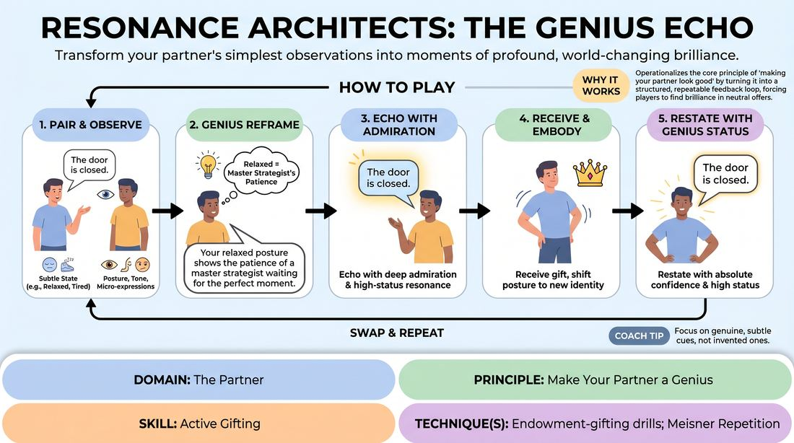

# The Genius Echo

{ .game-hero }

> Transform your partner's simplest observations into moments of profound, world-changing brilliance.

## Overview
A paired exercise where players transform mundane, everyday observations into extraordinary personal attributes. By closely observing subtle physical and vocal cues, players reframe their partner's subtext in the most flattering, high-status light possible, creating an escalating loop of mutual support, validation, and creative endowment.

## What It Trains
- **Domain:** D2 — The Partner
- **Principle(s):** Yes, And; Make Your Partner a Genius; Assume Competence
- **Skill(s):** Active Listening; Status Modulation; Single-Partner Empathy & Mirroring; Offer Reception; Active Gifting
- **Technique(s):** Meisner Repetition; Last Word Response; Status Seesaw; Mirror exercise; Emotional-echo drills; Endowment-acceptance; Endowment-gifting drills; Give them the answer
- **Focus:** connection

**Objective:** To develop active gifting and endowment skills by training players to actively listen, assume absolute competence, and elevate their partner's status through positive physical and vocal reframing.

## At a Glance
| Aspect | Detail |
|---|---|
| Players | 2+ (ideal 2 (or pairs in a larger group)) |
| Time | ~10 min |
| Complexity | 3/5 |
| Skill level | competent |
| Energy | medium |
| Physicality | low |
| Modality | in_person |
| Space | minimal |
| Props | none |
| Audience | not required |

## Setup
Players stand in pairs, facing each other at a comfortable distance. Ensure adequate space between pairs to minimize cross-talk distraction.

## How to Play
1. Divide players into pairs (Player A and Player B) standing face-to-face.
2. Player A initiates by making a simple, mundane, and neutral observation (e.g., 'The door is closed') while holding a subtle, genuine physical or emotional state (e.g., a slight slouch or a soft sigh).
3. Player B closely observes Player A's physical posture, vocal tone, and micro-expressions to identify this underlying state.
4. Player B formulates a 'genius reframe' that interprets this state as a sign of profound brilliance, skill, or deep wisdom.
5. Player B speaks this genius reframe directly to Player A (e.g., 'Your relaxed posture shows the patience of a master strategist waiting for the perfect moment').
6. Immediately after the reframe, Player B echoes Player A's exact original words back to them, delivered with deep admiration and high-status vocal resonance: 'The door is closed.'
7. Player A fully receives this gift, letting their physical posture, breathing, and eye contact shift to embody this newly endowed 'master strategist' identity.
8. Player A, now fully embodying the genius persona, restates their original line ('The door is closed') with absolute confidence and high status.
9. The partners swap roles, or continue for several cycles before swapping, allowing both players to practice active gifting and physical reception.

## Facilitation Notes
- Concrete Example: Player A sighs and says, 'The coffee is cold.' Player B observes the sigh and says, 'Your deep breath shows the profound patience of a master brewer who waits for the perfect temperature. The coffee is cold.' Player A stands taller, absorbing the status, and says, 'The coffee is cold' with regal authority.
- Side-coaching cue: 'Treat every sigh, twitch, or pause not as a mistake, but as a deliberate, brilliant choice made by a master of their craft.'
- Pitfall & Fix: Watch out for sarcastic or comedic reframing. Sarcasm lowers trust. If a player says 'You look like a genius because you're lazy,' pause them and redirect: reframe the laziness as 'deep, strategic energy conservation.'
- Physical embodiment cue: Ensure Player A doesn't just verbally agree. Coach them to physically expand, adjust their spine, and let the status shift register in their body before they speak.
- Pacing tip: Keep the transitions swift. Do not let players overthink the 'genius' explanation; the first positive instinct is usually the most fun to play.

## Variations
- The Silent Echo: Play the entire sequence without spoken words. Player A makes a simple physical gesture. Player B mirrors it, elevates it into a high-status movement (e.g., transforming a shrug into a majestic sweep of the arm), and Player A adopts the elevated movement.
- The Status Seesaw: Player B deliberately lowers their own status (acting as a humble assistant or awestruck student) while delivering the reframe, amplifying the partner's gifted genius status even further.
- Group Echo: One player stands in the center of a circle. They make a mundane statement. The entire circle echoes the statement back simultaneously with awe and admiration, instantly elevating the center player's status.

## Debrief
- How did it feel to have a simple, neutral action or physical state interpreted as a sign of absolute brilliance?
- What physical changes did you experience when you actively accepted and embodied the high-status gift?
- How does assuming absolute competence in your partner change the way you listen to and receive their offers in an active scene?

## Safety & Inclusion
Because this game requires close, sustained eye contact and physical observation, players should establish comfortable physical boundaries beforehand. Allow players to opt for a 'soft focus' (looking at the forehead or nose) if direct eye contact causes anxiety. Ensure all reframed endowments are empowering, respectful, and free of physical touch unless explicit consent is established.

## Why It Works
This game operationalizes the core improv principle of 'making your partner look good' by turning it into a structured, repeatable feedback loop. By forcing players to find brilliance in neutral or low-energy offers, it short-circuits the habit of judging or blocking. It teaches players to treat every offer as a deliberate gift, building deep scenic trust and physical confidence.
