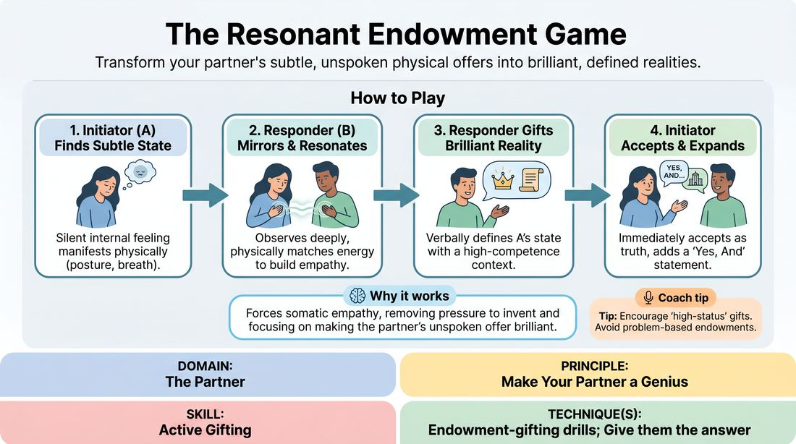

# Resonant Endowment

{ .game-hero }

> Transform your partner's subtle, unspoken physical offers into brilliant, defined realities.

## Overview
A slow-tempo partner exercise where players practice deep physical attunement and generous character endowment. One player projects a subtle, unspoken internal state, while their partner mirrors that energy before verbally gifting them a brilliant, justifying context. The result is a highly connected, co-created relationship built entirely on mutual support and active listening.

## What It Trains
- **Domain:** D2 — The Partner
- **Principle(s):** Make Your Partner a Genius; Yes, And; Assume Competence
- **Skill(s):** Active Gifting; Active Listening; Single-Partner Empathy & Mirroring; Offer Reception; Status Modulation
- **Technique(s):** Endowment-gifting drills; Give them the answer; Endowment-acceptance; Mirror exercise; Emotional-echo drills; Meisner Repetition
- **Focus:** connection

**Objective:** To develop active gifting and partner attunement by training players to treat their partner's ambiguous physical cues as deliberate, genius choices that deserve a high-stakes, supportive definition.

## At a Glance
| Aspect | Detail |
|---|---|
| Players | 4–20 (ideal 4-20) |
| Time | ~15 min |
| Complexity | 2/5 |
| Skill level | advanced_beginner |
| Energy | low |
| Physicality | low |
| Modality | in_person |
| Space | moderate |
| Props | none |
| Audience | not required |

## Setup
Divide the group into pairs. Partners stand facing each other in a comfortable, distraction-free space with enough room to move slightly. No props or materials are required.

## How to Play
1. Assign one player in each pair as Player A (the Initiator) and the other as Player B (the Responder).
2. Player A takes a moment to center themselves, then silently establishes a subtle internal emotional state or physical sensation (e.g., feeling a heavy weight, sensing a distant sound, or feeling a quiet anxiety) without using obvious pantomime.
3. Player A holds this silent state for 10 to 15 seconds, letting the physical and emotional cues naturally manifest in their posture, breath, and gaze.
4. Player B observes Player A with deep focus, then silently mirrors or resonates with the physical quality of Player A's state for 5 to 10 seconds to build empathetic connection.
5. Player B delivers a generous verbal endowment that explicitly defines Player A's state, framing it as a brilliant, high-stakes, or highly competent choice (e.g., 'You carry the weight of the entire kingdom on those shoulders, General').
6. Player A immediately accepts this gifted reality as absolute truth, responding with a 'Yes, And' statement that expands on Player B's definition and deepens the relationship.
7. The facilitator calls 'Switch' so players reverse roles, allowing Player B to initiate and Player A to respond.
8. Optionally, after Player A's 'Yes, And' response, the facilitator can call 'Continue' to let the pair play out a brief 30-to-60-second scene based on the established dynamic.

## Facilitation Notes
- Side-coach Initiators to avoid broad, cartoonish pantomime; the goal is to project an internal feeling or physical sensation rather than acting out a literal activity.
- Encourage Responders to take their time during the observation phase. Remind them that silence builds tension and depth, and they do not need to rush to the verbal gift.
- If Responders struggle to find a gift, coach them to 'give the answer' by making a bold, positive assumption about what their partner is experiencing, rather than asking questions.
- Watch out for 'denial' or negotiation in the final phase. Ensure the Initiator fully embraces the Responder's endowment as absolute truth, even if it differs from what they originally imagined.

## Variations
- Status Shift: Instruct the Responder to deliberately gift an endowment that either elevates the Initiator to high status or lowers them to low status, exploring how physical resonance adapts to power dynamics.
- Silent Resolution: Play the entire cycle, including the 'Yes, And' and the brief scene, completely without words, relying solely on physical endowment and object work.

## Debrief
- How did it feel to have your subtle, ambiguous physical state defined and elevated by your partner?
- As the responder, what physical cues did you rely on to find a fitting and generous endowment?
- How does assuming your partner is a genius change the way you interpret their silent choices?

## Safety & Inclusion
Ensure players maintain a comfortable physical distance. Since this game involves close observation and mirroring, remind participants that they can adjust their eye contact or physical proximity at any time to remain comfortable.

## Why It Works
By stripping away immediate verbal communication, this game forces players to rely on somatic empathy and deep observation. When the responder is tasked with defining the initiator's state, it removes the pressure of invention from the initiator and teaches the responder to actively gift. This cycle of silent attunement followed by enthusiastic acceptance builds a profound sense of safety and collaborative flow.
