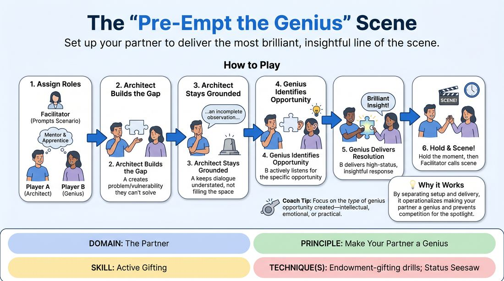

# Platforming the Partner

{ .game-hero }

> Set up your partner to deliver the most brilliant, insightful line of the scene.

## Overview
A two-player virtual scene work exercise where one player acts as the architect, deliberately constructing a narrative vacuum, problem, or emotional vulnerability. The other player steps into this custom-built space to deliver a highly satisfying, high-status, or deeply insightful resolution. It shifts the focus from self-oriented cleverness to active, strategic platform-building for your partner.

## What It Trains
- **Domain:** D2 — The Partner
- **Principle(s):** Yes, And; Make Your Partner a Genius; Assume Competence
- **Skill(s):** Active Listening; Status Modulation; Single-Partner Empathy & Mirroring; Offer Reception; Active Gifting
- **Technique(s):** Status Seesaw; Endowment-acceptance; Endowment-gifting drills; Give them the answer
- **Focus:** connection

**Objective:** To develop active gifting and status modulation by intentionally lowering one's own spotlight to engineer a high-status, brilliant moment for a scene partner.

## At a Glance
| Aspect | Detail |
|---|---|
| Players | 2+ (ideal 2 (or 6-12 in rotating pairs)) |
| Time | ~15 min |
| Complexity | 3/5 |
| Skill level | competent |
| Energy | medium |
| Physicality | low |
| Modality | virtual |
| Space | minimal |
| Props | none |
| Audience | not required |

## Setup
Played in virtual breakout rooms or on the main screen with two active players (cameras on) and the rest of the group observing (cameras off). No physical props or special space required; players just need a stable video connection.

## How to Play
1. Designate Player A as the Architect and Player B as the Genius for the round.
2. The facilitator provides a simple relationship or scenario, such as two scientists at a breakthrough moment or a mentor and apprentice.
3. Player A begins the scene with the explicit goal of creating a narrative gap or problem that they cannot solve themselves, establishing Player B as the expert or wise figure.
4. Player A must keep their own dialogue grounded and understated, presenting a clear vulnerability, a complex riddle, or an incomplete observation without filling the space themselves.
5. Player B actively listens, identifying the specific type of genius opportunity Player A is constructing, whether it is an intellectual solution, an emotional truth, or a philosophical insight.
6. Player B steps confidently into the high-status role, delivering a powerful, insightful, or clever response that perfectly resolves the setup.
7. Once the genius moment is delivered and acknowledged, the players hold the moment for a beat, and the facilitator calls scene.
8. Reverse the roles so Player B becomes the Architect and Player A becomes the Genius, using a new scenario.

## Facilitation Notes
- Coaching Cue: Build the pedestal, don't stand on it. Remind the Architect that their success is measured entirely by how bright their partner shines.
- Pitfall: The Genius might feel intense pressure to say something objectively brilliant. Fix: Coach them that genius in improv is simply committed, confident acceptance of the high-status role, not actual scientific breakthrough.
- Coaching Cue: Leave a vacuum. If the Architect presents a problem and immediately suggests three solutions, they have filled their own vacuum. Remind them to stop talking after presenting the gap.
- Pitfall: The Architect might make the setup too obscure. Fix: Encourage simple, classic setups like, 'I've tried every combination, but the vault won't budge—what are we missing?' which clearly invites a specific type of expertise.

## Variations
- The Silent Setup: The Architect must set up the partner's genius moment using only physical object work and non-verbal cues on camera before speaking their single setup line.
- Emotional Genius: Instead of an intellectual or technical problem, the Architect presents a deep emotional crisis or vulnerability, setting up the partner to deliver a moment of profound empathy or wisdom.
- Blind Genius: The Genius player keeps their eyes closed or camera off until the Architect finishes the setup, forcing them to rely entirely on vocal tone and subtext to identify the opportunity.

## Debrief
- How did it feel to intentionally lower your status and give away the cleverest line of the scene?
- How did you recognize the specific moment your partner was setting up for you, and what made it easy to step into?
- How does active, strategic gifting change the trust level between scene partners compared to standard reactive play?

## Safety & Inclusion
Since this game asks players to step into high-status or highly competent roles, ensure players do not use real-world sensitive topics, such as actual personal traumas or systemic inequalities, as the vulnerability or problem to be solved, keeping the stakes fictional and supportive.

## Why It Works
By separating the scene into a deliberate setup and delivery dynamic, the game operationalizes the principle of making your partner a genius. It prevents the common improv pitfall of players competing for the spotlight, instead teaching that the most satisfying narrative moments come from collaborative status modulation and generous, active gifting.
