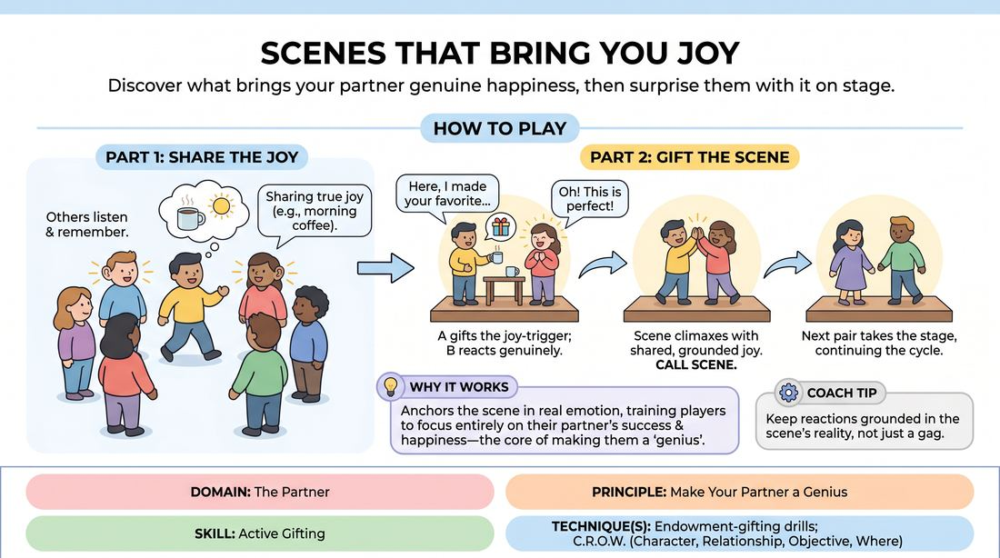

# Gifts of Joy

{ .game-hero }

> Discover what brings your partner genuine happiness, then surprise them with it on stage.

## Overview
A warm-up and scene-work exercise where players share real-life sources of personal joy, which their partners then weave into subsequent scenes as unexpected gifts. It fosters deep connection, active listening, and the art of making your partner look and feel like a genius.

## What It Trains
- **Domain:** D2 — The Partner
- **Principle(s):** Make Your Partner a Genius; Vulnerability; Yes, And
- **Skill(s):** Active Gifting; Active Listening; World-Building
- **Technique(s):** Endowment-gifting drills; C.R.O.W. (Character, Relationship, Objective, Where)
- **Focus:** connection

**Objective:** To practice active gifting and endowment by listening closely to a partner's real-world preferences and deliberately setting up a scene to deliver that specific joy to them.

## At a Glance
| Aspect | Detail |
|---|---|
| Players | 5+ (ideal 5-15) |
| Time | ~15 min |
| Complexity | 2/5 |
| Skill level | novice |
| Energy | medium |
| Physicality | low |
| Modality | in_person |
| Space | moderate |
| Props | none |
| Audience | not required |

## Setup
Players stand in a line or semi-circle facing the playing area. No props or special materials are required; just a moderate open space for two-person scenes.

## How to Play
1. Gather a group of 5 to 8 players to stand in a line at the back of the stage area.
2. Have each player, one by one, step forward, state their name, and share a brief, true story about a specific, simple thing that brings them genuine joy in real life, such as finding a forgotten ten-dollar bill in a winter coat.
3. Instruct the rest of the group to listen actively and commit these joy-triggers to memory.
4. Once everyone has shared, transition into a series of two-person scenes where Player A steps forward to initiate a scene and invites Player B to join them.
5. Player A's primary mission is to establish a platform and then actively gift Player B their specific joy-trigger within the context of the scene.
6. Player B must accept the gift with genuine, heightened reaction, playing the truth of that joy while keeping the scene grounded.
7. Once Player B has received their joyful gift and the moment is fully played out, the facilitator calls 'scene' and a new pair steps up.
8. Continue until every player in the group has been the recipient of their specific joy-trigger in a scene.

## Facilitation Notes
- Encourage players to share specific, small joys rather than broad concepts because specificity makes gifting much easier.
- Side-coach the initiator to build a plausible context first rather than handing over the gift in the first line, which makes the discovery feel earned.
- Watch out for players who try to gift their own joy; remind them that this is an exercise in making their partner the star.
- If a player struggles to remember their partner's joy, allow them to ask the group or the partner directly before starting rather than guessing.

## Variations
- The Secret Gift: The initiator must gift the joy without naming it directly, forcing the partner to recognize it through sensory details or context clues.
- Double Joy: In a two-person scene, both players must find a way to gift each other's joy-triggers, requiring mutual endowment and careful balancing.

## Debrief
- How did it feel to receive a customized gift from your scene partner?
- What strategies did you use to set up the gift naturally without rushing the scene?
- How does knowing what actually brings your partner joy in real life change how you support them on stage?

## Safety & Inclusion
Ensure players know they only need to share low-stakes, comfortable personal joys. There is no pressure to share deeply private or vulnerable secrets unless they feel completely safe doing so.

## Why It Works
By anchoring the scene's climax in a partner's real-world joy, the exercise bypasses intellectual plotting and taps into genuine emotion. It trains players to focus entirely on their partner's success and happiness, which is the core of making your partner look like a genius.
