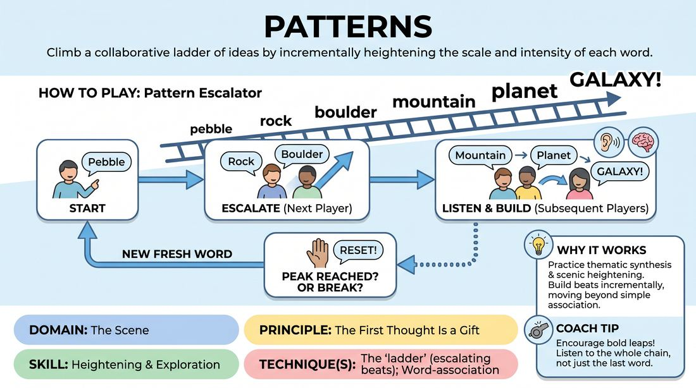

# Pattern Escalator

{ .game-hero }

> Climb a collaborative ladder of ideas by incrementally heightening the scale and intensity of each word.

## Overview
Pattern Escalator is a rapid-fire circle warm-up that challenges players to build on a sequence of words by escalating their scale, intensity, or category. Instead of simple free association, players must track the trajectory of the entire sequence to find the next logical step up the ladder, resetting once they reach a natural peak.

## What It Trains
- **Domain:** D3 — The Scene
- **Principle(s):** The First Thought Is a Gift; Yes, And; Group Mind
- **Skill(s):** Unfiltered Spontaneity; Heightening & Exploration; Suggestion Deconstruction (A-to-C); Thematic Synthesis
- **Technique(s):** Word-association; The 'ladder' (escalating beats); A-to-C drills
- **Focus:** skill_drill

**Objective:** Develops the skill of incremental heightening (the 'ladder' technique) and thematic synthesis, training players to recognize patterns and escalate them collaboratively.

## Setup
Players stand in a circle in an open space. No props or materials are required.

## How to Play
1. Form a standing circle of 3 to 12 players.
2. The facilitator or a designated player starts the round by calling out a single, simple noun (e.g., 'pebble').
3. The next player in clockwise order contributes a word that escalates or expands upon the previous word's category, scale, or intensity (e.g., 'rock').
4. Subsequent players continue around the circle, each adding a word that climbs the ladder of scale or intensity (e.g., 'boulder', 'mountain', 'planet').
5. Players must actively listen to the entire sequence, not just the immediate predecessor, to maintain a consistent upward trajectory.
6. When the pattern reaches a logical peak where it cannot be heightened further, or if the pattern breaks, any player can call 'Reset!'
7. Upon a reset, the next player in sequence starts a brand-new ladder with a fresh, simple starting word.

## Facilitation Notes
- Coaching cue: 'Take small steps! Don't jump from pebble to universe in two turns. Enjoy the climb.'
- Pitfall: Players making lateral associations (e.g., 'grass' to 'green' to 'jealousy') instead of vertical heightening. Fix: Remind them to focus on scale, intensity, or quantity.
- Coaching cue: 'Listen to the trajectory, not just the last word. Where is this pattern going?'
- Pitfall: Hesitation or overthinking. Fix: Encourage players to trust their first instinct and keep the tempo brisk.

## Variations
- Emotional Escalation: Instead of physical scale, escalate emotional states (e.g., 'miffed' to 'annoyed' to 'angry' to 'furious' to 'enraged').
- Status Escalation: Escalate social status or power dynamics (e.g., 'intern' to 'manager' to 'director' to 'CEO' to 'emperor').
- Reverse Ladder: Start at the peak and de-escalate down to the smallest possible element (e.g., 'galaxy' to 'solar system' to 'Earth' to 'continent' to 'city' to 'street' to 'house').

## Debrief
- How did it feel to track the trajectory of the whole group rather than just reacting to the person right before you?
- What made a ladder feel satisfying to climb, and how did you know when you reached the top?
- How can we apply this concept of incremental heightening to our scenic work?

## Safety & Inclusion
Ensure a supportive environment where 'mistakes' or broken patterns are celebrated with a quick, joyful reset rather than frustration. Allow players to pass if they experience a cognitive block.

## Why It Works
It forces players to move away from purely transactional, one-to-one association and instead practice thematic synthesis. By climbing a shared ladder, players internalize the mechanics of scenic heightening—building beats incrementally rather than jumping immediately to the extreme.
