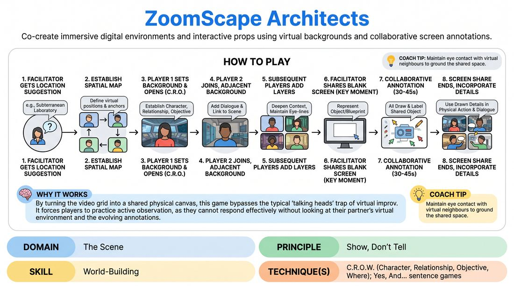

# Virtual Vista Architects

{ .game-hero }

> Co-create immersive digital environments and interactive props using virtual backgrounds and collaborative screen annotations.

## Overview
Virtual Vista Architects is a fast-paced, virtual-native improv game where players use their video conferencing backgrounds and shared screen annotation tools to co-create a dynamic environment. Instead of just talking about where they are, players visually 'Yes, And' each other's settings in real-time, creating a rich, multi-layered scene. The experience is highly collaborative, turning the limitations of remote play into a playground for visual storytelling.

## What It Trains
- **Domain:** D3 — The Scene
- **Principle(s):** Show, Don't Tell; Yes, And; Group Mind
- **Skill(s):** World-Building; Active Listening; Offer Reception; Physicality & Space Work; Support Work
- **Technique(s):** C.R.O.W. (Character, Relationship, Objective, Where); Yes, And… sentence games; Object work; Playing architecture/objects
- **Focus:** mixed

**Objective:** To develop physical world-building and environmental awareness (C.R.O.W. - specifically the 'Where') in a virtual space, training players to show rather than tell by treating their digital environment as an active scene partner.

## At a Glance
| Aspect | Detail |
|---|---|
| Players | 6+ (ideal 6-12) |
| Time | ~15 min |
| Complexity | 3/5 |
| Skill level | competent |
| Energy | high |
| Physicality | low |
| Modality | virtual |
| Space | minimal |
| Props | none |
| Audience | not required |

## Setup
Run on a video conferencing platform with gallery view enabled. All players should have access to a pre-curated list of basic background archetypes (e.g., Cozy Cabin, High-Tech Lab, Deep Space, Underwater, Ancient Ruins, Office Cubicle) or know how to quickly switch to standard solid colors. The host must enable screen sharing and annotation tools for all participants.

## How to Play
1. The facilitator obtains a broad location suggestion from the group, such as a subterranean laboratory or ancient ruins.
2. To counter unstable platform gallery views, the facilitator establishes a 'spatial map' where players verbally and physically anchor their positions (e.g., looking down to speak to someone 'below' them, regardless of where their video tile actually sits).
3. Player 1 activates a background representing the primary location and delivers an opening line establishing their Character, Relationship, and Objective (C.R.O.W.) within this 'Where'.
4. Player 2 joins, selecting an adjacent or complementary background from the curated list (e.g., the generator room next to the control room) and establishes their connection to Player 1.
5. Subsequent players enter one by one, adding visual layers with their backgrounds and verbal layers that deepen the scene's context, using consistent eye-lines to maintain spatial continuity.
6. At a high-energy moment, the facilitator shares a blank white screen representing a key object or blueprint in the scene.
7. For 30 to 45 seconds, all players use the platform's annotation tools to collaboratively draw, label, or add details to this shared object.
8. The screen share ends, and the active players must immediately incorporate these newly drawn visual details and props into their physical actions and dialogue, bringing the scene to a climax.

## Facilitation Notes
- To combat shifting video tiles, coach players to use explicit verbal anchors ('I am looking at you through the security camera') and exaggerated physical eye-lines rather than relying on the platform's grid layout.
- Keep setup friction low by using the curated background list; if a player cannot change their background quickly, have them verbally describe their 'frame' or hold up a physical household object as a backdrop.
- Coaching Cue: 'React to the background, not just the words!' Remind players to look at their partner's digital environment and treat it as a physical reality.
- During the annotation phase, prevent visual clutter by instructing players to add only one clear detail (a line, a word, a shape) rather than scribbling.

## Variations
- The Environmental Chorus: Non-active players act as the background environment, changing their backdrops to reflect shifts in weather, lighting, or dramatic tension (e.g., switching to a red background to indicate an alarm) behind the main actors.
- The Silent Architects: Run the entire background-building phase in complete silence, relying purely on physical reactions, object work, and background changes to tell the story before opening up the microphones for the final act.

## Debrief
- How did establishing verbal and physical spatial anchors help overcome the shifting video grid?
- How did the curated background archetypes help you make faster, more confident choices about your character's environment?
- In what ways did the collaborative annotation phase change your character's immediate objective or relationship?

## Safety & Inclusion
Ensure all pre-loaded backgrounds are appropriate for the group's agreed-upon boundaries. For players with hardware limitations that prevent virtual backgrounds, allow them to use physical household items held up to the camera, use solid color filters, or designate them as the primary 'Prop Masters' who lead the annotation phases.

## Why It Works
By turning the video grid into a shared physical canvas, this game bypasses the typical 'talking heads' trap of virtual improv. It forces players to practice active observation, as they cannot respond effectively without looking at their partner's visual frame. The combination of background shifts and real-time annotations builds a strong sense of Group Mind and shared ownership over the scene's physical reality.
