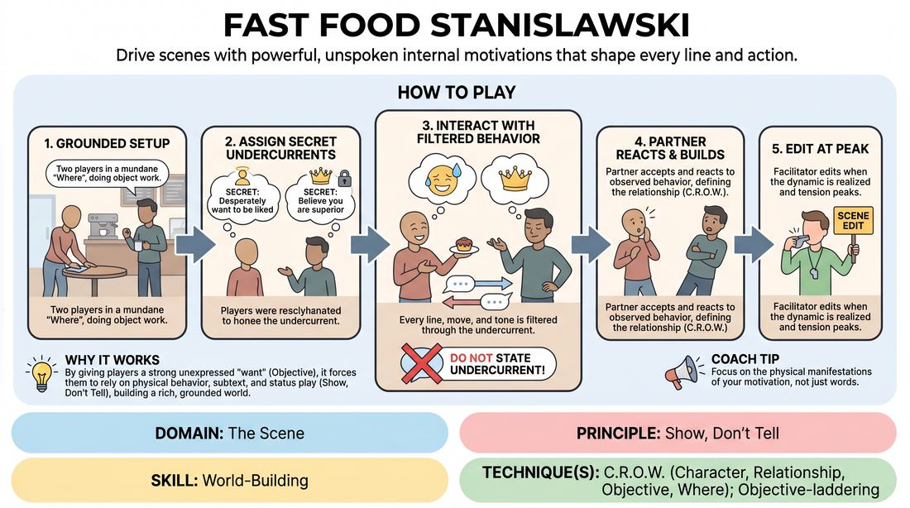

# Undercurrents

{ .game-hero }

> Drive scenes with powerful, unspoken internal motivations that shape every line and action.

## Overview
Two players perform a grounded scene in a mundane location while holding a specific, secret internal subtext or psychological drive. The focus is on letting this internal state filter through their dialogue and physical choices naturally, rather than stating it directly. The result is a rich, high-context scene built on behavioral truth rather than exposition.

## What It Trains
- **Domain:** D3 — The Scene
- **Principle(s):** Show, Don't Tell; Make Your Partner a Genius; Vulnerability
- **Skill(s):** World-Building; Stakes / The 'Want'; Status Modulation; Emotional Fluidity
- **Technique(s):** C.R.O.W. (Character, Relationship, Objective, Where); Objective-laddering; Status Seesaw; Emotional substitution
- **Focus:** skill_drill

**Objective:** To master the principle of 'Show, Don't Tell' by grounding characters in a deep, unspoken objective (C.R.O.W.), driving stakes, and modulating status without explicit exposition.

## At a Glance
| Aspect | Detail |
|---|---|
| Players | 2+ (ideal 2-10) |
| Time | ~10 min |
| Complexity | 2/5 |
| Skill level | advanced_beginner |
| Energy | medium |
| Physicality | low |
| Modality | in_person |
| Space | minimal |
| Props | none |
| Audience | not required |

## Setup
An open performance space with two chairs. The facilitator prepares a list of simple, everyday locations (e.g., a laundromat, a bus stop, a hardware store) and a list of psychological subtexts or behavioral drives.

## How to Play
1. Select two players to step into the performance space and assign them a mundane, everyday location to establish the 'Where'.
2. Assign each player a distinct, secret 'undercurrent' (e.g., 'You desperately want to be liked,' 'You believe you are superior to everyone,' 'You are terrified of making a mistake'). This can be whispered to them or shown on cards.
3. Instruct the players to begin the scene by engaging in physical action (object work) appropriate to the location to ground themselves.
4. Have the players interact, allowing their assigned undercurrent to filter through every line of dialogue, physical movement, and vocal tone.
5. Enforce the golden rule: players must never explicitly state their undercurrent; they must show it through their behavior, status shifts, and subtextual choices.
6. The partner must accept and react to the behavior they observe, treating the other player's choices as gifts that define the relationship (C.R.O.W.).
7. The facilitator edits the scene once the dynamic is fully realized and the tension or comedy of the contrasting undercurrents peaks.

## Facilitation Notes
- Side-coaching cue: 'Don't say what you want; show us how it changes how you hold your body or fold that laundry.'
- Common Pitfall: Players explicitly stating their subtext (e.g., saying 'I am trying to impress you'). Fix: Pause the scene and ask them to convey that same desire using only eye contact, posture, or the way they hand over an object.
- Side-coaching cue: 'Let your partner's attitude affect you. If they are cold, does it make you try harder or shut down?'
- Common Pitfall: Playing the subtext too broadly or cartoonishly. Fix: Encourage 'micro-choices' and high-stakes vulnerability; the more grounded the behavior, the more compelling the scene.

## Variations
- Blind Undercurrents: Only the audience and the individual player know their own subtext; the scene partner must discover and adapt to it in real-time.
- Shifting Currents: The facilitator calls out 'Shift!' and players must instantly transition to a new, pre-assigned subtext mid-scene.
- Status Dial: Players are given a subtext that directly correlates to high or low status, and they must dial it up or down on a scale of 1-10 based on facilitator prompts.

## Debrief
- How did having a specific internal drive change the way you used the physical space and objects?
- What was the effect of not saying your subtext out loud? How did it build tension or comedy?
- How did your partner's unspoken attitude shape your own character's status and choices?

## Safety & Inclusion
Ensure subtexts are respectful and do not rely on offensive stereotypes or trigger-heavy psychological states. Keep the focus on relational dynamics and simple behavioral drives.

## Why It Works
By giving players a strong internal 'want' (Objective) that remains unexpressed in words, it forces them to rely on physical behavior, subtext, and status play (Show, Don't Tell). This naturally builds a rich, grounded world (C.R.O.W.) where the relationship is defined by behavior rather than exposition.
