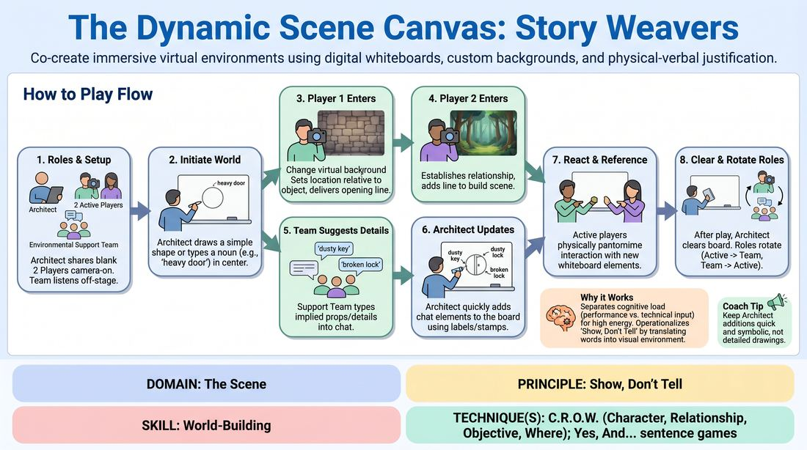

# The Digital Scene Canvas

{ .game-hero }

> Co-create immersive virtual environments using digital whiteboards, custom backgrounds, and physical-verbal justification.

## Overview
A virtual-first improv game where players collaboratively construct a scene's environment, characters, and stakes in real-time. By separating physical performance from technical inputs, players build a rich, multi-modal base reality. One player acts as the Scene Architect, translating chat suggestions from off-stage players into a shared visual canvas that serves as the physical stage.

## What It Trains
- **Domain:** D3 — The Scene
- **Principle(s):** Yes, And; Show, Don't Tell; Base Reality First; Group Mind
- **Skill(s):** Active Listening; Offer Reception; World-Building; Support Work
- **Technique(s):** Yes, And… sentence games; C.R.O.W. (Character, Relationship, Objective, Where); Playing architecture/objects
- **Focus:** mixed

**Objective:** To master the C.R.O.W. framework (Character, Relationship, Objective, Where) in a virtual space, training players to show rather than tell by integrating visual, environmental, and verbal offers without cognitive overload.

## Setup
Players join a video conferencing platform in gallery view. Each player prepares a small folder of diverse virtual backgrounds (e.g., interiors, outdoor landscapes, abstract textures). The facilitator or a designated player (the Scene Architect) shares a blank digital whiteboard screen visible to all participants.

## How to Play
1. Designate one player as the Scene Architect, who shares a blank digital whiteboard, and two players as the active Scene Partners. Remaining players act as the Environmental Support Team.
2. The Scene Architect initiates the world by drawing a single, simple geometric shape or typing one evocative noun in the center of the whiteboard (e.g., 'a heavy iron safe' or 'an overgrown vine').
3. The first active player turns on their camera, changes their virtual background to establish their character's location relative to the object, and delivers an opening line establishing their Character and Where.
4. The second active player enters by turning on their camera, selecting a complementary virtual background, and delivering a line that establishes their Relationship and Objective with the first player.
5. While the active players perform, the Environmental Support Team listens closely and types specific physical props or environmental details mentioned or implied by the actors into the chat.
6. The Scene Architect monitors the chat and uses quick text labels, stamps, or basic shapes to add these elements to the whiteboard, avoiding complex drawing to keep the pace brisk.
7. The active players must physically react to and reference these newly appearing whiteboard elements, using pantomime to 'touch' or 'use' them in their virtual frames.
8. After a few minutes of dynamic play, the Architect clears the board, and roles rotate: the active players join the Support Team, two Support players become the new active actors, and a new scene begins.

## Facilitation Notes
- Coaching Cue: 'Interact with the canvas!' Remind active players to treat the whiteboard drawings as real, physical props in their virtual space, using pantomime to touch or use them.
- Architect Speed Tip: Instruct the Scene Architect to use simple text labels (e.g., typing 'DESK' or 'WINDOW') or basic stamps instead of trying to sketch detailed drawings. This keeps the visual updates instantaneous and prevents stalling.
- Pacing Fix: If the scene slows down, have the off-stage Support Team type 'environmental disruptions' (e.g., 'rain starts', 'power outage') to force immediate physical and background adjustments.
- Background Selection: Instruct players to select the first background that loosely fits the vibe rather than searching for the perfect image; imperfection breeds comedy and spontaneous justification.

## Variations
- The Silent Canvas: Run the entire scene in complete silence, relying solely on background changes, whiteboard drawings, and physical pantomime to establish C.R.O.W.
- Background Roulette: Active players must change their background to a completely random image from their folder on a cue from the Architect, and then immediately justify how their character ended up in that new location.
- Architect's Choice: The Architect occasionally moves or deletes elements on the whiteboard (e.g., moving a 'table' to the other side of the screen), forcing the actors to physically adjust their positioning and justify the sudden shift.

## Debrief
- How did separating the acting from the typing help you focus on your partner and the C.R.O.W. elements?
- In what ways did the Scene Architect's visual additions change the direction or stakes of your scene?
- How did we use our physical space and virtual backgrounds to 'show' our relationship and environment rather than 'telling' the audience?

## Safety & Inclusion
Ensure all players have pre-loaded, accessible backgrounds to prevent technical exclusion. If a player's device does not support virtual backgrounds, they can participate by holding up physical drawings, household objects, or using descriptive text in the chat to represent their environment. For players with limited mobility, physical reactions can be represented through facial expressions, vocal shifts, or verbal descriptions of their physical actions.

## Why It Works
By separating the cognitive load of performance (active players) from technical input (off-stage support team typing and the Architect drawing), the game maintains a high-energy, theatrical pace. It operationalizes 'Show, Don't Tell' by forcing players to align their verbal offers with visual background changes and whiteboard updates, preventing the 'talking heads' syndrome of virtual improv.
