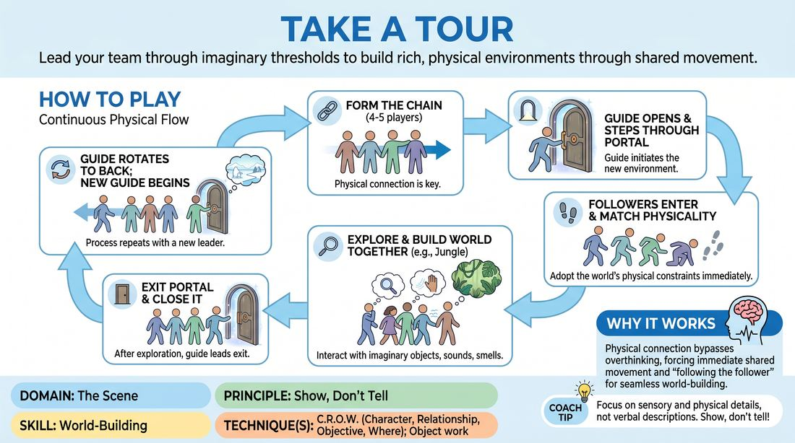

# The Portal Tour

{ .game-hero }

> Lead your team through imaginary thresholds to build rich, physical environments through shared movement.

## Overview
Players form a physical chain to step through an imaginary portal into a new environment. Led by the person at the front, the group explores this space using physical reactions, object work, and sensory details to establish the 'Where' of the scene. Once the environment is fully realized, the leader rotates to the back, and a new leader opens a portal to a completely different world.

## What It Trains
- **Domain:** D3 — The Scene
- **Principle(s):** Show, Don't Tell; Commit 100%; Follow the Follower
- **Skill(s):** World-Building; Physicality & Space Work; Peripheral Awareness; Support Work
- **Technique(s):** C.R.O.W. (Character, Relationship, Objective, Where); Object work; Stage-picture exercises
- **Focus:** skill_drill

**Objective:** To develop physical world-building (the 'Where' of C.R.O.W.) and group mind by showing environmental conditions (temperature, gravity, obstacles) through physical commitment and sensory reaction rather than verbal exposition.

## Setup
Divide players into small groups of 4 to 5. Ensure there is enough open floor space for groups to move around safely without colliding. No props are needed.

## How to Play
1. Form a single-file line of 4 to 5 players, with everyone holding hands or placing a hand on the shoulder of the person in front of them to establish a physical connection.
2. The player at the front of the line acts as the guide, who initiates the round by miming the opening of a heavy door, curtain, or portal to an imaginary location.
3. The guide steps through the portal, immediately adopting a physical state that reflects the environment (such as shivering in a frozen tundra, ducking under low branches in a jungle, or floating in zero gravity).
4. The rest of the line follows the guide through the portal, instantly adopting the same physical constraints and environmental reactions to support the established reality.
5. The guide leads the group on a physical tour of the space, interacting with imaginary objects, navigating obstacles, and reacting to sensory details (smells, sights, textures) without explicitly naming the location.
6. Followers must actively support the guide's choices by mirroring the physical gravity, scale, and texture of the environment, building on the world-building through their own physical reactions.
7. After approximately one to two minutes of exploration, the guide leads the group back through the portal, closes it, and moves to the very back of the line.
8. The new player at the front of the line immediately becomes the next guide, opening a brand-new portal to a completely different environment, and the process repeats.

## Facilitation Notes
- Side-coach players to 'show, don't tell.' Encourage them to express the environment through physical weight, temperature, and sensory reactions rather than narrating what they see.
- If the group is moving too fast, coach them to slow down and fully interact with one imaginary object or obstacle before moving to the next.
- Watch for 'ghost objects'—remind players to respect the physical space and boundaries established by the leader (e.g., if the leader ducks under a low beam, every player must duck at that exact spot).
- Encourage the leader to establish a clear relationship with the followers (e.g., a drill sergeant, a museum curator, or a cautious explorer) to weave in the 'Character' and 'Relationship' elements of C.R.O.W.

## Variations
- Silent Expedition: Run the entire tour in complete silence, relying 100% on physical movement, facial expressions, and breath to communicate the environment and relationships.
- Varying Gravity and Elements: The facilitator calls out environmental modifiers mid-tour (e.g., 'The floor is now quicksand!' or 'Gravity has doubled!') to force immediate physical adaptation.
- Emotional Atmosphere: The portal leads not just to a physical place, but to an emotional climate (e.g., a room of pure joy, a valley of paranoia) which the entire line must instantly inhabit.

## Debrief
- How did physicalizing the environment together help you understand the 'Where' without needing verbal explanations?
- What physical cues from the leader made it easiest for you to follow and support the reality of the space?
- How did maintaining physical contact (holding hands or shoulders) affect your group's timing and collective focus?

## Safety & Inclusion
Since this game involves physical contact (holding hands or touching shoulders), always ask for consent before starting. If any player is uncomfortable with touch, the group can connect via 'invisible threads' (holding hands near each other without touching) or by holding onto a shared prop like a rope or scarf.

## Why It Works
By physically linking the players, the game forces a high level of peripheral awareness and 'following the follower.' The physical connection translates the leader's movements instantly to the rest of the group, bypassing intellectual overthinking and fostering immediate, committed physical support. This builds a shared, visceral understanding of the scene's environment (the 'Where' of C.R.O.W.) through collective physical action.
