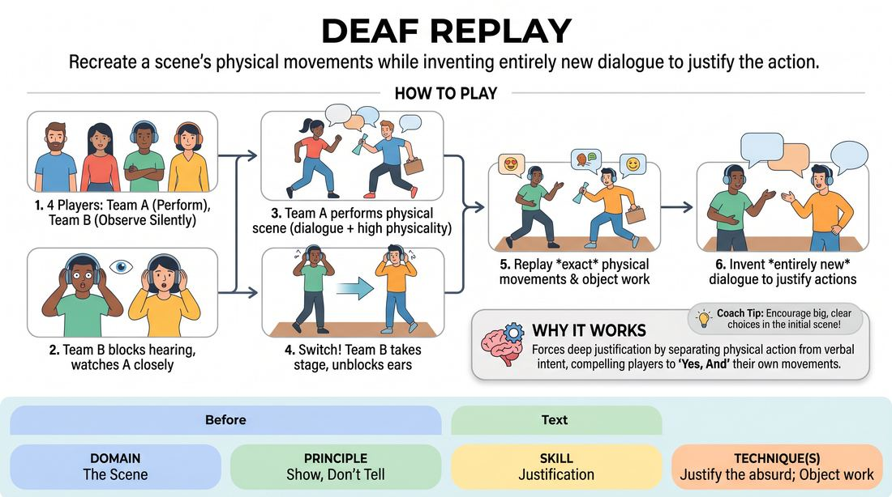

# Muted Replay

{ .game-hero }

> Recreate a scene's physical movements while inventing entirely new dialogue to justify the action.

## Overview
Two players perform a fully voiced, highly physical scene while two other players watch without being able to hear any of the dialogue. The observing pair then steps up to replay the exact physical choreography of the original scene, but must invent a completely new narrative and dialogue that logically justifies their physical actions.

## What It Trains
- **Domain:** D3 — The Scene
- **Principle(s):** Show, Don't Tell; Yes, And
- **Skill(s):** Justification; Offer Reception; Physicality & Space Work; Active Listening
- **Technique(s):** Justify the absurd; Object work; Endowment-acceptance
- **Focus:** mixed

**Objective:** To develop physical offer reception, active visual listening, and the ability to justify absurd or unexpected physical choices in the moment.

## At a Glance
| Aspect | Detail |
|---|---|
| Players | 4+ (ideal 4-8) |
| Time | ~5 min |
| Complexity | 3/5 |
| Skill level | advanced_beginner |
| Energy | medium |
| Physicality | medium |
| Modality | in_person |
| Space | moderate |
| Props | none |
| Audience | not required |

## Setup
Four players step forward. Two are designated as the 'Actors' and two as the 'Observers'. The Observers must plug their ears, wear noise-canceling headphones, or step out of earshot while remaining in a position where they can clearly see the stage.

## How to Play
1. Select four players: two to perform the initial scene (Team A) and two to observe silently (Team B).
2. Instruct Team B to completely block their hearing (using fingers, earplugs, or headphones) while keeping their eyes wide open to watch Team A's performance.
3. Get a simple suggestion for Team A to start their scene, emphasizing that they must use clear, distinct physical actions, object work, and spatial movement.
4. Team A performs a two-minute scene with normal dialogue and high physicality, ensuring they move around the space and interact with imaginary objects.
5. Once Team A finishes, Team B unblocks their ears and takes the stage.
6. Team B must now replay the scene, mimicking the exact physical movements, blocking, and object work of Team A as closely as possible.
7. While replicating the physical actions, Team B must improvise entirely new dialogue that makes logical sense of their movements, transforming the original context into a completely different scenario.

## Facilitation Notes
- Encourage Team A to be highly physical. If they just stand and talk, Team B will have nothing to mimic. Side-coach Team A: 'Use the space! Interact with objects!'
- Remind Team B that they are not trying to guess the original scene's plot. Instead, they should embrace the absurdity of the movements and find a new, logical justification for them.
- Pitfall: Team B gets stuck trying to remember the exact sequence of movements and stops talking. Fix: Side-coach them to prioritize flow and justification over perfect physical accuracy.
- Pitfall: Team A uses subtle or invisible physical choices. Fix: Remind players before starting that big, clear physical choices are gifts for their partners.

## Variations
- Double Blind: Team B cannot see or hear Team A, but is given a written list of five physical actions they must perform in order, justifying them as they go.
- Emotional Shift: Team B must perform the replay with a completely different emotional tone than Team A (e.g., if Team A's physical actions were done angrily, Team B must do them with extreme joy).

## Debrief
- How did having to justify pre-determined physical movements change your approach to dialogue?
- For the observers, what did you notice about how much story is communicated purely through physical movement?
- How does this game reinforce the principle of 'Show, Don't Tell' in your regular scene work?

## Safety & Inclusion
Ensure players who are blocking their hearing have comfortable options (like holding their hands over their ears rather than inserting earplugs). If a player has hearing or visual impairments, adapt the roles so they can participate fully, such as using a third player to live-translate physical actions into audio descriptions for a visually impaired player.

## Why It Works
By separating physical action from verbal intent, this game forces players to practice deep justification. When players must perform a physical action without knowing its original context, they are forced to 'Yes, And' their own bodies, finding immediate, creative explanations for absurd movements. This strengthens the connection between physicality and narrative.
