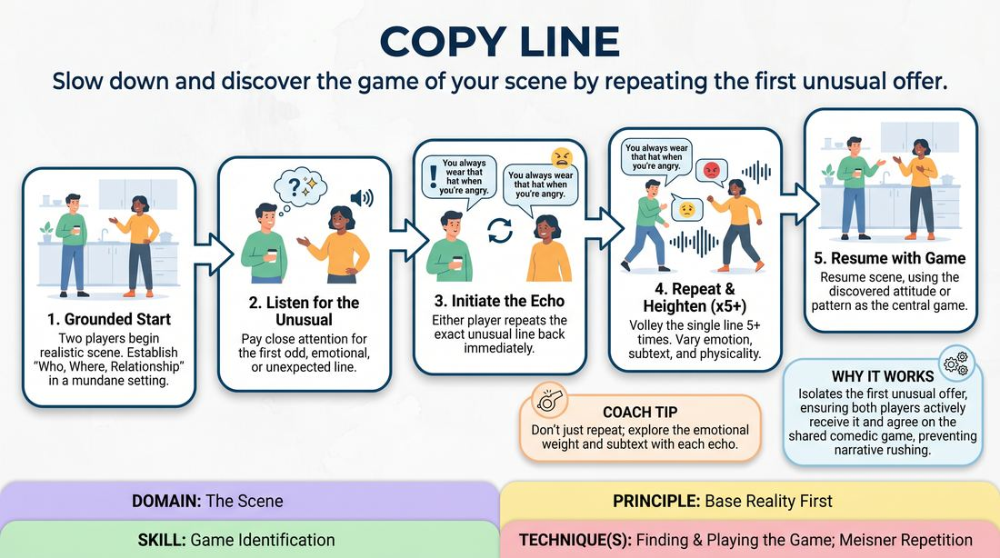

# The Echo Line

{ .game-hero }

> Slow down and discover the game of your scene by repeating the first unusual offer.

## Overview
Two players initiate a grounded scene to establish a clear, realistic base reality. As soon as an unusual or emotionally charged line is spoken, the players pause their narrative progression to repeat that exact line back and forth several times. This repetition acts as a magnifying glass, helping both players align on the scene's comedic game before continuing.

## What It Trains
- **Domain:** D3 — The Scene
- **Principle(s):** Base Reality First; Yes, And
- **Skill(s):** Game Identification; Heightening & Exploration; Active Listening; Offer Reception
- **Technique(s):** Finding & Playing the Game; Meisner Repetition; Exploring the 'why'
- **Focus:** skill_drill

**Objective:** To develop game identification and offer reception by forcing players to pause, actively listen to the first unusual thing, and explore its subtextual patterns rather than rushing forward to new information.

## Setup
An in-person playing space with two chairs or a clear stage area. The rest of the group acts as active observers. No props or special materials are required.

## How to Play
1. Ask two players to take the stage and obtain a simple, mundane suggestion to establish a grounded base reality.
2. The players begin a standard, realistic scene, focusing on establishing who they are, where they are, and their relationship.
3. Both players listen closely for the 'first unusual thing'—a line, reaction, or choice that stands out as slightly odd, highly emotional, or unexpected.
4. Once the unusual line is spoken, either player can initiate the echo by repeating that exact line back to their partner with the same or heightened emotional commitment.
5. The players must now volley this single line back and forth at least five times, experimenting with different subtexts, physicalities, and emotional weights each time.
6. After the repetition cycle, the players resume the scene, integrating the discovered attitude or pattern as the central game of their interaction.

## Facilitation Notes
- Side-coaching cue: 'Don't rush past the weirdness! If you hear something odd, freeze the plot and echo it.'
- Common Pitfall: Players repeat the line mechanically without changing the emotional subtext. Fix: Encourage them to find a new 'why' behind the line with each repetition (e.g., defensive, joyful, sarcastic).
- If a player misses the unusual line, the other player should boldly repeat it again to signal the game. If both miss it, the facilitator can call out 'Echo!' to prompt them.
- Ensure the initial setup is truly grounded; if the scene starts too wacky, it is difficult to identify a single 'first unusual thing'.

## Variations
- Physical Echo: Instead of repeating a spoken line, players repeat and exaggerate a specific physical gesture or piece of object work five times.
- The Emotional Echo: Players repeat the line but must shift to a completely different, extreme emotion with each repetition (e.g., angry, then terrified, then ecstatic).
- Silent Echo: The players do not speak the line, but instead mimic the exact facial expression and posture of the offer back and forth.

## Debrief
- How did repeating the line change your understanding of what the scene was actually about?
- Did you find it easier or harder to build a scene when you weren't allowed to introduce new plot points immediately?
- How did the emotional subtext of the line evolve over the course of the five repetitions?

## Safety & Inclusion
Ensure players feel safe exploring heightened emotional states during the repetition phase. Remind participants that they can choose to echo lines that are quirky or unusual without being emotionally distressing or crossing personal boundaries.

## Why It Works
By forcing players to repeat a single line, the game disrupts the common habit of 'yes-and-and-then' narrative rushing. It isolates the first unusual offer, ensuring both players have actively received it and are in agreement. This shared focus naturally reveals the underlying comedic pattern (the game) through emotional exploration rather than intellectual plotting.
