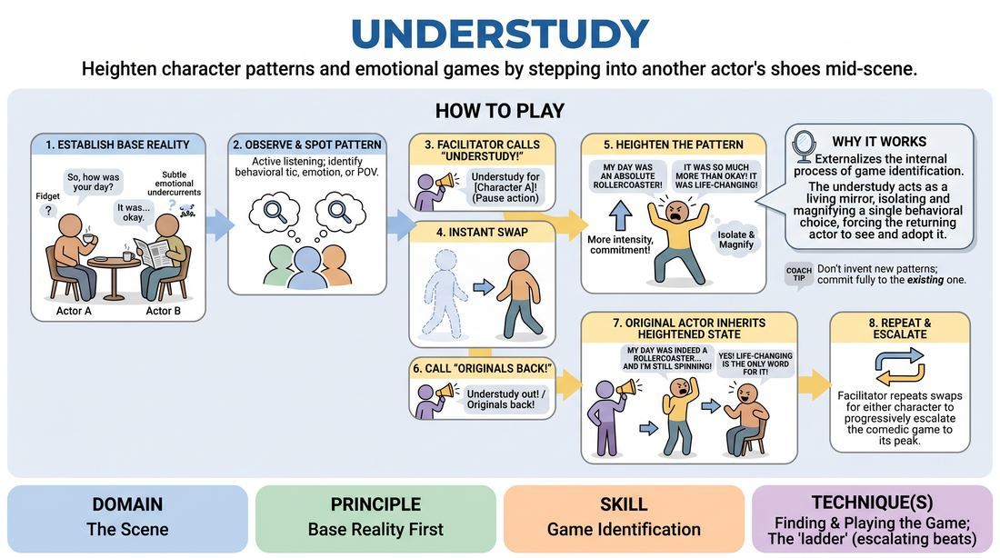

# Understudy

{ .game-hero }

> Heighten character patterns and emotional games by stepping into another actor's shoes mid-scene.

## Overview
Two players initiate a grounded, realistic scene to establish a firm base reality. At any moment, the facilitator calls out 'Understudy!' for one of the characters, prompting an off-stage player to instantly swap in, isolate the character's core behavioral pattern, and aggressively heighten it. When the original actor swaps back in, they must inherit and continue this newly amplified game.

## What It Trains
- **Domain:** D3 — The Scene
- **Principle(s):** Base Reality First; Group Mind; Make Your Partner a Genius
- **Skill(s):** Game Identification; Heightening & Exploration; Support Work; Single-Partner Empathy & Mirroring
- **Technique(s):** Finding & Playing the Game; The 'ladder' (escalating beats); Tap-ins; Emotional-echo drills
- **Focus:** mixed

**Objective:** To develop rapid game identification and physical/emotional heightening. Players practice isolating a partner's subtle behavioral choices, amplifying them as an understudy, and seamlessly mirroring those heightened choices when returning to the scene.

## At a Glance
| Aspect | Detail |
|---|---|
| Players | 4+ (ideal 6-10) |
| Time | ~10 min |
| Complexity | 3/5 |
| Skill level | competent |
| Energy | medium |
| Physicality | medium |
| Modality | in_person |
| Space | moderate |
| Props | none |
| Audience | not required |

## Setup
An open performance space with two active players on stage and the remaining players standing on the wings as an active audience/ensemble. The facilitator acts as the Director, positioned where they can clearly observe and call out cues.

## How to Play
1. Two players step forward and begin a grounded, relationship-focused scene, establishing a clear base reality (who, what, where) with subtle emotional undercurrents.
2. The off-stage players watch closely, actively looking for emerging behavioral patterns, emotional tics, or unusual points of view in the active characters.
3. Once a pattern is established, the facilitator (or an off-stage player) calls out 'Understudy for [Character Name]!' and pauses the action.
4. The original actor steps out of the scene, and an off-stage player immediately steps into their exact physical position.
5. The scene resumes. The new 'understudy' player must immediately adopt the character's established pattern but perform it with significantly more intensity, commitment, and comedic heightening.
6. After a few lines of this heightened play, the facilitator calls 'Understudy out!' or 'Originals back!'
7. The original actor steps back into the scene, instantly adopting the newly amplified emotional state and behavioral choices demonstrated by their understudy.
8. The facilitator can repeat this process multiple times, swapping understudies for either character to progressively escalate the scene's comedic game to its peak.

## Facilitation Notes
- Coaching cue: 'Look for the unusual.' Remind off-stage players not to invent a brand-new trait, but to find the seed of what the original actor was already doing and water it.
- Pitfall: Understudies changing the plot. Fix: Remind players that an understudy's job is to play the same role, just with more theatrical energy and clearer choices, not to introduce new narrative twists.
- Coaching cue: 'Match the physical posture.' Encourage returning actors to physically mirror the understudy's body language to easily tap into the heightened emotional state.
- Ensure the base reality is solid before the first swap. If the scene starts too chaotic, the understudy won't have a clear pattern to isolate and heighten.

## Variations
- Double Understudy: Both characters are swapped out simultaneously, forcing two new players to negotiate a highly amplified version of the scene's dynamic.
- Ensemble-Led Swaps: Instead of the facilitator calling the swaps, off-stage players can self-tag by shouting 'Understudy!' and running on stage when they spot a game they want to play.
- The Style Shift: The understudy must play the character's core game but in a specific theatrical genre (e.g., Shakespearean, Soap Opera, Melodrama) called out by the facilitator.

## Debrief
- How did establishing a quiet, grounded base reality at the start make it easier to identify the 'game' of the character?
- As an understudy, what clues did you look for to determine which behavior to heighten?
- For the original actors, what was it like to inherit a highly exaggerated version of your own initial choices?

## Safety & Inclusion
Ensure physical swaps are done safely without colliding. Since players are stepping into the exact physical space of another, maintain spatial awareness. If a character's heightened trait involves high physicality, players should adapt it to their own physical comfort and safety levels.

## Why It Works
This game works because it externalizes the internal process of game identification. By physically replacing an actor, the understudy acts as a living mirror, isolating and magnifying a single behavioral choice. This forces the returning actor to bypass intellectualizing and immediately play the heightened reality, demonstrating the power of 'yes-and' through physical and emotional commitment.
