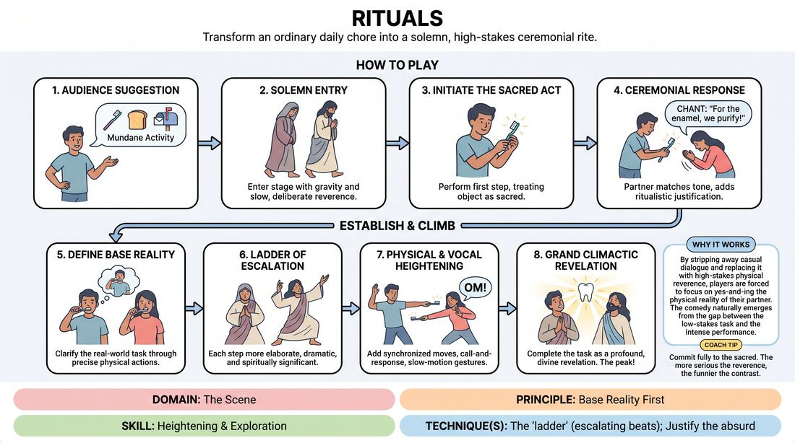

# Mundane Rituals

{ .game-hero }

> Transform an ordinary daily chore into a solemn, high-stakes ceremonial rite.

## Overview
In this game, players take a simple, everyday task and perform it with the gravity, precision, and reverence of an ancient, sacred ritual. The humor and narrative tension build as players treat mundane objects and actions as holy artifacts and sacraments, escalating the stakes with every step. The contrast between the triviality of the task and the intensity of the performance creates a powerful comedic engine.

## What It Trains
- **Domain:** D3 — The Scene
- **Principle(s):** Base Reality First; Yes, And; Commit 100%; The Audience Is the Final Scene Partner
- **Skill(s):** Heightening & Exploration; Justification; Physicality & Space Work; Offer Reception
- **Technique(s):** The 'ladder' (escalating beats); Justify the absurd; Object work; Endowment-acceptance
- **Focus:** comedy_game

**Objective:** To develop the skill of heightening and exploration by establishing a clear base reality first, then systematically elevating the emotional and physical stakes of simple actions using the ladder technique.

## At a Glance
| Aspect | Detail |
|---|---|
| Players | 2–6 (ideal 2-4) |
| Time | ~5 min |
| Complexity | 2/5 |
| Skill level | advanced_beginner |
| Energy | medium |
| Physicality | medium |
| Modality | in_person |
| Space | moderate |
| Props | none |
| Audience | required |

## Setup
A clear stage area for 2 to 4 active players. The remaining group acts as the audience, seated in front of the stage to provide a suggestion and serve as the congregation.

## How to Play
1. Ask the audience for a suggestion of a mundane, everyday activity, such as making toast, checking the mail, or brushing teeth.
2. The players enter the stage with a slow, deliberate, and highly reverent physical posture, immediately establishing a solemn, ceremonial atmosphere.
3. Player A initiates the scene by performing the first physical step of the mundane activity, treating the mimed objects with extreme care as if they were sacred relics.
4. Player B receives this offer, matching the high-stakes tone, and justifies the action by adding a ceremonial response, such as a rhythmic chant, a deep bow, or presenting a secondary mimed object.
5. Together, the players establish a clear base reality by identifying the real-world task through their precise physical actions, ensuring the audience knows exactly what chore is being performed.
6. Players begin climbing the ladder of escalation, making each subsequent step of the task more elaborate, dramatic, and spiritually significant than the last.
7. Introduce physical and vocal heightening, such as synchronized movements, call-and-response dialogue, or slow-motion gestures, to elevate the tension of the ceremony.
8. Bring the ritual to a grand, climactic peak where the mundane task is finally completed, treating this final moment as a profound, divine revelation.

## Facilitation Notes
- Side-coaching cue: Treat every mimed object like it is made of spun gold and ancient magic. Slow down your physical work.
- Common Pitfall: Rushing to the weirdness without establishing the base reality. Fix: Remind players to clearly mime the actual physical steps of the real-world task first before making it weird.
- Side-coaching cue: Match and raise. If your partner bows, you must prostrate yourself. Climb the ladder step by step.
- Common Pitfall: Breaking character or laughing. Fix: Encourage players to find the comedy in absolute, deadpan commitment rather than trying to act funny.
- Side-coaching cue: Use call-and-response. Let the repetition build the sacred atmosphere.

## Variations
- The Initiate: One player is a novice being inducted into the ritual, learning the bizarre, high-stakes steps on the fly from the experienced high priests.
- Chanted Commentary: One or two off-stage players act as a solemn choir, chanting the holy scriptures of the mundane task to accompany the physical action on stage.

## Debrief
- How did establishing a clear, slow physical base reality help you find specific details to heighten later?
- What happened to the comedic tension when you committed 100% to the gravity of the situation instead of playing it for laughs?
- How did the ladder technique help you pace the scene so that the ritual didn't peak too early?

## Safety & Inclusion
Ensure physical movements like kneeling, bowing, or chanting are adapted to players' physical comfort and mobility levels. Avoid mocking actual living religious practices; focus the parody entirely on the absurdity of the mundane task itself.

## Why It Works
By stripping away casual dialogue and replacing it with high-stakes physical reverence, players are forced to focus on yes-and-ing the physical reality of their partner. The comedy naturally emerges from the gap between the low-stakes task and the high-stakes execution, allowing players to easily practice escalating beats.
