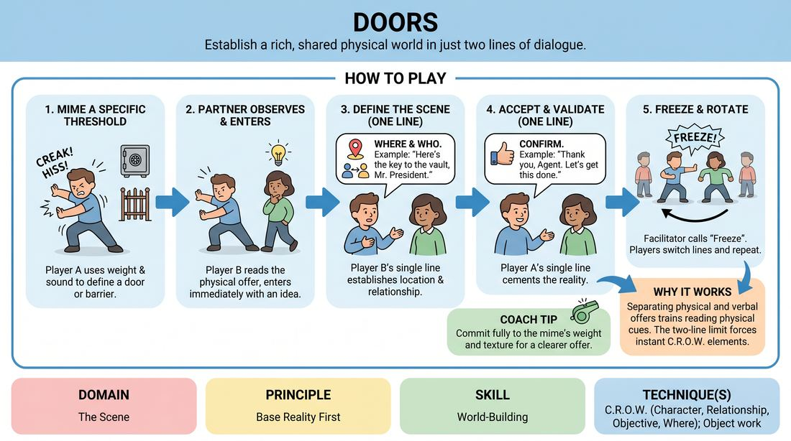

# Thresholds

{ .game-hero }

> Establish a rich, shared physical world in just two lines of dialogue.

## Overview
Thresholds is a rapid-fire, two-person drill designed to build a solid base reality instantly. One player mimes passing through a specific type of door or barrier, and their partner enters with a single line that defines the location and relationship, followed by a confirming response.

## What It Trains
- **Domain:** D3 — The Scene
- **Principle(s):** Base Reality First; Yes, And; Make Your Partner a Genius
- **Skill(s):** World-Building; Physicality & Space Work; Offer Reception; Active Gifting
- **Technique(s):** C.R.O.W. (Character, Relationship, Objective, Where); Object work; Endowment-acceptance; Endowment-gifting drills
- **Focus:** skill_drill

**Objective:** To master the rapid establishment of C.R.O.W. (Character, Relationship, Objective, Where) using physical environment work and immediate verbal agreement, laying a strong foundation for any scene.

## At a Glance
| Aspect | Detail |
|---|---|
| Players | 2+ (ideal 6-12) |
| Time | ~10 min |
| Complexity | 2/5 |
| Skill level | novice |
| Energy | medium |
| Physicality | low |
| Modality | in_person |
| Space | minimal |
| Props | none |
| Audience | not required |

## Setup
Players form two parallel lines facing each other (Line A and Line B). The space between them serves as the stage. No props or special materials are required.

## How to Play
1. The first player from Line A steps into the performance space and mimes interacting with a specific type of door, gate, or barrier (e.g., a heavy bank vault, a bead curtain, a spaceship hatch).
2. The player must use physical weight, speed, and optional sound effects to clearly communicate the nature of this threshold and the environment beyond it.
3. The first player from Line B observes the physical offer, identifies a potential setting, and steps into the scene as soon as they have an idea.
4. Player B delivers a single, clear line of dialogue that establishes the 'Where' (location) and the 'Who' (their relationship to Player A).
5. Player A immediately responds with a single line of dialogue that accepts, validates, and builds upon Player B's offer, cementing the base reality.
6. Once these two lines of dialogue are spoken, the facilitator calls 'Freeze' or 'Scene,' and both players return to the back of the opposite lines.
7. The next pair steps up immediately, with the player from Line B now initiating the physical threshold, keeping the rotation moving quickly.

## Facilitation Notes
- Encourage diverse thresholds: Remind players that a 'door' can be a zipper, a doggy door, a laser grid, or a heavy wooden drawbridge.
- Avoid the guessing game: Player B shouldn't try to guess exactly what Player A was thinking; instead, they should make a strong, definitive choice based on the physical clues and commit to it.
- Side-coaching cue: 'Show us the weight!' If a player mimes a heavy door too easily, remind them to engage their muscles and use sound effects.
- Pitfall: Over-talking. Ensure players stick strictly to the one-line-each rule to keep the focus on rapid, high-impact world-building.

## Variations
- Silent Thresholds: Play the entire interaction in complete silence, relying solely on physical space work and facial expressions to establish the relationship and location.
- Three-Line Build: Add a third line of dialogue from Player B to establish an immediate 'Objective' or conflict, completing the C.R.O.W. framework before ending.
- Blind Entrances: Player B turns their back while Player A mimes the door, turning around only when they hear the sound effect, forcing them to react instantly to the physical state Player A is in.

## Debrief
- How did the physical details of the door (weight, speed, sound) help you instantly understand the environment?
- What made the verbal offers successful in establishing a relationship right away?
- How does establishing a clear 'Where' and 'Who' in the first few seconds make the rest of a scene easier to play?

## Safety & Inclusion
Ensure the physical space is clear of obstacles. Players with limited mobility can adapt the physical 'door' to any barrier or boundary that suits their physical comfort level, such as a verbal description of a sensory boundary or a simple hand gesture.

## Why It Works
By separating the physical initiation from the verbal initiation, players learn to read physical offers before speaking. Limiting the dialogue to two lines prevents over-complication, forcing players to rely on the C.R.O.W. framework to establish a rich, shared base reality instantly.
