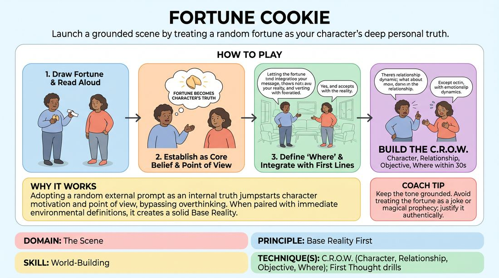

# Fortune Cookie Scene

{ .game-hero }

> Launch a grounded scene by treating a random fortune as your character's deep personal truth.

## Overview
In this exercise, players use a random fortune cookie slip as the immediate inspiration for a scene's emotional core. Instead of treating the fortune as a joke or a magical prophecy, players must instantly justify it as their character's personal philosophy, using it to build a solid, believable relationship and environment.

## What It Trains
- **Domain:** D3 — The Scene
- **Principle(s):** Base Reality First; The First Thought Is a Gift; Yes, And
- **Skill(s):** World-Building; Unfiltered Spontaneity; Offer Reception; Justification
- **Technique(s):** C.R.O.W. (Character, Relationship, Objective, Where); First Thought drills; Endowment-acceptance; Justify the absurd
- **Focus:** mixed

**Objective:** To develop a strong base reality (C.R.O.W.) by practicing immediate justification, offer reception, and grounded world-building from an arbitrary prompt.

## At a Glance
| Aspect | Detail |
|---|---|
| Players | 2+ (ideal 2-8) |
| Time | ~10 min |
| Complexity | 2/5 |
| Skill level | novice |
| Energy | medium |
| Physicality | low |
| Modality | in_person |
| Space | minimal |
| Props | Fortune cookies |
| Audience | not required |

## Setup
An open performance space with two chairs. A bowl containing real fortune cookies (or a basket of paper slips printed with classic fortune cookie fortunes).

## How to Play
1. Two players step up to the performance space, and one player selects and opens a fortune cookie (or draws a paper fortune slip).
2. The player reads the fortune aloud to the partner and the audience; this text is now established as an absolute truth or core belief for that player's character.
3. The players immediately begin the scene by establishing physical object work to define the 'Where' (the physical environment).
4. The player who read the fortune must integrate the fortune's message into their character's point of view or objective within their first two lines of dialogue.
5. The second player accepts this perspective ('Yes, And') by defining their relationship to the first player and justifying why this philosophy matters to them both right now.
6. Both players work together to flesh out the C.R.O.W. (Character, Relationship, Objective, Where) within the first thirty seconds, keeping the tone grounded and realistic.
7. The scene plays out for two to three minutes, focusing on how this shared or clashed philosophy affects the characters' relationship.

## Facilitation Notes
- Coaching cue: 'Don't just recite the fortune. Make it your character's deeply held belief, a piece of advice they are desperate to follow, or a secret fear.'
- Common pitfall: Treating the fortune as a literal magic spell or a wacky, absurd event. Fix: Guide players back to a recognizable, everyday relationship (e.g., parent/child, coworkers, spouses) to ground the scene.
- Coaching cue: 'Use your environment! Show us where you are through physical actions so the dialogue doesn't float in empty space.'
- Remind players that 'The First Thought Is a Gift.' Whatever relationship or setting comes to mind when the fortune is read, commit to it immediately without second-guessing.

## Variations
- Secret Fortunes: Both players draw a fortune in secret. They must reveal their fortunes solely through their character's behavior, objectives, and subtext without ever reading them aloud.
- The Oracle: One player plays a character who can only speak using fortunes drawn from the bowl, while the other player must realistically justify how this cryptic advice perfectly applies to their very mundane, high-stakes problem.

## Debrief
- How did having a pre-determined philosophy (the fortune) help you establish your character's objective and point of view?
- What strategies did you use to make a generic, abstract fortune feel deeply personal and grounded in a relationship?
- How did physical object work help anchor the scene so it didn't become just a talking-head debate about the fortune?

## Safety & Inclusion
If using real fortune cookies, check with all participants beforehand regarding food allergies (such as gluten or soy). If allergies are present, use paper slips exclusively. Ensure the pre-written fortunes do not contain culturally insensitive or offensive stereotypes.

## Why It Works
This game works because it bypasses the analytical mind. By forcing a player to adopt a random, external prompt as an internal truth, it jumpstarts character motivation (Objective) and point of view. When paired with immediate physical environment work (Where) and relationship definition (Relationship), it teaches players how to construct a complete, compelling base reality (C.R.O.W.) out of any unexpected offer.
