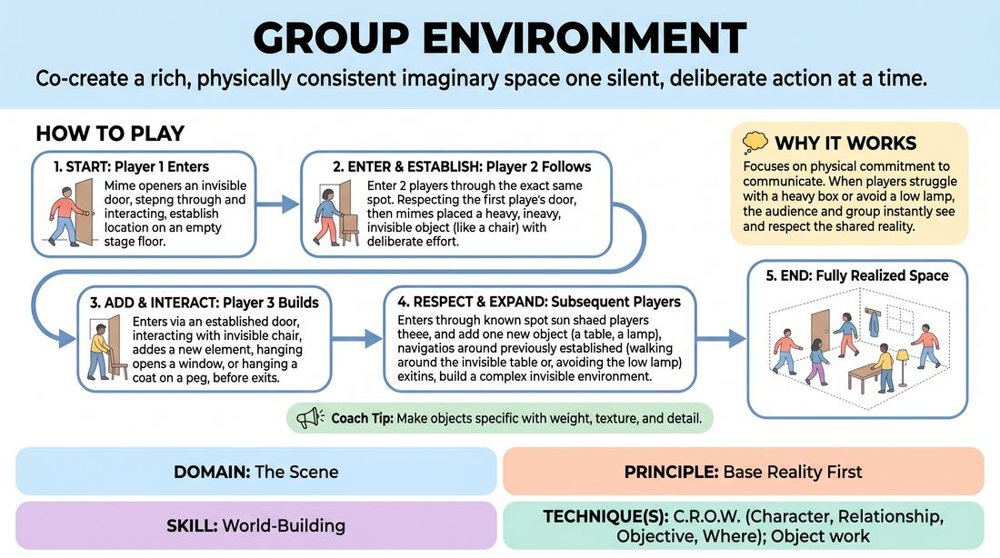

# The Shared Room

{ .game-hero }

> Co-create a rich, physically consistent imaginary space one silent, deliberate action at a time.

## Overview
Players take turns entering an empty stage to establish and interact with a single, shared physical environment. By adding mimed objects and respecting previously established items, the group builds a highly detailed, invisible set. The experience emphasizes spatial memory, physical consistency, and collaborative world-building.

## What It Trains
- **Domain:** D3 — The Scene
- **Principle(s):** Show, Don't Tell; Base Reality First; Group Mind
- **Skill(s):** Physicality & Space Work; World-Building; Peripheral Awareness
- **Technique(s):** Object work; C.R.O.W. (Character, Relationship, Objective, Where); Thread-tracking drills
- **Focus:** skill_drill

**Objective:** To develop a strong sense of 'Where' (from C.R.O.W.) and establish a solid Base Reality. Players learn to show rather than tell, using precise physicality and space work to make imaginary objects feel tangible and permanent to both the performers and the audience.

## Setup
An empty stage or playing area representing the room to be built. The remaining players sit in an audience line facing the stage, observing closely to track the location and dimensions of every established object.

## How to Play
1. The first player steps onto the empty stage, mimes opening and entering through a specific door (establishing its location, handle type, and weight), walks into the space, and then exits, either through the same door or by establishing a second exit.
2. The next player enters the space using one of the established doors, respecting its exact location and mechanism.
3. This second player introduces a new mimed object to the room (e.g., placing a heavy chair, hanging a coat on a peg, or opening a window) and interacts with it briefly to define its size, weight, and location.
4. Before exiting, the player must also interact with or acknowledge at least one object established by a previous player (e.g., walking around a table or glancing at a clock).
5. The player then exits the space through an established door or by creating a logical new exit.
6. Subsequent players repeat this process, each entering, interacting with existing elements, adding one new element that fits the emerging environment, and exiting.
7. The game continues until all players have contributed, resulting in a fully realized, invisible room that everyone can navigate flawlessly.

## Facilitation Notes
- Side-coaching cue: 'Feel the weight!' Remind players to use their muscles to convey the resistance, weight, and texture of the objects they touch.
- Watch out for 'ghosting'—players walking directly through established tables, walls, or chairs. Gently call out 'Ghost!' and have them retrace their steps to walk around the object.
- Discourage 'gagging' or disruptive additions (e.g., placing a laser grid in a cozy kitchen). The goal is a cohesive Base Reality, not a quick laugh that breaks the established logic.
- Encourage players to use all their senses: react to the temperature of the room, the smell of the imaginary soup, or the creak of a floorboard.

## Variations
- Character & Relationship: Have players enter as specific characters who have a relationship to the space or to each other, adding emotional context to how they interact with the objects.
- The Living Room: Once the room is fully built, two or three players enter simultaneously and play a fully voiced scene using the established environment as their set.
- Blind Build: The players in line close their eyes and only listen to the physical sounds (footsteps, mimed effort) and verbalized descriptions (if allowed), relying entirely on memory when they step up.

## Debrief
- What physical details made certain objects feel the most real or permanent to you?
- How did respecting the established environment help you make choices when it was your turn to enter?
- How does having a highly detailed 'Where' make starting a scene easier and more grounded?

## Safety & Inclusion
Ensure the physical path is clear of actual tripping hazards. Players with mobility considerations can establish objects that accommodate their needs (e.g., a comfortable ramp, a low table, or a wide doorway) which the rest of the group must then physically respect and preserve.

## Why It Works
By stripping away dialogue, players must rely entirely on physical commitment to communicate. When a player struggles to lift a heavy box or carefully avoids a low-hanging light fixture, the audience and subsequent players instantly see the space. This shared physical agreement builds Group Mind and ensures that the Base Reality is solid before any verbal narrative begins.
