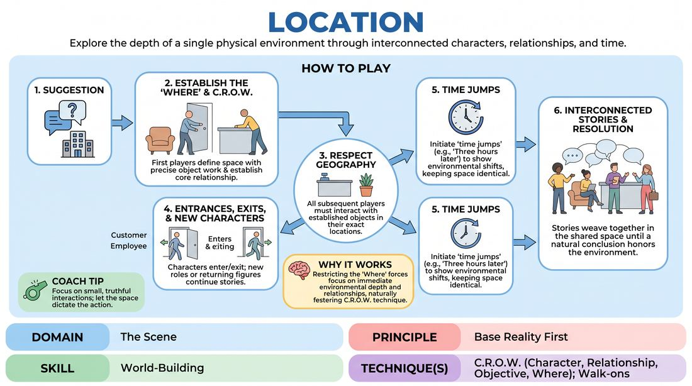

# The Shared Space

{ .game-hero }

> Explore the depth of a single physical environment through interconnected characters, relationships, and time.

## Overview
The Shared Space is a long-form improv format where players establish and maintain a single, unchanging physical location for an entire performance. Characters enter, interact, and exit, weaving a tapestry of interconnected stories while strictly respecting the established geography and objects of the environment. This game challenges players to build a rich base reality and explore the narrative possibilities of a single 'Where'.

## What It Trains
- **Domain:** D3 — The Scene
- **Principle(s):** Base Reality First; Serve the Piece
- **Skill(s):** World-Building; Support Work; Format Literacy
- **Technique(s):** C.R.O.W. (Character, Relationship, Objective, Where); Walk-ons; Longform vs. shortform mechanics
- **Focus:** mixed

**Objective:** To master the C.R.O.W. framework (Character, Relationship, Objective, Where) by establishing a robust, consistent base reality and using physical world-building to support ongoing narrative threads.

## At a Glance
| Aspect | Detail |
|---|---|
| Players | 3+ (ideal 6-12) |
| Time | ~20 min |
| Complexity | 4/5 |
| Skill level | competent |
| Energy | medium |
| Physicality | medium |
| Modality | in_person |
| Space | moderate |
| Props | none |
| Audience | not required |

## Setup
An open performance space with a clear 'stage' area and an 'off-stage' area where players wait. No physical props are used; all furniture, doors, and items must be established through consistent object work. The facilitator asks the group for a specific, mundane, or interesting location (e.g., a laundromat, a hotel lobby, a community garden).

## How to Play
1. Obtain a single, specific location suggestion from the group to serve as the anchor for the entire piece.
2. The first player enters the space and immediately establishes the physical layout (the 'Where') using precise, silent object work to define doors, counters, windows, or furniture.
3. A second player enters, adopting a clear relationship to the first player and the space, establishing their Character, Relationship, and Objective to complete the C.R.O.W. foundation.
4. Players must respect the established physical geography; if a counter is placed on stage-left, all subsequent players must interact with it in that exact location.
5. Characters may exit the space naturally, leaving others behind or leaving the stage empty momentarily to signal a transition.
6. Subsequent players can enter as new characters (e.g., customers, employees, passersby) or re-enter as previously established characters to continue ongoing storylines.
7. Players can initiate 'time jumps' (e.g., 'three hours later' or 'the next morning') while keeping the physical location identical, allowing the environment to show the passage of time.
8. The piece concludes after a designated time limit or when the interconnected stories reach a natural, satisfying resolution that honors the shared space.

## Facilitation Notes
- Side-coach players to focus on object work: if someone drinks from a mug, that mug must exist when they set it down. Remind them: 'Where is that table now?'
- Pitfall: Players turn the game into a series of unrelated two-person scenes. Fix: Encourage players to re-enter as previous characters or reference events/objects left behind by others to build continuity.
- Encourage 'low-stakes' entries. Not every entrance needs to bring high drama; sometimes a character just needs to sweep the floor or read a magazine to ground the reality.
- Side-coach C.R.O.W. elements early: 'Who are you to each other? What do you want in this space?'

## Variations
- Time-Traveler: Allow scenes to take place in the exact same physical space but across different eras (e.g., the same room in 1820, 1950, and 2050).
- The Ghost: One player remains in the space as an invisible observer or 'spirit' of the room, reacting to the changing occupants over time.
- Monologue Cutaways: A player can step to the edge of the stage to deliver a brief internal monologue, freezing the action in the main space, before stepping back into the scene.

## Debrief
- How did having a fixed physical location affect your character choices and relationships?
- What techniques did we use to make the physical environment feel real and consistent to the audience and each other?
- How did returning characters or referencing past events in the space help build a cohesive narrative?

## Safety & Inclusion
Ensure the physical layout of the space is accessible to all players. If a player has mobility constraints, the group should collectively establish a physical layout (e.g., ramps, seating) that accommodates everyone seamlessly without making it a point of struggle.

## Why It Works
By restricting the 'Where' to a single location, players are forced to abandon high-concept plot generation and instead focus on the depth of their immediate environment and relationships. This constraint naturally fosters the C.R.O.W. technique, as players must define who they are and why they are in this specific space, leading to organic, character-driven storytelling.
