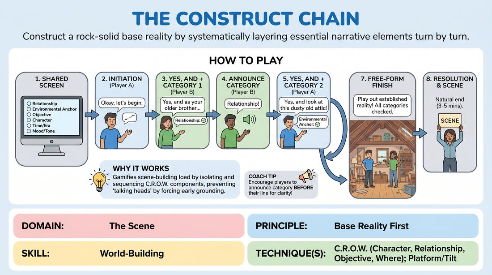

# The Narrative Scaffold

{ .game-hero }

> Construct a rock-solid base reality by systematically layering essential narrative elements turn by turn.

## Overview
The Narrative Scaffold is a structured scene-building game designed for virtual play where two to three players systematically construct a scene's foundation. By taking turns that must both accept the previous offer and fulfill a specific narrative category, players learn to build a complete world. The experience is highly deliberate, transforming the chaotic early moments of a scene into a satisfying, collaborative puzzle.

## What It Trains
- **Domain:** D3 — The Scene
- **Principle(s):** Base Reality First; Serve the Story; Yes, And
- **Skill(s):** World-Building; Narrative Architecture; Stakes / The 'Want'; Offer Reception; Justification
- **Technique(s):** C.R.O.W. (Character, Relationship, Objective, Where); Platform/Tilt; Yes, And… sentence games; Stakes-escalation reps
- **Focus:** narrative

**Objective:** To develop a deep, intuitive grasp of C.R.O.W. (Character, Relationship, Objective, Where) and Base Reality First. Players learn to move beyond generic agreement by making targeted, high-value narrative contributions that establish stakes and physical context early in a scene.

## Setup
Designed for a virtual video platform. The facilitator shares their screen displaying a digital whiteboard or document listing five to seven narrative categories: 1. Relationship Revelation, 2. Environmental Anchor, 3. Objective/Problem Ignited, 4. Stakes Escalated, 5. Implied History, 6. Emotional Arc. No physical props are required, but players must be able to see the shared list.

## How to Play
1. The facilitator displays the list of six narrative categories on the shared screen so all players can track them.
2. Player A initiates the scene with a simple, open-ended line of dialogue or a clear physical action to establish a starting point.
3. Player B responds by explicitly 'Yes, And-ing' Player A's initiation, while simultaneously incorporating the first category from the list (e.g., Relationship Revelation).
4. Player B verbally announces the category they are fulfilling before or immediately after delivering their line (e.g., 'Relationship: Yes, and as your older brother, I...').
5. Player A then responds, accepting Player B's contribution and incorporating the second category (e.g., Environmental Anchor) to ground the scene in a physical space.
6. Players continue alternating turns, selecting an unused category from the shared list for each line, ensuring every contribution builds logically on the last.
7. Once all categories on the list have been checked off, the facilitator transitions the players into a 'Free-Form Finish' where they play out the established reality naturally without category constraints.
8. The facilitator calls 'Scene' once the narrative arc reaches a natural resolution, typically within 3 to 5 minutes of free-form play.

## Facilitation Notes
- Side-coaching cue: 'Don't just name the category—make it matter to your character!' Ensure players feel the emotional weight of the elements they introduce.
- Pitfall: Players treat the categories as a checklist, dropping unrelated facts that derail the scene. Fix: Remind them that the 'Yes' (acceptance of the previous line) must come before the 'And' (the category addition).
- Side-coaching cue: 'Use your virtual frame!' Encourage players to use physical object work and eye contact relative to their cameras to support the 'Environmental Anchor' category.
- Pitfall: One player dominates the narrative direction. Fix: The turn-based structure naturally balances contribution, but coach players to keep their lines concise so their partner has room to build.

## Variations
- Blind Draw: Instead of a visible list, the facilitator privately messages each player their next category via the chat window, forcing the other player to discover the narrative element organically.
- Three-Player Rotation: Introduce a third player into the rotation, requiring even tighter listening as the narrative thread passes through three distinct perspectives.
- The Revisit & Deepen: After completing the list, players must go through the categories a second time, but instead of introducing new facts, they must deepen or complicate the existing ones.

## Debrief
- How did having a structured checklist change the way you listened to your partner's offers?
- Which category felt the most challenging to integrate naturally, and why?
- How did establishing the 'Where' and 'Relationship' early on affect the stakes of the scene later?
- In what ways can we apply this deliberate building style to our unstructured, free-form scenes?

## Safety & Inclusion
Since this game is played virtually, ensure players are mindful of physical accessibility; physical actions can be adapted to facial expressions, vocal shifts, or descriptive verbal choices. Encourage players to establish boundaries around personal relationships or sensitive topics during the setup phase.

## Why It Works
This game works because it gamifies the cognitive load of scene-building. By isolating the individual components of C.R.O.W. and forcing players to address them sequentially, it prevents the common trap of 'talking heads' scenes. The structured constraint of 'Yes, And-ing' a specific category ensures that both players share the cognitive weight of world-building, resulting in a balanced, highly detailed base reality that naturally generates its own narrative momentum.
