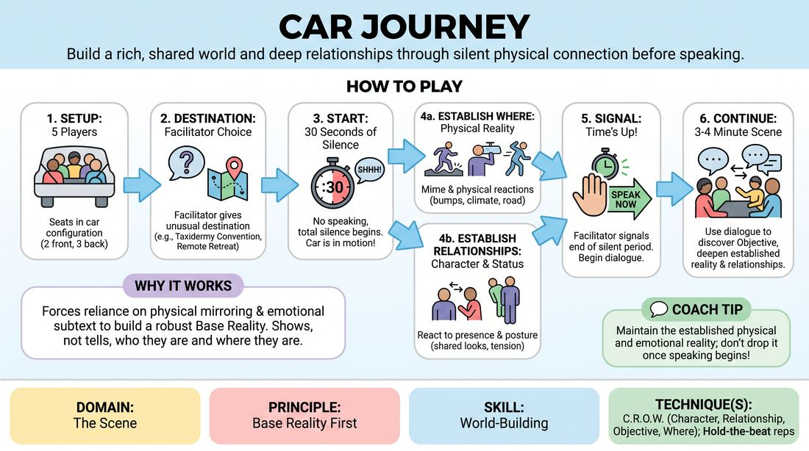

# Road Trip Base Reality

{ .game-hero }

> Build a rich, shared world and deep relationships through silent physical connection before speaking.

## Overview
Five players sit in a simulated car, embarking on an unusual journey. By starting with thirty seconds of absolute silence, players must establish their physical environment, individual characters, and interpersonal dynamics using only body language, eye contact, and shared physical reactions.

## What It Trains
- **Domain:** D3 — The Scene
- **Principle(s):** Base Reality First; Make Your Partner a Genius; Group Mind
- **Skill(s):** World-Building; Active Listening; Single-Partner Empathy & Mirroring; Peripheral Awareness
- **Technique(s):** C.R.O.W. (Character, Relationship, Objective, Where); Hold-the-beat reps; Stage-picture exercises
- **Focus:** mixed

**Objective:** To master the C.R.O.W. framework (Character, Relationship, Objective, Where) and establish a solid Base Reality before relying on verbal exposition.

## At a Glance
| Aspect | Detail |
|---|---|
| Players | 5+ (ideal 5) |
| Time | ~10 min |
| Complexity | 2/5 |
| Skill level | advanced_beginner |
| Energy | medium |
| Physicality | medium |
| Modality | in_person |
| Space | minimal |
| Props | chairs |
| Audience | not required |

## Setup
Arrange five chairs to mimic a standard car: two in the front row (driver and passenger), three in the back row. The rest of the group watches as an active audience. No physical props are used other than the chairs.

## How to Play
1. Select five players to take seats in the car configuration (two in front, three in back).
2. The facilitator provides a destination that is out of the ordinary for this group, such as a taxidermy convention, a remote spiritual retreat, or a high-stakes family reunion.
3. The scene begins in total silence. For the first 30 seconds, no player may speak or make vocal sounds.
4. During this silent period, players must establish the physical environment (the Where) through mime and physical reactions, such as bumps in the road, adjusting the AC, or looking out windows.
5. Players must also establish their Character and Relationship silently by reacting to one another's physical presence, posture, and status (e.g., sharing a look of annoyance, offering a silent snack, or fighting over legroom).
6. The car must remain in motion; players cannot stop the vehicle or exit during the scene.
7. Once the facilitator signals that 30 seconds have passed, players may begin speaking, using their dialogue to discover their Objective and deepen the established base reality.
8. The scene continues for 3 to 4 minutes, focusing on maintaining the physical reality of the car and the relationships established in the silence.

## Facilitation Notes
- Side-coaching cue: 'Feel the road. If the driver turns, everyone leans.' This trains peripheral awareness and physical mirroring.
- Side-coaching cue: 'Who are you to each other? Show us with a glance, a sigh, or a shared physical boundary.' This helps establish the Relationship element of C.R.O.W.
- Pitfall: Players rushing to speak the moment the 30 seconds are up, erasing the physical work. Fix: Remind them that dialogue should only support the physical reality already built, not replace it.
- Pitfall: The driver ignoring the road or passengers ignoring the driver. Fix: Coach the driver to keep eyes on the road while reacting, and passengers to mirror the car's movement.

## Variations
- The Return Trip: The same cast performs the drive home from the event. They can swap seats, reflecting how the event changed their relationships and energy levels.
- Radio Roulette: The facilitator occasionally mimes turning on the car radio, playing a specific genre of music. The passengers must instantly align their physical energy and mood to the music without speaking.

## Debrief
- How did the initial silence help you understand your relationship with the other passengers before anyone spoke?
- What physical cues did you pick up on that helped you identify the 'Where' and the 'Who'?
- How did keeping the car in motion force you to deal with the immediate present instead of planning future plot points?

## Safety & Inclusion
Ensure players are comfortable with close physical proximity, as five people in chairs can feel tight. Allow players to adjust chair spacing if they need more personal space. If a player has mobility limitations, they can be positioned in the front seat for easier access, or the vehicle can be re-imagined as a spacious train compartment.

## Why It Works
By stripping away verbal communication initially, players are forced to rely on physical mirroring, spatial awareness, and emotional subtext. This builds a robust Base Reality because players must show, not tell, who they are and where they are going. When dialogue is finally introduced, it lands on a fertile foundation of established relationships.
