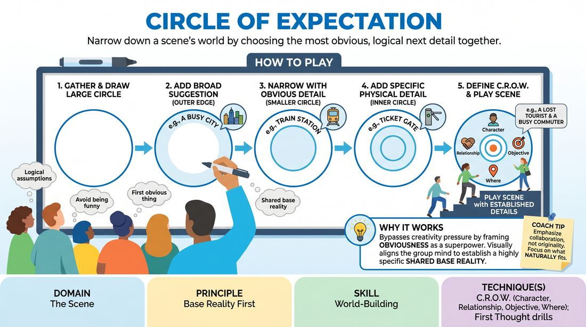

# The Expectation Circle

{ .game-hero }

> Narrow down a scene's world by choosing the most obvious, logical next detail together.

## Overview
The Expectation Circle is a collaborative world-building exercise where players use a whiteboard to visually narrow down a scene's base reality. By starting with a broad suggestion and repeatedly adding the most obvious next detail, the group aligns their imaginations to create a rich, shared platform. This process removes the pressure to be clever and demonstrates how a highly specific context naturally inspires compelling characters and relationships.

## What It Trains
- **Domain:** D3 — The Scene
- **Principle(s):** Base Reality First; The First Thought Is a Gift; Group Mind
- **Skill(s):** World-Building; Unfiltered Spontaneity; Narrative Architecture
- **Technique(s):** C.R.O.W. (Character, Relationship, Objective, Where); First Thought drills; Platform/Tilt
- **Focus:** skill_drill

**Objective:** Develops a strong, shared Base Reality (C.R.O.W.) by prioritizing logical, obvious choices over forced novelty, training players to build worlds collaboratively.

## At a Glance
| Aspect | Detail |
|---|---|
| Players | 3+ (ideal 8-20) |
| Time | ~15 min |
| Complexity | 2/5 |
| Skill level | novice |
| Energy | low |
| Physicality | low |
| Modality | in_person |
| Space | minimal |
| Props | Whiteboard, Markers |
| Audience | not required |

## Setup
A whiteboard, markers, and the group gathered in a semi-circle facing the board. No other props are required.

## How to Play
1. Gather the group around the whiteboard and draw a large circle that fills most of the board.
2. Ask the group for a broad, initial suggestion, such as a city or a general location, and write it on the outer edge of the circle.
3. Explain that this initial detail creates a wide 'circle of expectation'—a set of logical assumptions about what belongs in this world.
4. Draw a slightly smaller circle inside the first one, and ask a player to state the next most obvious detail that fits the established context (e.g., if the outer circle is 'London', an obvious year might be '1888'). Write this inside the second circle.
5. Draw a third, smaller circle inside the second, and ask another player to name a specific physical element or sensory detail that naturally exists in this combined context (e.g., 'foggy cobblestone street').
6. Continue drawing progressively smaller concentric circles, prompting players to define the remaining elements of C.R.O.W.: a character who belongs there, their relationship to someone else, and what they are doing.
7. Emphasize that players must avoid trying to be funny or original; they should simply say the first, most obvious thing that their brain visualizes based on the previous circles.
8. Once the innermost circle is filled with a highly specific, shared base reality, have two players step up to play a short scene using only the established details.

## Facilitation Notes
- Side-coaching cue: 'What is the most boring, obvious thing that comes to mind? Say that!'
- Pitfall: Players trying to be wacky or subversive (e.g., adding 'aliens' to a Victorian London setting). Fix: Gently erase the wacky offer and ask the group, 'What is actually expected here? Let's build trust in the obvious.'
- Side-coaching cue: 'Look at what is already on the board. Let the existing details do the work for you.'
- Pitfall: Over-complicating the details. Fix: Keep the prompts focused on basic sensory details and C.R.O.W. elements rather than complex plot points.

## Variations
- Invisible Circles: Run the exercise without a whiteboard, having players physically gesture to represent the shrinking circles in space.
- Instant Scene Launch: As soon as the final, tiny circle is drawn, the two players who contributed the last details immediately step into the space and start the scene in media res.
- The Unexpected Twist: Once a solid, obvious base reality is established (5-6 circles deep), introduce one minor unusual event that disrupts the expectation, showing how a strong platform makes the comedy pop.

## Debrief
- How did it feel to say the 'obvious' thing instead of trying to be clever?
- How does narrowing down the details make it easier to start a scene?
- Why does a shared, logical base reality make the scene feel more stable for the actors?

## Safety & Inclusion
Ensure that the 'obvious' expectations do not rely on harmful cultural stereotypes. Encourage players to focus on physical environments, historical facts, and universal human relationships.

## Why It Works
It bypasses the pressure to be creative by framing 'obviousness' as a collaborative superpower. By visually shrinking the possibilities, it aligns the group mind so that everyone is imagining the exact same room, street, or era, establishing a rock-solid C.R.O.W. platform.
