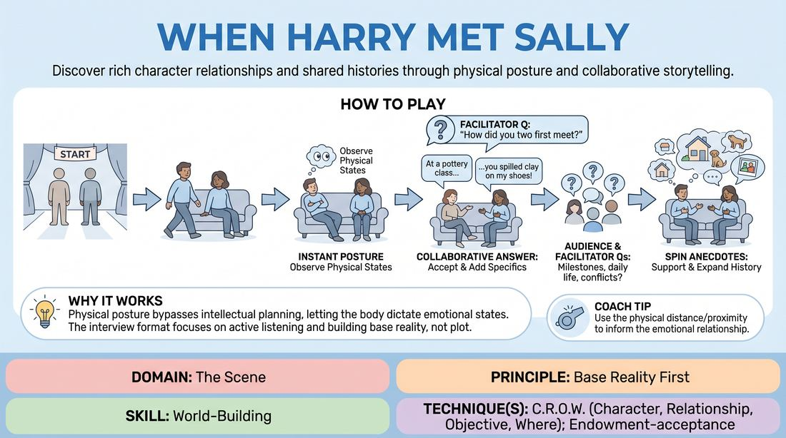

# Couples Retrospective

{ .game-hero }

> Discover rich character relationships and shared histories through physical posture and collaborative storytelling.

## Overview
Two players sit side-by-side on a couch or chairs and instantly adopt distinct physical postures. Prompted by questions from the facilitator and the group, they collaboratively construct a detailed, shared history of their relationship. The exercise focuses on discovering character dynamics through physical offers and building a solid base reality.

## What It Trains
- **Domain:** D3 — The Scene
- **Principle(s):** Yes, And; Make Your Partner a Genius; Base Reality First; Serve the Story
- **Skill(s):** Active Listening; Offer Reception; Active Gifting; World-Building; Narrative Architecture
- **Technique(s):** Endowment-acceptance; Endowment-gifting drills; C.R.O.W. (Character, Relationship, Objective, Where); Story Spine
- **Focus:** mixed

**Objective:** To develop the C.R.O.W. framework (Character, Relationship, Objective, Where) by using physical offers, active listening, and immediate narrative agreement.

## At a Glance
| Aspect | Detail |
|---|---|
| Players | 2+ (ideal 2 active (with group)) |
| Time | ~10 min |
| Complexity | 2/5 |
| Skill level | advanced_beginner |
| Energy | low |
| Physicality | low |
| Modality | in_person |
| Space | minimal |
| Props | sofa, chairs |
| Audience | not required |

## Setup
Place two chairs side-by-side (or a sofa) at the front of the space. The rest of the group sits facing them to act as the interviewers.

## How to Play
1. Two players stand at the back of the playing area as themselves.
2. On the facilitator's cue, the players walk forward and sit down next to each other on the chairs.
3. Upon sitting, both players immediately adopt a distinct physical posture, such as leaning away, slouching, sitting rigidly upright, or draping an arm over the chair.
4. Players observe their own and their partner's physical states, letting this physical relationship instantly inform their character's attitude and feelings toward the other person.
5. The facilitator or the audience opens the interview by asking a foundational question, typically: 'How did you two first meet?'
6. The players take turns answering, treating every detail their partner says as absolute truth and adding specific, colorful details to flesh out the scene's base reality.
7. The audience and facilitator continue to ask follow-up questions about their relationship milestones, daily lives, or conflicts.
8. The players answer these questions by spinning collaborative anecdotes, ensuring they support and expand upon each other's contributions.

## Facilitation Notes
- Side-coaching cue: 'Let your body tell you how you feel before you speak. If you are leaning away, let that physical distance dictate your emotional attitude.'
- Side-coaching cue: 'Be highly specific! Don't just say you met at a restaurant; name the diner, the street, and what you were eating.'
- Pitfall: Players contradicting each other's memories (e.g., 'No, we met in Paris, not Berlin'). Fix: Remind them that while playful bickering is fine, factual agreement builds a stronger base reality. Encourage them to say, 'Yes, and...' to the facts of their history.
- Pitfall: Passive answering where players give short, one-word responses. Fix: Coach the players to treat every question as an invitation to tell a mini-anecdote filled with gifts for their partner.

## Variations
- Emotional Catalyst: Assign a specific shared secret or underlying emotion to the couple before they sit down (e.g., they just won the lottery, or one is about to propose).
- Vocal Shift: Players must alter their vocal placement, pitch, or speech patterns based entirely on the physical posture they adopt when sitting.
- Generational Leap: Play the same couple at three different stages of life (first meeting, middle age, and elderly), shifting their physicalities and relationship dynamics accordingly.

## Debrief
- How did your initial physical posture shape the attitude, status, and history of your character?
- What strategies did you use to make your partner's narrative offers look brilliant and deliberate?
- How does establishing a detailed 'Where' and 'Relationship' early on make future scene work easier?

## Safety & Inclusion
Ensure players establish physical boundaries before sitting close or initiating touch. If a player is uncomfortable with physical contact, they can show closeness through posture, eye contact, or vocal tone instead of physical touch.

## Why It Works
By starting with physical posture, players bypass intellectual planning and let their bodies dictate their emotional state. The interview format removes the pressure of staging a plot, allowing players to focus entirely on active listening, mutual agreement, and building a detailed, collaborative base reality step-by-step.
