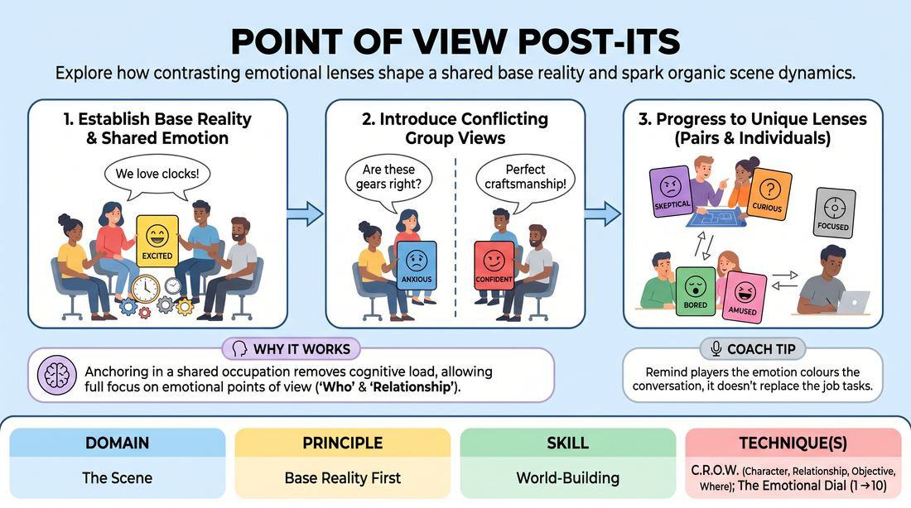

# Point of View Post-Its

{ .game-hero }

> Explore how contrasting emotional lenses shape a shared base reality and spark organic scene dynamics.

## Overview
In this exercise, players sit in a semi-circle and adopt a shared profession or hobby, then layer on specific emotional points of view written on cards. As the game progresses, players receive different, sometimes conflicting emotional lenses, demonstrating how individual attitudes naturally generate dramatic tension and rich world-building within a stable base reality.

## What It Trains
- **Domain:** D3 — The Scene
- **Principle(s):** Base Reality First; Commit 100%; Yes, And
- **Skill(s):** World-Building; Emotional Fluidity; Active Listening; Offer Reception
- **Technique(s):** C.R.O.W. (Character, Relationship, Objective, Where); The Emotional Dial (1→10); Endowment-acceptance
- **Focus:** skill_drill

**Objective:** To master the C.R.O.W. framework by establishing a clear, grounded base reality (the 'Where' and 'What') before introducing distinct emotional perspectives ('Character' and 'Relationship') that drive the scene forward without relying on plot.

## Setup
Arrange 4 to 6 chairs in a tight semi-circle facing the facilitator. Prepare a stack of index cards or large sticky notes, each pre-written with a distinct emotion, attitude, or point of view (e.g., 'sycophantic', 'paranoid', 'overly enthusiastic', 'deeply cynical'). Have a marker and blank cards handy for write-in suggestions.

## How to Play
1. Seat 4 to 6 players in the semi-circle and explain that they will be engaging in a conversational scene focused on establishing a shared environment and occupation.
2. Ask the group for a specific, mundane job or hobby suggestion, such as librarians, clockmakers, or community garden volunteers.
3. Draw one emotion card and display it clearly to all players, instructing the entire group to converse naturally as colleagues in that profession while all sharing this single emotional lens.
4. Encourage players to focus on world-building by discussing their daily tasks, tools, and environment while fully committing to the designated emotion.
5. After two minutes of play, pause the scene and introduce a new job suggestion, but this time split the group in half, assigning one emotion card to the left side and a contrasting emotion card to the right side.
6. Resume the conversation, prompting players to maintain their shared professional reality while reacting to the differing emotional perspectives of their peers.
7. Progress the challenge by assigning different emotions to pairs of players, and finally, giving each individual player their own unique emotional card to play.

## Facilitation Notes
- Side-coach players to avoid rushing into high-stakes plot or conflict; the goal is to explore the mundane details of their shared world through their emotional lens.
- If players struggle to embody the emotion, prompt them with physical cues: 'How does a cynical clockmaker hold their magnifying glass?' or 'Where does a paranoid librarian look when they speak?'
- Pitfall: Players might argue about their jobs. Fix: Remind them of 'Yes, And'—they must completely agree on the facts of their work, even if their emotional reactions to those facts differ wildly.
- Ensure the emotional choices are attitudes or points of view rather than temporary feelings, as attitudes provide more sustainable comedic and dramatic fuel.

## Variations
- Blind Perspectives: Hand out the emotion cards face-down so players do not know each other's assigned attitudes beforehand, forcing them to discover them through active listening.
- Status Shift: Instead of emotions, write relative status levels (e.g., '1' to '10') on the cards to explore how hierarchy affects the shared workplace.
- The Silent Partner: One player has no card and must actively observe the others, eventually adopting the attitude of whoever they are currently speaking to.

## Debrief
- How did having a shared, agreed-upon job make it easier to play a strong, distinct emotional point of view?
- What happened to the scene's energy when different players held contrasting emotional lenses?
- How does establishing the 'Where' and 'What' (Base Reality) first give you more freedom to play with 'Who' and 'Relationship'?

## Safety & Inclusion
Ensure the pre-written emotion cards avoid triggering or highly sensitive psychological states. Stick to playful, theatrical attitudes (e.g., 'melodramatic', 'suspicious', 'starstruck') rather than clinical terms. Allow players to pass or swap a card if they feel uncomfortable embodying a specific emotional state.

## Why It Works
By anchoring the players in a concrete, shared occupation (the 'What' and 'Where'), the cognitive load of inventing a plot is removed. This allows players to focus entirely on their emotional point of view (the 'Who' and 'Relationship'). When contrasting attitudes clash within a stable base reality, organic comedic tension and rich world-building occur naturally without the need for forced conflict.
