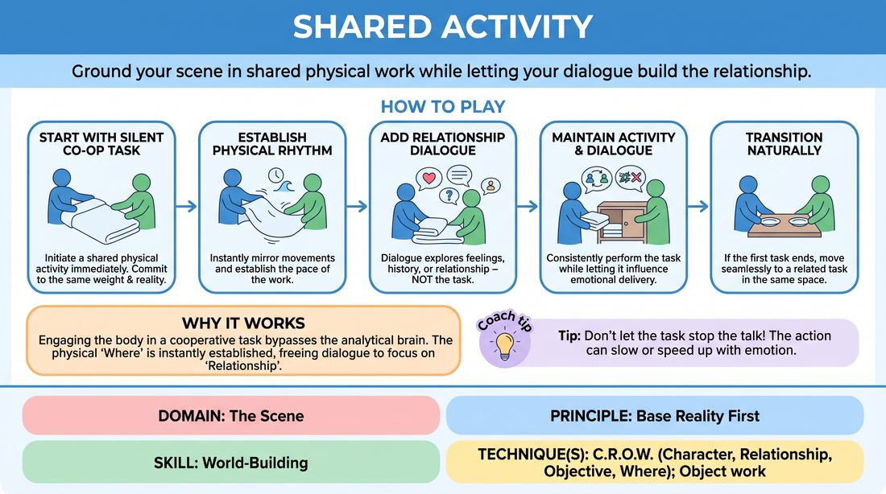

# Cooperative Action

{ .game-hero }

> Ground your scene in shared physical work while letting your dialogue build the relationship.

## Overview
Two players begin a scene simultaneously engaged in a shared, silent physical task. Instead of talking about the chore itself, they use their dialogue to explore their relationship, history, and emotional stakes. This creates an instant, rich base reality where action and dialogue run on parallel, complementary tracks.

## What It Trains
- **Domain:** D3 — The Scene
- **Principle(s):** Commit 100%; Yes, And; Show, Don't Tell; Base Reality First
- **Skill(s):** Physicality & Space Work; Active Listening; Single-Partner Empathy & Mirroring; World-Building
- **Technique(s):** Object work; Meisner Repetition; C.R.O.W. (Character, Relationship, Objective, Where)
- **Focus:** skill_drill

**Objective:** To establish a strong Base Reality (C.R.O.W.) by separating physical action from verbal exposition, training players to show the environment while speaking the relationship.

## At a Glance
| Aspect | Detail |
|---|---|
| Players | 2–2 (ideal 2) |
| Time | ~10 min |
| Complexity | 2/5 |
| Skill level | advanced_beginner |
| Energy | medium |
| Physicality | medium |
| Modality | in_person |
| Space | moderate |
| Props | none |
| Audience | not required |

## Setup
An open performance space. Two players stand on stage. No physical props are used; all objects and environments must be created through pantomime (space work).

## How to Play
1. Two players step onto the stage and immediately initiate a silent, cooperative physical activity (e.g., folding a bedsheet, washing a car, preparing a meal) without pre-planning.
2. Both players must instantly commit to the same physical reality, mirroring the weight, size, and location of the imaginary objects.
3. Once the physical rhythm of the shared activity is established, one player initiates dialogue.
4. The dialogue must not narrate or explain the physical activity; instead, it should focus on the characters' relationship, feelings, or an unrelated topic of conversation.
5. Players must maintain the physical activity consistently throughout the scene, letting the physical actions naturally influence their emotional delivery and pacing.
6. If the physical task reaches a natural conclusion (e.g., the sheet is folded), the players transition to a related physical task in the same environment (e.g., putting the sheet in the closet).

## Facilitation Notes
- Side-coaching cue: 'Don't talk about the task! Talk about how you feel about each other.'
- Pitfall: Players narrating their actions ('I am wiping this window now'). Fix: Remind them that in real life, we don't narrate chores. Challenge them to speak only about things not in the room.
- Side-coaching cue: 'Let the physical work dictate your pauses.' Encourage silence and physical beats between lines of dialogue.
- Pitfall: Dropping the physical work once the talking starts. Fix: Call out 'Freeze dialogue, resume action' to re-ground them in the space work.

## Variations
- High-Stakes Chore: The physical activity must be high-stakes or delicate (e.g., defusing a bomb, performing surgery, packing a getaway bag) while the conversation remains completely mundane.
- Status Shift: One player is the supervisor and the other is the trainee, but they must perform the task in perfect unison, letting the physical dynamic reflect their power struggle.

## Debrief
- How did having a physical task to focus on change the pressure to be 'funny' or 'inventive' with your words?
- What did you notice about the subtext of the scene when the dialogue and the physical action were on different tracks?
- How did your partner's physical commitment help you understand the 'Where' of the scene without them saying a word?

## Safety & Inclusion
Ensure the physical tasks chosen are accessible to both players' physical comfort levels. If a player has mobility limitations, the shared activity can be adapted to a seated or low-impact task (e.g., shelling peas, sorting mail, playing cards).

## Why It Works
By engaging the body in a cooperative task, players bypass the analytical brain that struggles to invent plot. The physical 'Where' is established instantly through shared space work, freeing the dialogue to focus entirely on 'Relationship' and 'Character' (C.R.O.W.). This creates a highly realistic, grounded scene engine where subtext naturally emerges from the tension between what the characters are doing and what they are saying.
