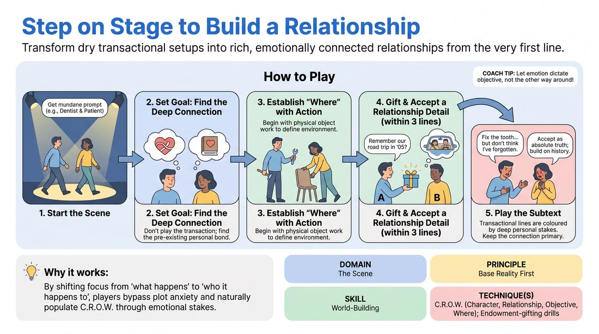

# Beyond the Transaction

{ .game-hero }

> Transform dry transactional setups into rich, emotionally connected relationships from the very first line.

## Overview
Two players step into a scene with a mundane, transactional suggestion but must immediately discover and play a deep, pre-existing personal relationship underneath. The focus shifts from what they are doing to who they are to each other, establishing a robust base reality. This shift transforms a routine interaction into a compelling, high-stakes scene driven by connection.

## What It Trains
- **Domain:** D3 — The Scene
- **Principle(s):** Base Reality First; Make Your Partner a Genius
- **Skill(s):** World-Building; Active Listening; Active Gifting
- **Technique(s):** C.R.O.W. (Character, Relationship, Objective, Where); Endowment-gifting drills
- **Focus:** connection

**Objective:** To develop the C.R.O.W. framework (specifically Relationship) and establish a strong Base Reality First by prioritizing emotional connection and shared history over plot or transactional tasks.

## Setup
A clear performance space for two players, with the rest of the group observing as an active audience. No props or special staging required.

## How to Play
1. Ask two players to step into the performance space.
2. Solicit a mundane, transactional relationship or setting from the audience, such as a dentist and patient, or a mechanic and car owner.
3. Instruct the players that their primary task is not to play the transaction, but to discover and play a deep, personal, pre-existing relationship underneath it.
4. Begin the scene with physical action and object work that establishes the physical environment (Where) and individual characters.
5. Within the first three exchanges, one player must actively gift a specific relationship detail or emotional history to the other.
6. The receiving player must immediately accept this gift as absolute truth, making their partner a genius by building upon the established history.
7. Play the scene for two to three minutes, ensuring that every transactional line is colored by the subtext of their deep personal connection.

## Facilitation Notes
- Side-coach players to move away from the logistics of the transaction: 'Stop talking about the car repairs; talk about how you feel about each other right now.'
- Watch out for the 'mystery relationship' pitfall where players ask questions instead of making statements. Side-coach: 'Don't ask who they are, tell them who they are.'
- Encourage physical proximity and eye contact to ground the emotional reality of the relationship.
- If players get stuck in conflict, remind them that a deep relationship can be rooted in warmth, shared secrets, or mutual respect, not just arguments.

## Variations
- Silent Undercurrents: The players must establish their deep relationship using only physical touch, eye contact, and object work for the first forty-five seconds before speaking.
- The Secret History: The facilitator whispers a secret relationship dynamic to only one player before the scene starts, forcing the other player to actively listen and adapt to the clues dropped.

## Debrief
- How did focusing on the relationship change the way you approached the physical environment and the transaction?
- What did it feel like to receive a relationship gift and immediately treat your partner like a genius for making it?
- How does establishing a strong personal connection make the rest of the scene easier to discover?

## Safety & Inclusion
Because this game encourages deep personal relationships, remind players to establish physical boundaries before starting. Emphasize that 'deep relationships' can be platonic, familial, or professional, and do not always need to default to romantic or sexual dynamics.

## Why It Works
By shifting the focus from 'what is happening' to 'who is this happening to,' players bypass the anxiety of inventing a plot. The C.R.O.W. framework is naturally populated because the emotional stakes dictate the objective and character choices, creating an instant, compelling base reality.
