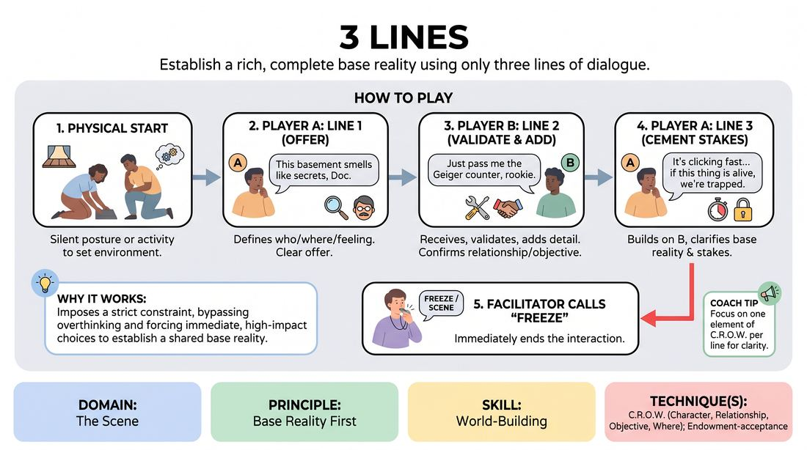

# Three-Line Launches

{ .game-hero }

> Establish a rich, complete base reality using only three lines of dialogue.

## Overview
A rapid-fire scene-initiation drill where pairs of players have exactly three lines of dialogue to establish a complete platform. By focusing on immediate, high-value choices, players learn to build a shared world without wasting time on vague exposition. The exercise emphasizes efficiency, active listening, and mutual support right from the first breath.

## What It Trains
- **Domain:** D3 — The Scene
- **Principle(s):** Base Reality First; Start in the Middle; Yes, And; Make Your Partner a Genius
- **Skill(s):** World-Building; Offer Reception; Active Gifting
- **Technique(s):** C.R.O.W. (Character, Relationship, Objective, Where); Endowment-acceptance; Endowment-gifting drills
- **Focus:** skill_drill

**Objective:** To master the C.R.O.W. technique (Character, Relationship, Objective, Where) instantly, establishing a solid base reality and starting in the middle of the action.

## At a Glance
| Aspect | Detail |
|---|---|
| Players | 2+ (ideal 6-16) |
| Time | ~10 min |
| Complexity | 2/5 |
| Skill level | novice |
| Energy | medium |
| Physicality | low |
| Modality | in_person |
| Space | minimal |
| Props | none |
| Audience | not required |

## Setup
Players stand in a circle or line up facing a designated performance space. No props or chairs are needed. The facilitator stands nearby to count lines and call 'scene' after the third line.

## How to Play
1. Two players step into the performance space and assume a physical posture or begin a silent physical activity to establish the physical environment.
2. Player A delivers the first line of dialogue, establishing a clear offer regarding who they are, where they are, or how they feel about Player B.
3. Player B receives the offer, validates it, and delivers the second line, adding a specific detail that defines their relationship or immediate objective.
4. Player A delivers the third and final line, cementing the base reality by building on Player B's contribution and clarifying the scene's stakes.
5. Immediately after the third line is spoken, the facilitator calls 'Freeze' or 'Scene' to end the interaction.
6. The facilitator briefly highlights which elements of C.R.O.W. were successfully established.
7. The current players return to the group, and two new players step forward to initiate a completely different scene.

## Facilitation Notes
- Encourage physical action before the first line; starting with object work instantly establishes the 'Where' without needing dialogue.
- Watch out for transactional starts (like clerk and customer) which often delay emotional relationship; push players to choose intimate or high-stakes relationships.
- Side-coach players to avoid asking questions. Questions shift the burden of world-building to the partner; instead, make bold, declarative statements.
- If a pair misses an element of C.R.O.W., don't treat it as a failure. Use it as a teaching moment to ask the group what was established and what was missing.

## Variations
- Silent Start: Players must engage in ten seconds of silent physical action and eye contact before the first line is spoken.
- Two-Line Challenge: Tighten the constraint even further by allowing only two lines of dialogue (one from each player) to establish the platform.
- Blind C.R.O.W.: Assign one specific letter of C.R.O.W. to each line (for example, Line 1 must establish Where, Line 2 must establish Relationship, Line 3 must establish Objective).

## Debrief
- Which of the three lines felt the most challenging to deliver, and why?
- How does having a strict line limit change your approach to making offers compared to an open-ended scene?
- How did physical object work or body language help fill in the gaps that dialogue couldn't cover?
- What strategies did you use to make your partner's line look brilliant and meaningful?

## Safety & Inclusion
Ensure players are mindful of physical boundaries when starting in close proximity. Remind participants that high-stakes relationships do not require physical touch or aggressive posturing to be effective.

## Why It Works
By imposing a strict structural constraint, this game bypasses the analytical mind and forces players to make immediate, high-impact choices. It prevents waffling or stalling tactics, demonstrating that a compelling base reality can be established in seconds when both players actively gift information and accept each other's offers unconditionally.
