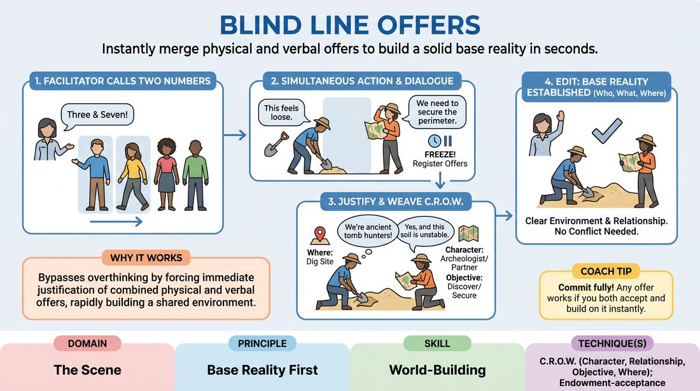

# Dual-Offer Discovery

{ .game-hero }

> Instantly merge physical and verbal offers to build a solid base reality in seconds.

## Overview
Players are called at random to step into the space, immediately initiating with both a physical action and a spoken line. The challenge is for both players to instantly accept these disparate offers, justifying them to establish a clear Character, Relationship, Objective, and Where (C.R.O.W.).

## What It Trains
- **Domain:** D3 — The Scene
- **Principle(s):** Base Reality First; Start in the Middle; Yes, And
- **Skill(s):** World-Building; Justification; Offer Reception; Active Gifting
- **Technique(s):** C.R.O.W. (Character, Relationship, Objective, Where); Endowment-acceptance; Endowment-gifting drills
- **Focus:** skill_drill

**Objective:** To develop rapid world-building and justification skills by establishing a cohesive base reality from two independent, simultaneous physical and verbal offers.

## Setup
Players stand in a line-up or semi-circle facing the playing area. The facilitator assigns each player a number from 1 to N. No props or special materials are needed.

## How to Play
1. Assign every player in the line-up a unique number.
2. The facilitator calls out two numbers at random (e.g., 'Three and Seven!').
3. The two selected players must immediately step into the playing space without hesitating or planning.
4. Upon entering, both players must simultaneously initiate with a distinct physical action (object work) and a spoken line of dialogue. These offers are made independently, without waiting for the other to finish.
5. Once both initial offers are on the table, the players must freeze their physical actions briefly to register what just happened, then resume.
6. The players immediately begin to 'yes-and' and justify both physical actions and both lines of dialogue, weaving them into a single, logical environment and relationship (C.R.O.W.).
7. The scene continues for 60-90 seconds, focusing entirely on solidifying the base reality rather than finding a conflict or joke.
8. The facilitator edits the scene once the Who, What, and Where are clearly established and agreed upon.

## Facilitation Notes
- Coaching cue: 'Don't drop your physical work! Keep doing your action while you listen.'
- Coaching cue: 'Justify the collision. Why would someone be sweeping while the other is performing surgery?'
- Pitfall: Players dropping their initial physical action to accommodate the other player's offer. Fix: Remind them that both offers must coexist; find a location where both activities make sense.
- Pitfall: Delaying the initiation. Fix: Encourage immediate, impulsive movement and speech the moment their number is called.

## Variations
- Silent Start: Players enter with only physical actions, establishing the 'Where' physically before speaking.
- C.R.O.W. Checklist: The audience or remaining players must call out 'Who, Relationship, Objective, Where' as soon as they are established in the scene.
- Three-Way Collision: Call three numbers instead of two, requiring three simultaneous physical and verbal offers to be integrated.

## Debrief
- How did it feel to have your initial idea immediately complicated by your partner's simultaneous offer?
- What strategies did you use to justify two seemingly incompatible physical activities in the same space?
- How does establishing a strong physical 'Where' help clarify the relationship between the characters?

## Safety & Inclusion
Ensure the physical space is clear of obstacles so players can step forward safely. Remind players to keep physical actions safe and respectful of personal boundaries, especially when moving quickly.

## Why It Works
By forcing simultaneous physical and verbal initiations, the game bypasses the analytical mind. Players cannot plan; they must rely on immediate justification and active gifting. This rapidly builds a robust base reality because both players are forced to find a creative bridge (C.R.O.W.) that accommodates both of their realities.
