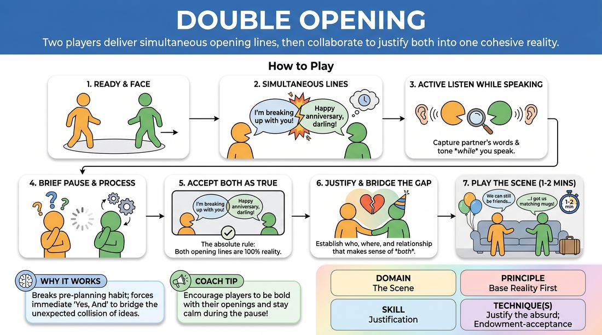

# Dual Openings

{ .game-hero }

> Two players deliver simultaneous opening lines, then collaborate to justify both into one cohesive reality.

## Overview
In this exercise, two actors step forward and deliver their initial lines of dialogue at the exact same moment, completely blind to what the other is about to say. Once the initial shock of the overlapping statements settles, the players must collaborate to discover a single, logical base reality that perfectly accommodates both offers, no matter how contradictory they seem.

## What It Trains
- **Domain:** D3 — The Scene
- **Principle(s):** Yes, And; Base Reality First
- **Skill(s):** Active Listening; Offer Reception; World-Building; Justification
- **Technique(s):** Endowment-acceptance; C.R.O.W. (Character, Relationship, Objective, Where); Justify the absurd
- **Focus:** skill_drill

**Objective:** To develop advanced justification skills and active listening by forcing players to accept two disparate, simultaneous offers as absolute truth, integrating them into a stable base reality.

## Setup
An open performance space. The group stands in a circle or sits as an audience. Two players step into the center. No props or special materials are required.

## How to Play
1. Two players step into the playing space and face each other, preparing to start a scene.
2. On the facilitator's signal, both players simultaneously deliver a strong, distinct opening line of dialogue.
3. Both players must actively listen to the other's line while speaking their own, capturing the exact words, tone, and emotional offer.
4. A brief moment of silence is allowed for both players to process the two disparate statements.
5. The players begin the scene, adhering to the absolute rule that both opening lines are 100% true and exist within the same reality.
6. Players use justification to bridge the gap between the two statements, establishing who they are, where they are, and their relationship.
7. The scene continues for one to two minutes as they play out the newly established reality, focusing on agreement and building upon the justified premise.

## Facilitation Notes
- Coaching cue: 'Don't panic or ignore the collision. Embrace the mystery of how these two worlds connect.'
- Pitfall: Players trying to negotiate or argue about whose line is 'right.' Fix: Remind them that both lines are absolute facts; they must find a third context that makes both true.
- Coaching cue: 'Look for the "Why." Why would Person A say their line while Person B says theirs in this exact moment?'
- Pitfall: Wiping the slate clean or treating one line as a joke, dream, or hallucination. Fix: Side-coach: 'No dreams, no lies, no insanity. Both of you are telling the absolute truth.'

## Variations
- Physical Dual Start: Instead of spoken lines, both players simultaneously initiate a distinct, high-energy physical action or object work, then must justify why both actions are happening in the same space.
- Double Reaction: Players simultaneously deliver their opening lines, then simultaneously deliver their immediate reactions to what they just heard, before settling into the scene.

## Debrief
- What mental shift had to happen to make two completely different ideas fit into one reality?
- How did active listening during your own speech affect your ability to receive the other player's offer?
- What strategies did you use to justify the gap between the two openings without making one player 'wrong'?

## Safety & Inclusion
Ensure players speak clearly and at a moderate volume so both lines can be heard without shouting. If a player has hearing difficulties, the facilitator can repeat the two spoken lines immediately after they are delivered to ensure equal access.

## Why It Works
By removing the sequential nature of 'offer and response,' this exercise breaks the habit of pre-planning. It forces players to immediately practice 'Yes, And' at a structural level, treating the unexpected collision of ideas not as a mistake, but as the very foundation of their scene's universe.
