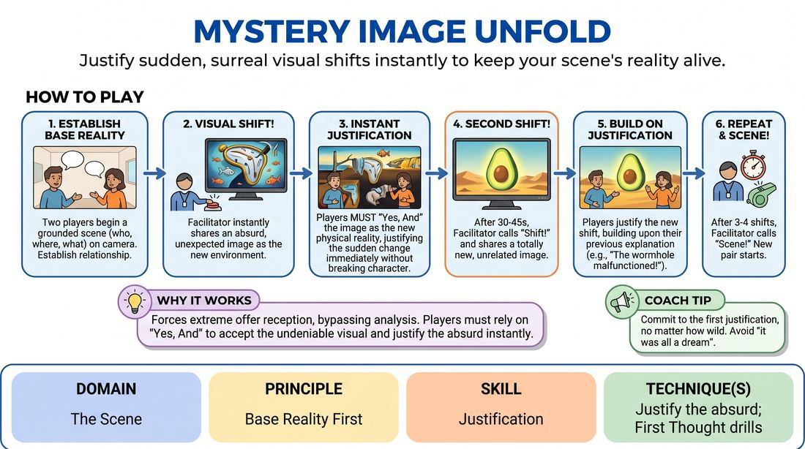

# Visual Reality Warp

{ .game-hero }

> Justify sudden, surreal visual shifts instantly to keep your scene's reality alive.

## Overview
In this high-energy virtual drill, players establish a grounded scene only to have their physical environment instantly transformed by a series of sudden, random images shared on screen. Players must immediately accept the new visual reality and justify the absurd transition without breaking character or abandoning their established relationship. The experience is a fast-paced mental sprint that challenges players to find logical explanations for illogical environmental shifts.

## What It Trains
- **Domain:** D3 — The Scene
- **Principle(s):** The First Thought Is a Gift; Yes, And; Base Reality First
- **Skill(s):** Unfiltered Spontaneity; Active Listening; Offer Reception; Justification
- **Technique(s):** First Thought drills; Justify the absurd
- **Focus:** skill_drill

**Objective:** Develops the ability to maintain a grounded base reality while instantly justifying absurd environmental disruptions. It trains players to treat sudden visual changes as immediate, undeniable truths, reinforcing active listening, offer reception, and spontaneous justification.

## Setup
Virtual meeting platform set to Gallery View. The facilitator prepares 5 to 10 highly diverse, evocative, and ambiguous images (such as abstract art, bizarre landscapes, or unusual historical photos) pre-loaded in a slideshow. The facilitator must be ready to share their screen and transition between images instantly.

## How to Play
1. 1. The facilitator instructs all players to turn on their cameras and switch to Gallery View, explaining that their physical environment will undergo sudden, unpredictable shifts.
2. 2. Two players volunteer to start a scene, establishing a simple, grounded base reality (who they are, where they are, and what they are doing) based on a neutral starting suggestion.
3. 3. Once the base reality is clear (usually after 30 to 45 seconds), the facilitator suddenly shares their screen, displaying the first highly unusual or abstract mystery image.
4. 4. The active players must instantly 'Yes, And' this visual offer, treating the image as their new physical environment and immediately justifying how or why their characters are now experiencing this reality.
5. 5. Players must maintain their original characters, relationship, and emotional stakes, integrating the new visual details into their ongoing narrative rather than starting a completely new scene.
6. 6. After another 30 to 45 seconds of play, the facilitator calls out 'Shift!' and instantly transitions to a completely different, unrelated image.
7. 7. The players must immediately justify this second shift, building upon their previous justification (e.g., explaining it as a teleportation glitch, a hallucination, or a sudden environmental collapse) to keep the narrative continuous.
8. 8. After 3 to 4 image shifts, the facilitator calls 'Scene!' and invites a new pair of players to step up for the next round with a fresh set of images.

## Facilitation Notes
- Side-coaching cue: 'Don't explain away the image—make it your actual physical reality right now!'
- Pitfall: Players hit the 'reset button' and start a brand-new scene with every image. Fix: Remind players that their characters, relationship, and history must remain intact; only the physical environment has warped.
- Side-coaching cue: 'Listen to your partner's explanation first! If they say it's a holographic simulation, agree and expand on that.'
- Pitfall: Facilitator lag during screen sharing kills the momentum. Fix: Pre-load all images into a single presentation file and use a simple keyboard shortcut to advance slides seamlessly.
- Pitfall: Players freeze trying to find the 'perfect' logical explanation. Fix: Coach them to use 'The First Thought Is a Gift'—blurt out the first justification that comes to mind and treat it as absolute truth.

## Variations
- Tag-Out Warp: Observers can use the chat to type 'TAG' when a new image appears, swapping places with one of the active players and immediately entering the scene with a fresh justification.
- Emotional Shift: Along with the visual shift, the facilitator types a new emotion in the chat (e.g., 'Paranoia', 'Ecstasy') that the players must instantly adopt alongside the environmental change.
- Object Integration: Instead of a whole environment, the shared image represents a single bizarre object that has suddenly appeared between the characters, which they must physically interact with using virtual object work.

## Debrief
- How did it feel to have your physical reality completely upended mid-sentence?
- What strategies did you use to make the absurd visual shifts feel grounded and justified?
- How did active listening help you and your partner stay on the same page when the world changed?
- Did you find yourself overthinking the 'why,' and how did letting go of that help your spontaneity?

## Safety & Inclusion
Ensure the curated images do not contain flashing lights, highly disturbing or gory imagery, or common phobias (like spiders or heights) to keep the space psychologically safe. For players with visual impairments, a designated 'describer' player can quickly call out two or three key visual elements of the new image as soon as it appears, allowing the active players to integrate those verbal cues.

## Why It Works
This game works because it forces players to practice extreme offer reception. By presenting a sudden, undeniable visual offer that cannot be ignored, it bypasses the analytical mind's tendency to plan or negotiate. Players must rely on 'Yes, And' and 'Justification' to bridge the gap between their established base reality and the new, absurd visual input, proving that any choice can be made logical if both players commit to it as truth.
