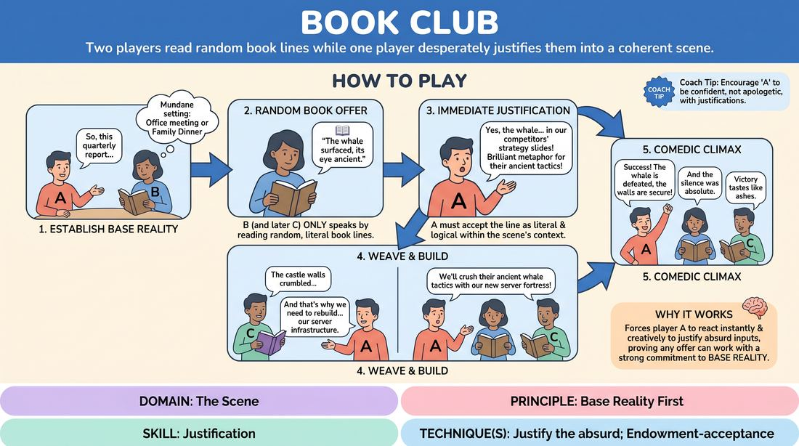

# Book Club

{ .game-hero }

> Two players read random book lines while one player desperately justifies them into a coherent scene.

## Overview
In this comedic scene-work game, two players are restricted to speaking only by reading verbatim lines from random books, while a third player speaks freely. The free-speaking player must act as the narrative anchor, instantly justifying the bizarre, out-of-context literary quotes to maintain a logical base reality. The result is a high-wire act of comedic justification and deep listening.

## What It Trains
- **Domain:** D3 — The Scene
- **Principle(s):** Base Reality First; Yes, And; Make Your Partner a Genius; The Audience Is the Final Scene Partner
- **Skill(s):** Justification; Active Listening; Offer Reception; Room Reading
- **Technique(s):** Justify the absurd; Endowment-acceptance
- **Focus:** comedy_game

**Objective:** To develop advanced justification skills (specifically justifying the absurd) and active listening. Players learn to treat random, disconnected inputs as absolute truth, seamlessly integrating them into a grounded relationship and environment.

## At a Glance
| Aspect | Detail |
|---|---|
| Players | 3–4 (ideal 3) |
| Time | ~5 min |
| Complexity | 3/5 |
| Skill level | advanced_beginner |
| Energy | medium |
| Physicality | low |
| Modality | in_person |
| Space | minimal |
| Props | Two books (usually borrowed from the audience) |
| Audience | required |

## Setup
Three players on stage. Ask the audience to borrow two physical books (ideally of completely different genres, such as a technical manual and a romance novel). Distribute these books to Player B and Player C. Player A remains empty-handed. Obtain a simple relationship or location suggestion from the audience to kick off the scene.

## How to Play
1. Begin the scene with Player A (no book) and Player B (holding Book 1) on stage, establishing a clear, mundane relationship and setting based on the audience suggestion.
2. Player A initiates the dialogue naturally, setting up a realistic, everyday scenario (e.g., a performance review or a family dinner).
3. Player B responds only by opening their book to a random page, pointing to a line, and reading it aloud exactly as written.
4. Player A must immediately accept this line as a completely logical, literal statement within the context of their relationship, justifying why Player B said it.
5. After a solid base reality is established, Player C (holding Book 2) enters the scene as a new character, also restricted to speaking only via random lines from their book.
6. Player A continues to weave both players' random literary lines into a cohesive narrative, while Player B and Player C listen closely to select lines that tonally or rhythmically fit the unfolding drama.
7. The scene builds to a comedic climax as Player A successfully rationalizes the increasingly absurd juxtaposition of the two different books.

## Facilitation Notes
- Side-coaching cue: 'Don't ignore the weirdness—explain it!' Encourage Player A to find the logical 'why' behind the bizarre book lines rather than brushing them off.
- Pitfall: Book-readers reading ahead or searching for the 'perfect' line, which kills the spontaneity. Fix: Instruct them to point blindly and read the very first line their finger lands on.
- Side-coaching cue: 'Let the book lines change your emotional state.' Encourage the book-readers to deliver their random lines with strong, committed emotional choices, even if the text is dry.
- Pitfall: Player A becoming a passive interviewer ('Why did you say that?'). Fix: Coach Player A to make active declarations that explain the line (e.g., 'I know you always quote your grandfather's railway manual when you're nervous').

## Variations
- Double Anchor: Two players speak freely, and only one player reads from a book, allowing for more complex relationship dynamics before the absurdity takes over.
- Genre Clash: Intentionally source books from wildly contrasting genres (e.g., a cookbook and a sci-fi thriller) to maximize the comedic friction of the justifications.
- The Silent Reader: The book-readers must physically act out the subtext of their random lines, using object work to ground their characters while reading.

## Debrief
- For the anchor player: How did you find a logical explanation for a line that seemed completely irrelevant to the scene?
- For the book readers: How did it feel to have your random lines treated as profound, deliberate statements by your partner?
- How does this game demonstrate the power of 'Yes, And' when dealing with unexpected or 'bad' offers?

## Safety & Inclusion
Ensure the borrowed books do not contain highly offensive or triggering material. If a player accidentally reads a line that feels inappropriate or unsafe for the room, they are encouraged to quickly skip to the next line or paraphrase safely without penalty.

## Why It Works
By forcing one player to justify completely random text, the game strips away the ability to pre-plan. It proves that any offer—no matter how absurd or disconnected—can be integrated into a scene if the players commit to a strong base reality. The comedy arises from the contrast between the rigid, random text and the desperate, logical gymnastics of the improviser trying to make sense of it.
