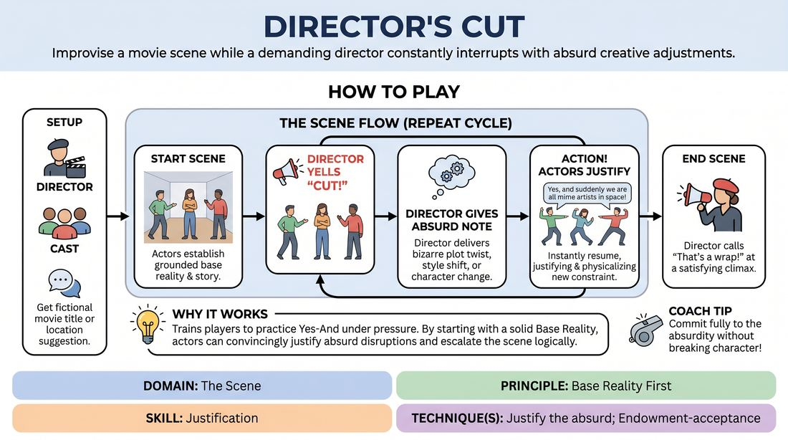

# Director's Cut

{ .game-hero }

> Improvise a movie scene while a demanding director constantly interrupts with absurd creative adjustments.

## Overview
In this fast-paced scene game, a cast of actors attempts to perform a movie scene while one player acts as an eccentric Director. The Director frequently halts the action to inject bizarre plot twists, stylistic shifts, or character changes. The actors must instantly accept these adjustments, justifying the absurd new realities while keeping the core story moving forward.

## What It Trains
- **Domain:** D3 — The Scene
- **Principle(s):** Commit 100%; Yes, And; Make Your Partner a Genius; Base Reality First; Serve the Story
- **Skill(s):** Active Listening; Offer Reception; Heightening & Exploration; Justification; Pacing & Rhythm
- **Technique(s):** Endowment-acceptance; Justify the absurd; Edits (Sweep, Tag-Out, Sound/Light)
- **Focus:** comedy_game

**Objective:** To develop rapid justification skills by forcing players to instantly integrate absurd external constraints into an established base reality without breaking character or narrative continuity.

## At a Glance
| Aspect | Detail |
|---|---|
| Players | 3–6 (ideal 4-6) |
| Time | ~10 min |
| Complexity | 3/5 |
| Skill level | advanced_beginner |
| Energy | medium |
| Physicality | medium |
| Modality | in_person |
| Space | moderate |
| Props | none |
| Audience | not required |

## Setup
Set up a clear stage area for 2 to 5 actors. One player is designated as the Director and stands downstage, facing the actors with their back to the audience. No props or chairs are needed, though players can mime objects as established by their base reality.

## How to Play
1. Assign one player to be the Director and the remaining players to be the cast of the movie.
2. Get a suggestion from the group for a fictional movie title or a simple starting location to help the actors establish their scene.
3. The actors begin improvising a grounded scene, focusing on establishing a clear base reality with bold, specific choices.
4. At any point, the Director yells CUT to pause the action, and the actors must freeze instantly in place.
5. The Director delivers a specific note, adjustment, or absurd twist to the cast.
6. The Director yells ACTION and the actors immediately resume the scene, seamlessly justifying and physicalizing the new constraint.
7. Repeat this cycle of CUT, adjustment, and ACTION several times, allowing the scene to escalate in absurdity while maintaining its logical thread.
8. The Director calls Cut and print or That's a wrap to end the scene once it reaches a satisfying, high-energy climax.

## Facilitation Notes
- Side-coach the Director to build on what the actors have already established rather than introducing completely unrelated random elements.
- Remind the actors to establish a strong, grounded base reality first so that the Director's cuts have a meaningful foundation to disrupt.
- If actors treat the Director's note as a joke, side-coach them to justify it and treat the absurd note as absolute, serious truth within the world of the scene.
- Ensure the Director lets the scene breathe for 30 to 45 seconds between cuts so the actors have time to fully explore and integrate the new reality.

## Variations
- Genre Shift: The Director changes the cinematic genre of the film mid-scene, such as switching to Film Noir or a Shakespearean tragedy.
- Subtext Reveal: The Director reveals hidden internal motivations or secrets, such as declaring that one character is secretly a spy.
- Emotional Dial: The Director commands players to dial their current emotion up to an extreme level or down to near zero.

## Debrief
- How did having a strong base reality at the start make it easier to handle the Director's absurd notes?
- What strategies did you use to justify a bizarre constraint so that it made sense in the context of the story?
- How did active listening help the cast stay on the same page when a sudden change was introduced?

## Safety & Inclusion
Ensure the Director's prompts respect physical boundaries and comfort levels. If a physical adjustment is called, players should prioritize safety and use safe stage physicalization or mime the action safely.

## Why It Works
This game works because it forces players to practice Yes-And under pressure. By establishing a firm base reality first, the players build a solid foundation. When the Director introduces an absurd disruption, the actors cannot negotiate; they must immediately justify the new reality. This rapid justification bypasses the analytical brain, leading to highly creative, organic comedic choices.
