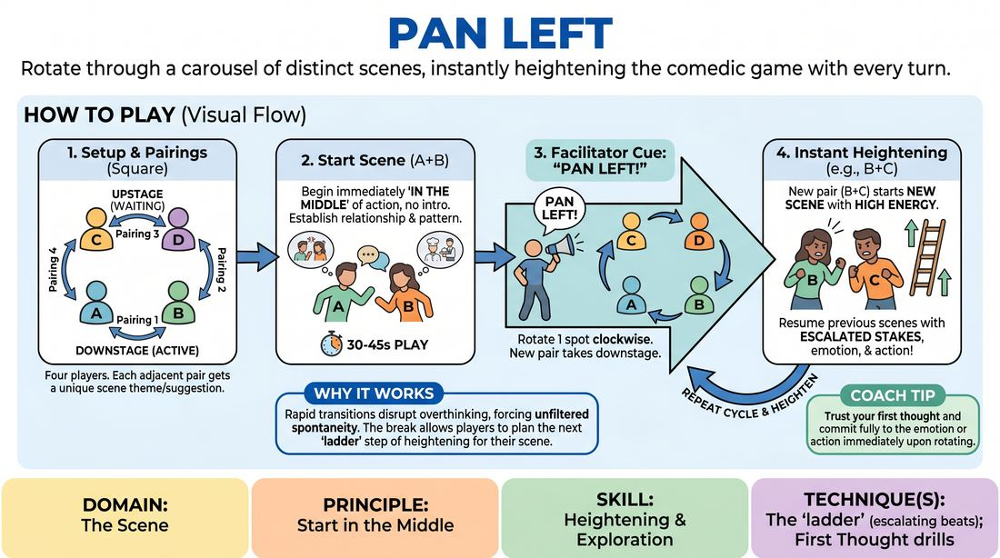

# Pan Left

{ .game-hero }

> Rotate through a carousel of distinct scenes, instantly heightening the comedic game with every turn.

## Overview
A fast-paced, rotating scene game where four players form a physical carousel. Two players perform at the front while the others wait in the wings; on the facilitator's cue, the players rotate, instantly launching into a different ongoing scene. Each time a scene returns to the stage, the players must escalate the established comedic pattern, climbing a ladder of intensity.

## What It Trains
- **Domain:** D3 — The Scene
- **Principle(s):** Start in the Middle; The First Thought Is a Gift; Make Your Partner a Genius; Group Mind
- **Skill(s):** Heightening & Exploration; Unfiltered Spontaneity; Active Listening; Pacing & Rhythm
- **Technique(s):** The 'ladder' (escalating beats); First Thought drills; Edits (Sweep, Tag-Out, Sound/Light)
- **Focus:** comedy_game

**Objective:** To master 'starting in the middle' of scenes and to practice the 'ladder' technique of heightening, where players immediately identify and escalate a scene's core comedic game upon every return.

## At a Glance
| Aspect | Detail |
|---|---|
| Players | 4+ (ideal 4-8) |
| Time | ~10 min |
| Complexity | 2/5 |
| Skill level | advanced_beginner |
| Energy | medium |
| Physicality | low |
| Modality | in_person |
| Space | moderate |
| Props | none |
| Audience | not required |

## Setup
Four players stand in a square formation on stage. Two players stand downstage (front) facing the audience, while the other two stand upstage (back) facing away or waiting. The facilitator obtains four distinct suggestions (such as a TV genre, an unusual job, a specific relationship, or a movie title) to assign to each of the four possible pairing combinations.

## How to Play
1. Position four players in a square: Player A and Player B at the front (downstage), Player C and Player D at the back (upstage).
2. Assign a unique suggestion to each of the four adjacent pairings (A+B, B+C, C+D, D+A) to define their 'channel' or scene theme.
3. Begin the first scene with the two downstage players (A and B) immediately starting in the middle of the action, establishing a clear relationship and comedic premise based on their suggestion.
4. After 30 to 45 seconds of play, the facilitator calls out 'Pan Left!' (or 'Pan Right!').
5. On the cue, all players physically rotate one spot clockwise (or counter-clockwise), bringing a new pair of players to the downstage position.
6. The new downstage pair must instantly initiate their scene with high energy, skipping any introductory exposition to start directly in the heat of their scenario.
7. When a previously seen pairing rotates back to the front, they must immediately resume their scene, instantly heightening the emotional stakes, physical action, or comedic game established in their previous beat.
8. Continue rotating through the carousel multiple times, allowing each scene to climb its own 'ladder' of escalation until all stories reach a satisfying, high-energy climax.

## Facilitation Notes
- Side-coach players to 'start in the middle' on every rotation. Remind them to avoid asking 'What are we doing?' and instead make a bold, active choice immediately.
- Watch for the 're-run' pitfall: players repeating the exact same jokes from the previous round. Coach them to escalate the pattern (the 'ladder' technique) rather than just repeating it.
- Keep the rotation cues snappy. If a scene is lagging, call 'Pan Left' quickly to maintain a high-energy rhythm and keep players out of their heads.
- If players receive a suggestion they don't know (e.g., an obscure movie), encourage them to confidently play their own absurd interpretation of the title rather than freezing.

## Variations
- Pan Right: Introduce the 'Pan Right' command to reverse the rotation direction on the fly, forcing players to stay highly alert to which partner they are facing.
- Emotional Slider: Each rotation increases the emotional intensity of all scenes by a notch (e.g., Round 1 is mild, Round 2 is passionate, Round 3 is extreme).
- Genre Mashup: Assign specific film or television genres to each channel (e.g., Soap Opera, Sci-Fi, Infomercial, Nature Documentary) to push stylistic heightening.

## Debrief
- How did starting 'in the middle' of the scene help you bypass overthinking and planning?
- What strategies did you use to instantly escalate (heighten) the comedic game when your scene returned to the front?
- How did the physical rotation affect your energy and spontaneity compared to a standard two-person scene?

## Safety & Inclusion
Ensure the physical rotation path is clear of obstacles. Players with mobility considerations can sit in chairs arranged in a circle, rotating their focus or swapping seats safely at a comfortable pace.

## Why It Works
By forcing rapid transitions, this game disrupts the analytical mind and encourages unfiltered spontaneity. The carousel structure naturally supports the 'ladder' technique of heightening: because players have a brief break while off-stage, they can easily spot the core comedic game of their scene and return with a clear, escalated beat, demonstrating how starting in the middle keeps scenes active and engaging.
