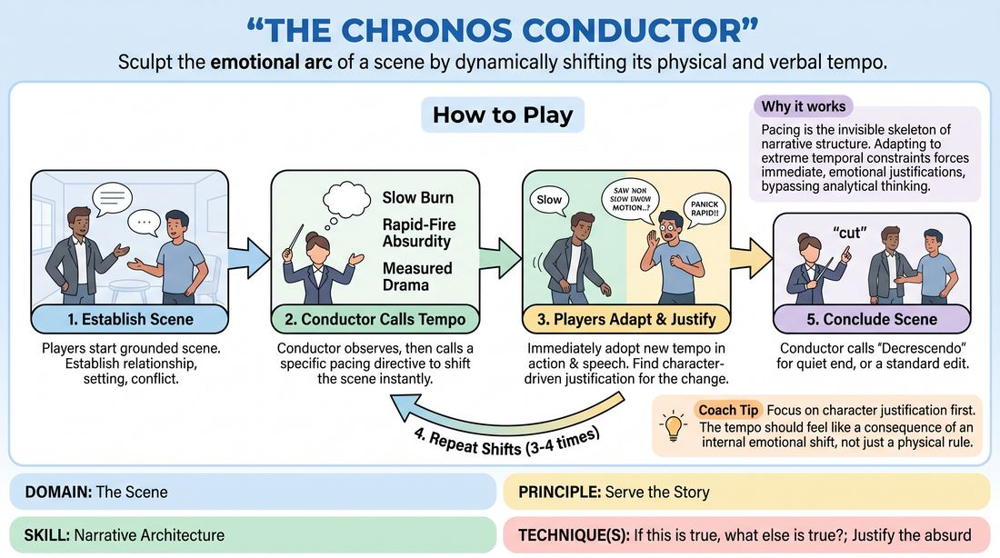

# The Rhythm Conductor

{ .game-hero }

> Sculpt the emotional arc of a scene by dynamically shifting its physical and verbal tempo.

## Overview
A real-time narrative-shaping exercise where a side-coaching facilitator directs the speed, rhythm, and emotional weight of an active scene. Players must instantly adapt their physical movement, speech patterns, and internal motivations to match these temporal shifts without breaking character. The result is a masterclass in how timing directly engineers audience tension, comedy, and drama.

## What It Trains
- **Domain:** D3 — The Scene
- **Principle(s):** Serve the Story; Show, Don't Tell; Make Your Partner a Genius; The Audience Is the Final Scene Partner; Commit 100%
- **Skill(s):** Narrative Architecture; Justification; Stakes / The 'Want'; Game Identification; Emotional Fluidity; Active Listening; Audience-Energy Management
- **Technique(s):** If this is true, what else is true?; Justify the absurd; The Emotional Dial (1→10); Timing exercises; Landing/cushioning a beat
- **Focus:** narrative

**Objective:** To develop a deep, physical understanding of narrative architecture and pacing, training players to use timing, pauses, and rapid-fire delivery to raise stakes, justify sudden emotional shifts, and control the scene's dramatic tension.

## At a Glance
| Aspect | Detail |
|---|---|
| Players | 3+ (ideal 6-12) |
| Time | ~15 min |
| Complexity | 3/5 |
| Skill level | competent |
| Energy | medium |
| Physicality | medium |
| Modality | hybrid |
| Space | moderate |
| Props | none |
| Audience | not required |

## Setup
Two to three players stand in the performance space to initiate a grounded scene. The remaining players observe as the audience. The facilitator stands off-stage as the Conductor, ready to call out pacing directives. No props or special materials are required; the space should allow for free movement.

## How to Play
1. Begin a standard, grounded scene with two or three players, establishing a clear relationship, setting, and initial conflict within the first few lines.
2. The Conductor observes the scene's natural rhythm, waiting for a stable platform to be established before introducing the first temporal shift.
3. When ready, the Conductor calls out a specific pacing directive (such as 'Slow Burn', 'Rapid-Fire Absurdity', or 'Measured Drama') to instantly alter the scene's speed and emotional weight.
4. Players must immediately adopt the new tempo in both their physical actions and verbal delivery, without acknowledging the shift meta-textually.
5. Crucially, players must find an internal, character-driven justification for this sudden change in speed, letting the physical tempo dictate their emotional stakes.
6. The Conductor continues to guide the scene through three to four distinct pacing shifts, allowing each phase to settle and build before calling the next.
7. The scene concludes when the Conductor calls 'Decrescendo' to bring the action to a natural, quiet resolution, or calls a standard edit at a high point.

## Facilitation Notes
- Side-coaching cue: 'Justify the speed!' Remind players that a change in tempo must reflect a change in their character's internal stakes or emotional state, not just a mechanical shift.
- Pitfall: Players acknowledging the shift out-of-character. Fix: Side-coach them to treat the new tempo as the absolute, unquestioned reality of the moment.
- Timing the calls: Avoid calling directives too rapidly. Give each pacing style at least 30 to 45 seconds to breathe so players can discover the narrative depth and emotional truth within that specific rhythm.
- Physicality check: Ensure players don't just change their speech; their physical movements, eye contact, and object work must match the directed tempo.

## Variations
- The Silent Conductor: The Conductor uses physical gestures (like an orchestral conductor) or visual cards to signal tempo changes, forcing players to keep their peripheral vision active.
- Individual Tempos: The Conductor assigns different pacing directives to individual characters, creating high-contrast comedic or dramatic friction.
- Audience-Driven Rhythm: The audience is divided into sections, and each section is assigned a tempo; players must match the tempo of whichever section is currently making a low hum or clapping.

## Debrief
- How did changing the physical and verbal tempo alter your character's internal feelings and objectives?
- Which pacing directive felt the most challenging to justify, and how did you overcome that hurdle?
- How did the shifts in timing affect the perceived stakes of the scene for those watching?

## Safety & Inclusion
Because rapid shifts in pacing can sometimes escalate physical movement or emotional intensity quickly, players should establish a clear physical boundary before starting. If a high-tempo directive is called, players must maintain physical safety, avoiding reckless running or sudden physical contact. Players can always choose to internalize the speed rather than expressing it through high-impact physical movement.

## Why It Works
This game works because pacing is the invisible skeleton of narrative structure. By forcing players to adapt to extreme temporal constraints, it bypasses their analytical minds and forces them to find immediate, emotional justifications. This teaches them that tension is built not just through what is said, but through the space and speed of how it is delivered, making them active architects of the audience's emotional journey.
