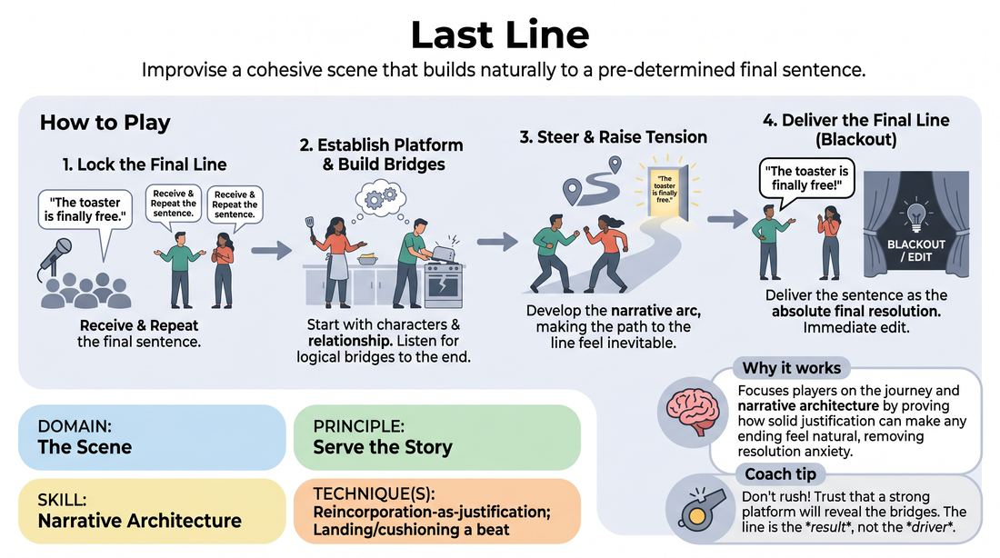

# The Destination Line

{ .game-hero }

> Improvise a cohesive scene that builds naturally to a pre-determined final sentence.

## Overview
In this narrative-focused game, players receive a random sentence from the audience that must serve as the absolute final line of their scene. The performers must collaborate to build a logical, emotionally grounded story arc that makes this specific line feel like the inevitable and satisfying conclusion. It shifts the players' focus from wondering what happens next to deliberately crafting how they get there.

## What It Trains
- **Domain:** D3 — The Scene
- **Principle(s):** Serve the Story; Yes, And; The Audience Is the Final Scene Partner
- **Skill(s):** Narrative Architecture; Justification; Active Listening; Audience-Energy Management
- **Technique(s):** Reincorporation-as-justification; Landing/cushioning a beat
- **Focus:** narrative

**Objective:** Develops narrative architecture, active listening, and justification by training players to reverse-engineer a scene's progression so that every beat serves a specific story destination.

## At a Glance
| Aspect | Detail |
|---|---|
| Players | 2+ (ideal 2-4) |
| Time | ~5 min |
| Complexity | 2/5 |
| Skill level | advanced_beginner |
| Energy | medium |
| Physicality | low |
| Modality | in_person |
| Space | minimal |
| Props | none |
| Audience | required |

## Setup
An open performance space with an audience. Two to four players stand on stage, ready to perform.

## How to Play
1. Request a random, mundane, or unusual sentence from the audience to serve as the final line of the scene.
2. Have the players repeat the line aloud to ensure both the performers and the audience are aligned on the target destination.
3. Begin the scene by establishing a clear platform, focusing on the characters, their relationship, and the setting without immediately referencing the final line.
4. Listen actively to your partner's offers, looking for logical or emotional bridges that can connect the current situation to the target sentence.
5. Build the stakes and tension of the scene, steering the narrative trajectory so that the final line becomes the natural climax or resolution.
6. Deliver the target sentence as the absolute final line of the scene, prompting an immediate edit or blackout.

## Facilitation Notes
- Side-coach players to 'pave the road' by establishing a strong platform first, rather than rushing to say the line in the first thirty seconds.
- If players are struggling to connect the dots, remind them to use justification: find a creative reason why this specific character would say this specific line in this moment.
- Watch out for 'shoehorning,' where a player suddenly blurts out the line out of context; encourage them to wait until the narrative momentum makes the line feel earned.
- Encourage the non-delivering player to set up their partner, creating a verbal 'ramp' that makes the final line the obvious next step.

## Variations
- First Line, Last Line: Obtain two distinct suggestions from the audience, using the first to open the scene and the second to close it.
- Blind Destination: Only one player knows the final line, requiring them to subtly guide the narrative until either they or their partner naturally arrives at the target sentence.
- The Relay: Run three short, connected scenes where the final line of one scene becomes the first line of the next, ending the entire sequence on the final target line.

## Debrief
- How did knowing the ending change the way you paced the beginning of your scene?
- What techniques did you use to make an unusual or absurd final line feel completely justified by the end?
- How did active listening help you discover narrative pathways you might have otherwise missed?

## Safety & Inclusion
Ensure the audience suggestion is appropriate for the group's comfort level. If a suggestion is offensive or overly restrictive, the facilitator should warmly ask for an alternative.

## Why It Works
By locking in the ending, this game removes the anxiety of finding a resolution and instead focuses players on the journey. It teaches narrative architecture by demonstrating how solid platforming and deliberate justification can make even the most absurd destination feel earned and satisfying.
