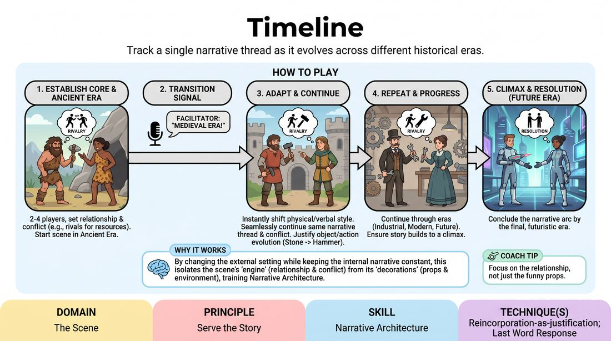

# Timeline

{ .game-hero }

> Track a single narrative thread as it evolves across different historical eras.

## Overview
In this game, players perform a continuous scene that leaps forward through distinct historical eras, from the ancient past to the distant future. While the setting, technology, and social norms change with each era, the core relationship, conflict, and narrative arc must remain unbroken. Players must justify how their characters and objectives adapt to each new time period.

## What It Trains
- **Domain:** D3 — The Scene
- **Principle(s):** Serve the Story; Yes, And; Group Mind
- **Skill(s):** Narrative Architecture; Justification; Active Listening; Thematic Synthesis
- **Technique(s):** Reincorporation-as-justification; Last Word Response; Weave the threads
- **Focus:** narrative

**Objective:** To develop narrative architecture and thematic synthesis by tracking a story's core emotional truth while dynamically adapting its external circumstances across time.

## Setup
An open performance space. The facilitator or audience prepares a list of 4-5 chronological eras (e.g., Stone Age, Medieval, Industrial Revolution, Present Day, Far Future). Players stand ready to enter the scene.

## How to Play
1. Select 2 to 4 players to begin the scene, while the remaining players act as an active audience or potential late-entering characters.
2. Establish the first era (typically prehistoric or ancient history) and a simple starting relationship or conflict (e.g., two rivals competing for resources).
3. Begin the scene in the first era, establishing the core narrative, character dynamics, and physical environment using the tools of that time.
4. At a signal from the facilitator, call out the next chronological era (e.g., 'Medieval Era!').
5. On the transition, players must instantly shift their physical posture, language, and tools to match the new era, while seamlessly continuing the exact same narrative conflict and relationship.
6. Justify how the previous actions or objects have evolved (e.g., a stone hand-axe in the prehistoric era becomes a blacksmith's hammer in the medieval era, and a laser cutter in the future).
7. Continue this process through subsequent eras, ensuring the story progresses toward a logical climax and resolution by the final, futuristic era.

## Facilitation Notes
- Side-coach players to focus on the relationship rather than just the historical gimmicks; the emotional stakes must carry over.
- Common Pitfall: Players hit 'reset' on the story with every era change. Fix: Remind them that the plot must progress. If a character was about to confess a secret in the Stone Age, they must be in the middle of confessing it in the Middle Ages.
- Encourage physical transformation. How does a character's physical status or posture change when they go from carrying heavy stones to sitting at an office desk?
- Keep the transitions snappy. Do not let players pause to think; they should immediately physicalize the new era and let the dialogue follow.

## Variations
- Reverse Timeline: Start in the far future and move backward in time, revealing the historical 'origins' of the current conflict.
- Audience-Driven Eras: Have the audience shout out random, non-linear time periods, forcing players to justify a disjointed chronological journey.
- Generational Saga: Instead of the same characters, players play the descendants of the original characters, carrying on a multi-generational family feud or legacy.

## Debrief
- How did changing the era help you discover new ways to express your character's core objective?
- What strategies did you use to keep the narrative continuous rather than starting a brand new scene each time?
- How did physicalizing the technology of each era affect your verbal choices and pacing?

## Safety & Inclusion
Ensure that historical eras are played with respect and avoid harmful cultural stereotypes. If an era is called out that a player feels uncomfortable portraying or lacks context for, they can call 'skip' or the facilitator can immediately offer an alternative era.

## Why It Works
By forcing players to change the external setting while keeping the internal narrative constant, this game isolates the 'engine' of a scene (relationship and conflict) from its 'decorations' (setting and props). It trains players to see that a good story is built on emotional truth and progression, which can survive any shift in context.
