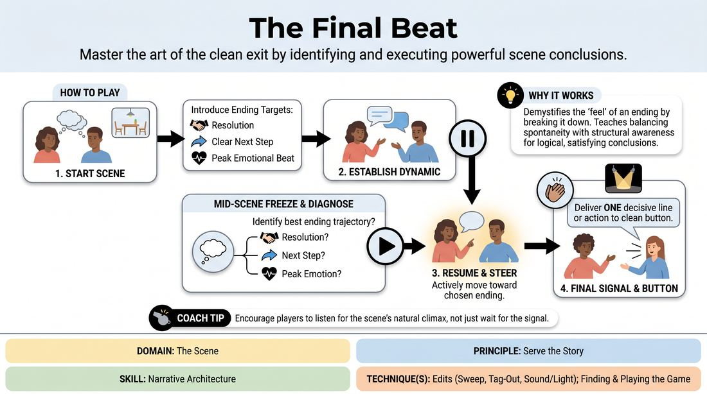

# The Final Beat

{ .game-hero }

> Master the art of the clean exit by identifying and executing powerful scene conclusions.

## Overview
A structured scene-work exercise where players are paused mid-action to evaluate their narrative trajectory. By identifying potential pathways to resolution, emotional peaks, or future consequences, players learn to steer scenes toward a deliberate and satisfying final moment rather than letting them peter out.

## What It Trains
- **Domain:** D3 — The Scene
- **Principle(s):** Serve the Story; Make Your Partner a Genius
- **Skill(s):** Narrative Architecture; Stakes / The 'Want'; Game Identification; Pacing & Rhythm; Unfiltered Spontaneity
- **Technique(s):** Edits (Sweep, Tag-Out, Sound/Light); Finding & Playing the Game
- **Focus:** narrative

**Objective:** Develops narrative architecture and story-serving instincts by training players to recognize organic ending points and execute decisive, high-impact scene conclusions.

## Setup
An open playing space for two actors, with the remaining group observing as active audience members. No props or special materials are required.

## How to Play
1. Two players step forward to initiate a standard, relationship-driven scene based on a simple suggestion.
2. The facilitator introduces three target ending categories: a Resolution of conflict, a Clear Next Step for the characters, or a Peak Emotional Beat.
3. The players begin the scene normally, establishing characters, platform, and a central dynamic or game.
4. Midway through the scene, the facilitator calls freeze, pausing the action to ask a targeted question about the scene's trajectory.
5. The facilitator prompts the players to internally identify which of the three ending categories best fits the current momentum.
6. The facilitator calls resume, and the players continue the scene, actively but subtly steering the narrative toward their chosen ending type.
7. When the scene reaches its natural climax, the facilitator gives a double-clap signal.
8. Upon hearing the signal, the players must immediately deliver one final, decisive line or physical action that cleanly buttons the scene.

## Facilitation Notes
- Ensure the mid-scene pause is brief (under ten seconds) to keep the actors' energy and emotional investment high.
- If players struggle to find an ending, use the pause to ask: 'What is the most logical consequence of the last line spoken?'
- Watch out for players over-planning during the pause; remind them to discover the ending together rather than forcing a pre-written script.
- Encourage physical buttons (a look, a gesture, a freeze) rather than just relying on a witty verbal punchline.

## Variations
- Secret Objective: The facilitator secretly assigns one of the three ending types to only one player before the scene starts.
- Player-Triggered Button: Instead of the facilitator clapping, either player in the scene can initiate the final beat when they feel the narrative is complete.
- The Sequel Tag: Immediately after the final beat, a third player tags in to play a brief, silent five-second scene showing the immediate aftermath of the decision.

## Debrief
- Which of the three ending types did you target, and how did the mid-scene pause shift your focus?
- How did it feel to have the ending forced by an external trigger versus waiting for a natural fade?
- What clues did your partner give you that helped you align on the same final beat?

## Safety & Inclusion
Because this game requires rapid, high-commitment choices under pressure, remind players that physical boundaries must be respected during the sudden final beat. No sudden physical contact should be initiated during the final beat unless previously established.

## Why It Works
By breaking the scene into diagnostic phases, it demystifies the 'feel' of a scene ending. It forces players to balance spontaneous play with structural awareness, teaching them that a great ending is a logical extension of the established platform rather than an arbitrary joke.
