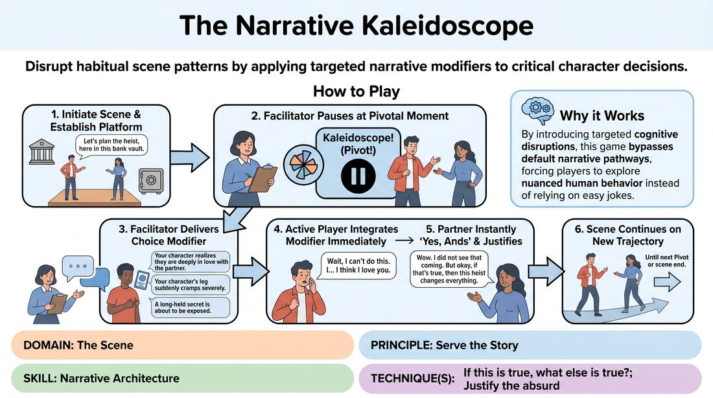

# The Narrative Kaleidoscope

{ .game-hero }

> Disrupt habitual scene patterns by applying targeted narrative modifiers to critical character decisions.

## Overview
An active scene-building game where players pivot their choices at critical junctures using specific narrative modifiers. Instead of replacing a line randomly, players receive a prompt that shifts their character's internal state, emotional stakes, or relationship history. This real-time intervention breaks predictable patterns and expands the story's architecture.

## What It Trains
- **Domain:** D3 — The Scene
- **Principle(s):** Serve the Story; Yes, And
- **Skill(s):** Narrative Architecture; Stakes / The 'Want'; Justification; Offer Reception
- **Technique(s):** If this is true, what else is true?; Justify the absurd
- **Focus:** narrative

**Objective:** To develop advanced narrative architecture and choice-making skills. Players learn to serve the story by consciously breaking habitual performance patterns, deepening character stakes, and practicing immediate justification of unexpected narrative offers.

## Setup
Designed for a virtual platform. The facilitator prepares a digital list of Choice Modifiers. Sample Modifiers include: 'Reveal a hidden vulnerability', 'Raise the stakes by making a confession', 'Shift to a high-status physical posture', 'Express a secret admiration for your partner', or 'Introduce an urgent, unspoken deadline'. Two players turn their cameras on to perform the scene, while the remaining participants keep cameras off as active observers.

## How to Play
1. Initiate a standard two-player scene based on a simple relationship suggestion, establishing a clear platform of who, where, and what.
2. The facilitator acts as the Narrative Director, monitoring the scene for critical decision points or moments where a player is about to make a predictable, habitual choice.
3. When a pivotal moment occurs, the facilitator calls out 'Pivot!' or 'Kaleidoscope!' to pause the action.
4. The facilitator immediately delivers a Choice Modifier to the active player whose turn it is to speak or act by sending it in the chat, displaying a digital card, or reading it aloud.
5. The active player must immediately integrate the spirit of this modifier into their very next line of dialogue or physical action, without breaking character or explaining the prompt.
6. The scene partner must instantly accept and 'Yes, And' this new development, justifying the shift and treating it as absolute truth within the reality of the scene.
7. The scene continues naturally from this new trajectory until the facilitator calls another pivot or brings the scene to a close.

## Facilitation Notes
- Pacing and Frequency: Limit pivots to 1 or 2 per scene. Calling pivots too frequently (e.g., every 30 seconds) disrupts the narrative flow and prevents players from fully exploring and justifying the previous shift. Allow at least 60-90 seconds of organic play between pivots.
- Avoid literalism: Coach players to integrate the spirit of the modifier rather than speaking the prompt word-for-word. For example, if the prompt is 'reveal a vulnerability,' they shouldn't say 'I am now going to reveal a vulnerability,' but instead share a quiet, honest fear.
- Pitfall: Players freezing up trying to find the 'perfect' choice. Fix: Side-coach them to take a breath, make the first physical or emotional shift that comes to mind, and trust their partner to help justify it.
- Ensure the non-prompted player doesn't ignore the shift. If Player A suddenly becomes vulnerable, Player B must immediately adjust their status and emotional temperature to match.

## Variations
- Self-Selected Modifiers: Players can self-call a pivot when they feel themselves falling into safe, repetitive choices, drawing their own modifier from a digital deck.
- Audience-Driven Modifiers: The virtual audience uses the chat to suggest modifiers in real-time, and the facilitator selects one to throw into the scene.
- Silent Modifiers: The facilitator private-messages the modifier to one player, forcing the other player to discover the shift purely through organic play and offer reception.

## Debrief
- How did receiving a specific modifier change your physical or emotional presence in the virtual space?
- What did it feel like to justify a sudden, unexpected shift made by your scene partner?
- How did these constraints help us avoid common narrative tropes and clichés?
- In what ways did the modifiers help us 'serve the story' rather than just our individual comedic instincts?

## Safety & Inclusion
Because modifiers can ask for vulnerability or emotional escalation, establish a safety tap-out or skip option. If a player receives a modifier that touches on a personal boundary, they can simply say 'Next' or use a designated virtual reaction (like a thumbs-down or hand-raise) to receive a different prompt with no explanation needed. Ensure modifiers avoid sensitive personal trauma unless explicitly agreed upon beforehand.

## Why It Works
By introducing targeted cognitive disruptions, this game bypasses the brain's default narrative pathways. Instead of relying on easy jokes or repetitive conflict, the structured modifiers force players to explore nuanced human behavior. This builds robust narrative architecture by demonstrating how small, high-stakes choices can organically transform a scene's direction.
