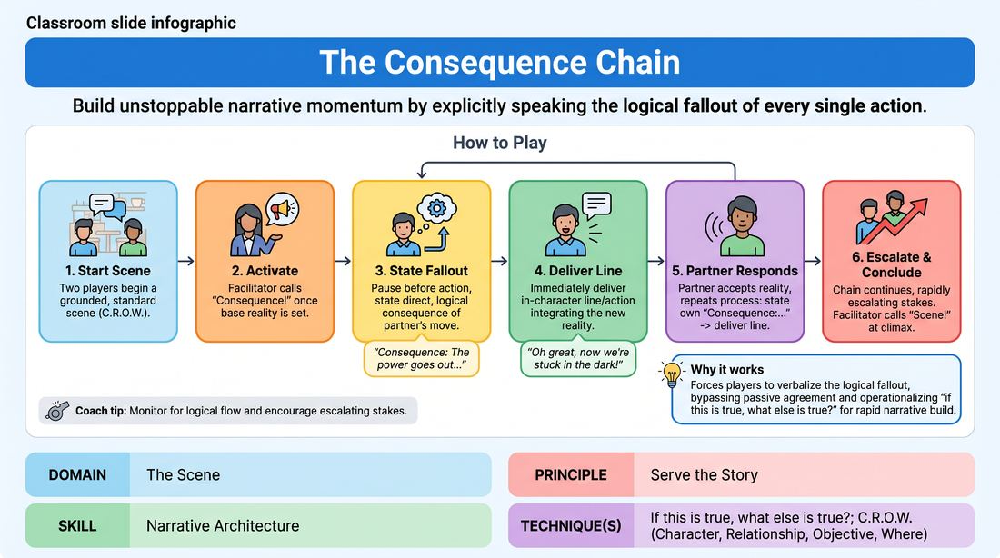

# The Consequence Chain

{ .game-hero }

> Build unstoppable narrative momentum by explicitly speaking the logical fallout of every single action.

## Overview
A dynamic narrative-building exercise where players must explicitly declare the direct, logical fallout of their partner's actions before speaking in character. By forcing the internal 'if this is true, what else is true?' calculation into spoken dialogue, the game strips away narrative stagnation and rapidly escalates stakes. The result is a highly connected, cause-and-effect driven scene that moves with clear, justified momentum.

## What It Trains
- **Domain:** D3 — The Scene
- **Principle(s):** Serve the Story; Yes, And; Base Reality First
- **Skill(s):** Narrative Architecture; Game Identification; World-Building; Justification; Raising the Stakes; Active Listening
- **Technique(s):** If this is true, what else is true?; C.R.O.W. (Character, Relationship, Objective, Where); Stakes-escalation reps
- **Focus:** narrative

**Objective:** To develop a deep, active mastery of narrative architecture and cause-and-effect progression, training players to instinctively heighten stakes and justify every new offer by exploring its immediate and long-term ramifications.

## At a Glance
| Aspect | Detail |
|---|---|
| Players | 2+ (ideal 6-12) |
| Time | ~10 min |
| Complexity | 3/5 |
| Skill level | competent |
| Energy | medium |
| Physicality | low |
| Modality | in_person |
| Space | minimal |
| Props | none |
| Audience | not required |

## Setup
An open performance space. The group stands in a circle or semi-circle to observe, with two players stepping into the center. No props or special materials are required. The facilitator secures a simple, grounded suggestion of a relationship and a location to begin.

## How to Play
1. Two players step forward and begin a standard, grounded scene based on the suggestion, focusing on establishing their characters, relationship, and environment for about one minute.
2. Once a stable base reality is established, the facilitator calls out 'Consequence!' to activate the core mechanic.
3. From this point forward, before delivering any line of dialogue or physical action, the active player must pause and state a direct, logical consequence of the previous player's offer, starting with the phrase 'Consequence:...'
4. The stated consequence must be a direct, logical extension of the previous line—answering the question 'If that is true, what must happen next?'—and should ideally raise the stakes or complicate a character's objective.
5. Immediately after stating the consequence, the player must deliver their in-character line or action, fully integrating and reacting to that newly established reality.
6. The other player must then listen actively, accept this new reality, and repeat the process: state their own 'Consequence:...' based on the partner's line, and then deliver their next in-character response.
7. The chain continues back and forth, with each turn consisting of the explicit consequence declaration followed by the in-character execution.
8. The facilitator monitors the logical flow, stepping in to gently redirect if a consequence is too trivial, disconnected, or fails to advance the narrative.
9. The scene runs for approximately three to five minutes, building to a natural, high-stakes climax before the facilitator calls 'Scene!' to conclude.

## Facilitation Notes
- Coaching Cue: 'Focus on emotional and relational fallout, not just physical disasters. How does their action change how you feel or what you want?'
- Pitfall & Fix: Players may treat the 'Consequence' statement as a detached, meta-commentary joke. Fix: Remind them that the consequence is absolute truth in the scene's reality; they must immediately feel the weight of it in their subsequent in-character line.
- Coaching Cue: 'Avoid trivial consequences like "Consequence: now we are five seconds older." Push for consequences that make the character's life harder or their goal more urgent.'
- Pitfall & Fix: High cognitive load causing long, awkward pauses. Fix: Encourage players to breathe and trust their first logical instinct. It is better to have a simple, direct consequence than a convoluted, over-intellectualized plot twist.
- Coaching Cue: 'Keep the base reality strong. If the first minute of setup is weak, pause the scene, clarify the relationship, and then call "Consequence!"'

## Variations
- Targeted Consequences: The facilitator can call out specific types of consequences to vary the focus, such as 'Emotional Consequence!', 'Status Consequence!', or 'Environmental Consequence!' to stretch different narrative muscles.
- The Ripple Effect: Instead of only reacting to the immediate last line, players can occasionally declare a consequence of an event that happened much earlier in the scene, pulling thread-lines together.
- Silent Consequences: An advanced version where players do not speak the 'Consequence:...' line aloud, but must pause, visibly register the internal calculation, and immediately play the physical and verbal consequence in-character.

## Debrief
- How did explicitly stating the consequence change how quickly the stakes of the scene escalated?
- Did you find it difficult to transition from the analytical 'Consequence' statement back into your character's emotional reality? How did you bridge that gap?
- How does this exercise change the way you think about 'if true, what else is true' during a standard, unconstrained scene?
- What made a consequence feel satisfying and narrative-driving versus trivial or stalling?

## Safety & Inclusion
This game requires players to rapidly escalate stakes, which can sometimes lead to high-pressure or high-conflict scenarios. Remind players that escalating stakes does not require physical violence or crossing personal boundaries. Players always retain agency over their physical space and can choose emotional or situational complications over physical threats.

## Why It Works
By forcing players to verbalize the logical fallout of every action, the game bypasses the passive 'yes-and' where players merely agree without building. It operationalizes the 'if true, what else is true' principle, transforming it from an abstract concept into a concrete narrative engine. This ensures that every line of dialogue is a direct, justified reaction to the last, creating an airtight, compelling story arc.
