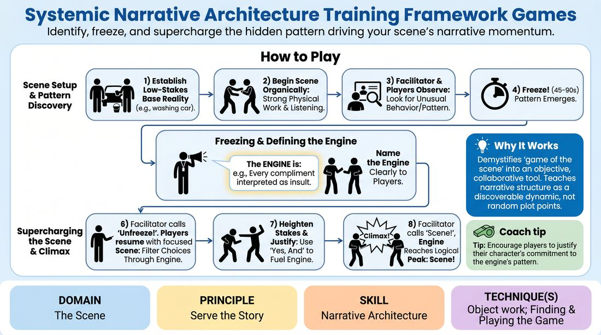

# Engine Lock-In

{ .game-hero }

> Identify, freeze, and supercharge the hidden pattern driving your scene's narrative momentum.

## Overview
A structured training game where players initiate a scene organically until a central comedic or dramatic pattern emerges. The facilitator pauses the action to explicitly define this 'engine,' prompting the players to resume with a hyper-focused commitment to heightening and justifying that specific dynamic. It transforms passive scene-building into active, intentional narrative architecture.

## What It Trains
- **Domain:** D3 — The Scene
- **Principle(s):** Show, Don't Tell; Base Reality First; Serve the Story; Yes, And
- **Skill(s):** Game Identification; Heightening & Exploration; Narrative Architecture; World-Building; Raising the Stakes; Physicality & Space Work; Active Listening
- **Technique(s):** Object work; Finding & Playing the Game; If this is true, what else is true?; Story Spine; C.R.O.W. (Character, Relationship, Objective, Where); Stakes-escalation reps
- **Focus:** narrative

**Objective:** To develop the ability to recognize emergent patterns (the 'game of the scene') and consciously escalate them to serve the story's progression.

## Setup
Conducted in a virtual meeting space. Two active players have their cameras on, while the remaining participants keep their cameras off to act as the active audience. No physical props are required, but players should have a clear, well-lit frame for physical and facial expression.

## How to Play
1. Invite two players to turn on their cameras and establish a simple, low-stakes relationship and setting based on a basic suggestion (e.g., 'washing a car' or 'waiting for a bus').
2. Instruct the players to begin the scene organically, focusing on establishing a solid base reality with clear physical work and active listening.
3. The facilitator and off-camera players observe the scene closely, looking for any unusual behavior, recurring choices, or emotional overreactions that could serve as a narrative engine.
4. Between 45 to 90 seconds into the scene, once a clear pattern or 'unusual thing' begins to surface, the facilitator calls out 'Freeze!'
5. The facilitator explicitly names the identified engine to the players (e.g., 'The engine is: every time Player A tries to pay a compliment, Player B interprets it as a passive-aggressive insult').
6. The facilitator calls 'Unfreeze!' and the players immediately resume the scene, consciously filtering all subsequent choices through this locked-in engine.
7. Players must use 'Yes, And' to accept the engine, heightening the stakes with each exchange while finding logical justifications for why their characters continue this behavior.
8. The scene continues to escalate along this trajectory until the engine reaches its logical peak or climax, at which point the facilitator calls 'Scene!'

## Facilitation Notes
- If no clear engine emerges within the first 90 seconds, the facilitator should freeze the scene and offer a gentle prompt to help players discover one, rather than letting the scene drift.
- Ensure the identified engine is based on what the players actually did, rather than inventing a completely new concept that forces them to abandon their established base reality.
- Side-coach players to 'justify' their behavior. If a character is acting bizarrely, they must believe their actions are completely logical within their own worldview.
- Watch out for 'looping' where players repeat the exact same beat without heightening. Prompt them with 'Make it bigger!' or 'What is the next level of this?'

## Variations
- Audience Lock-In: Instead of the facilitator pausing the scene, an off-camera player uses the chat or audio to call 'Freeze!' and identify the engine, then turns their camera off again.
- Silent Engine: Players attempt to identify and lock in the engine entirely on their own without a facilitator freeze, signaling their alignment through heightened physical and verbal agreement.
- Engine Swap: Mid-way through the scene, after the first engine has been heightened, the facilitator freezes the scene again and introduces a secondary, complicating engine that must run parallel to the first.

## Debrief
- How did having the engine explicitly named change your focus and decision-making in the scene?
- What is the difference between simply repeating a funny pattern and actually heightening it to move the story forward?
- How did justifying your character's unusual behavior help keep the scene grounded instead of turning into pure absurdity?
- For the observers, at what exact moment did you feel the engine first started to reveal itself?

## Safety & Inclusion
In virtual spaces, physical boundaries are self-managed, but players should remain mindful of their physical safety when performing physical actions on camera. Ensure players have a clear space free of tripping hazards.

## Why It Works
By pausing the scene to name the engine, the game demystifies the 'game of the scene' concept, turning an intuitive skill into an objective, collaborative tool. It teaches players that narrative structure isn't about inventing random plot points, but about discovering, committing to, and escalating the organic patterns that already exist within their interactions.
