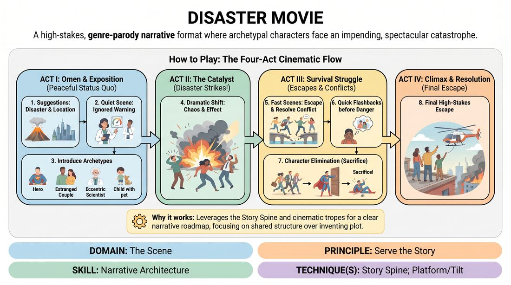

# Disaster Movie

{ .game-hero }

> A high-stakes, genre-parody narrative format where archetypal characters face an impending, spectacular catastrophe.

## Overview
Disaster Movie is a high-energy, long-form narrative format where an ensemble builds a cinematic story around a sudden, catastrophic event. The performance moves from peaceful exposition and character introductions, through the chaotic onset of the disaster, to a desperate survival struggle where archetypes are dramatically sacrificed until only a few survivors remain. It is a thrilling, highly physical experience that relies on strong genre tropes and tight technical integration.

## What It Trains
- **Domain:** D3 — The Scene
- **Principle(s):** Serve the Story; Serve the Piece; The Audience Is the Final Scene Partner
- **Skill(s):** Narrative Architecture; World-Building; Raising the Stakes; Format Literacy; Pacing & Rhythm
- **Technique(s):** Story Spine; Platform/Tilt; C.R.O.W. (Character, Relationship, Objective, Where); Longform vs. shortform mechanics; Edits (Sweep, Tag-Out, Sound/Light)
- **Focus:** narrative

**Objective:** To master narrative pacing, genre tropes, and collaborative story architecture using a structured, multi-act narrative engine.

## At a Glance
| Aspect | Detail |
|---|---|
| Players | 6+ (ideal 8-15) |
| Time | ~30 min |
| Complexity | 4/5 |
| Skill level | competent |
| Energy | high |
| Physicality | medium |
| Modality | in_person |
| Space | large_open |
| Props | lighting effects, sound effects, smoke machine |
| Audience | required |

## Setup
A large, open stage area with access to technical controls (lighting, sound effects, and a smoke machine if available). An audience is seated to provide suggestions and act as the final scene partner. Players assemble offstage or in a back line, ready to edit and enter scenes rapidly.

## How to Play
1. Obtain two suggestions from the audience: a specific type of disaster (e.g., volcanic eruption, alien invasion, giant mutant hamsters) and a highly populated location (e.g., a luxury cruise ship, a high-tech research lab, a shopping mall).
2. Begin Act I (The Omen & Exposition) with a quiet scene establishing the status quo, featuring a character who notices a subtle, ignored warning sign of the impending doom.
3. Introduce a series of quick, distinct scenes establishing classic cinematic archetypes, such as the estranged couple, the disgraced hero, the eccentric scientist, and the authority figure who refuses to believe the danger.
4. Trigger Act II (The Catalyst) where the disaster strikes. Use dramatic physical theater, sudden lighting shifts, loud sound effects, and smoke to instantly alter the environment and force all characters into immediate crisis.
5. Transition to Act III (The Survival Struggle), playing out short, fast-paced scenes where characters attempt to escape, band together, or resolve personal conflicts amidst the chaos.
6. Incorporate quick flashbacks to deepen character stakes and emotional relationships right before those characters face extreme danger.
7. Systematically eliminate characters in dramatic, spectacular, or comedic ways, ensuring that each heroic sacrifice raises the stakes and clears the path for the designated survivors.
8. Conclude with Act IV (The Climax & Resolution), bringing the final survivors (typically the hero, a love interest, and a child or pet) to a high-stakes escape point where they emerge into safety as the lights fade.

## Facilitation Notes
- Tech Integration: Coordinate closely with the tech booth. Encourage the tech improviser to use sudden lighting changes, rumbling sound effects, and smoke to heighten the physical reality of the disaster.
- Pacing the Deaths: Remind players not to die too early. The first half of the survival struggle needs tension; if everyone dies in the first five minutes, the narrative engine stalls.
- Archetype Clarity: Encourage bold, instantly recognizable physical and vocal choices for characters so the audience can easily track who is who amidst the chaos.
- The Yes-And of Danger: If a player establishes a hazard (e.g., 'The bridge is collapsing!'), all other players must immediately treat it as an absolute physical reality.

## Variations
- Director's Cut: A designated 'Director' sits in the audience and can pause the action to call for flashbacks, slow-motion sequences, or inner monologues.
- Silent Disaster: Play the entire disaster sequence (Act II) completely silently or set only to music, relying entirely on physical theater and object work.
- B-Movie Budget: Intentionally play with low-budget tropes, where players must vocally mimic cheap sound effects and physically represent terrible special effects.

## Debrief
- How did honoring the classic genre archetypes help us make quick, cohesive narrative choices?
- What did we do to successfully build tension before the disaster actually struck?
- How did the pacing shift once the disaster occurred, and how did we manage that transition as an ensemble?

## Safety & Inclusion
Since this game involves high physical energy, simulated peril, and physical contact during 'rescues' or 'sacrifices,' establish clear boundaries beforehand. Use non-contact physical theater for deaths and falls, and ensure players consent to any physical lifting or carrying before the show begins.

## Why It Works
It leverages the highly recognizable structure of the Story Spine and cinematic tropes, giving players a clear roadmap. By using a shared narrative engine, players don't have to invent a plot from scratch; they simply fill the established structural beats with high-energy character work and physical commitment.
