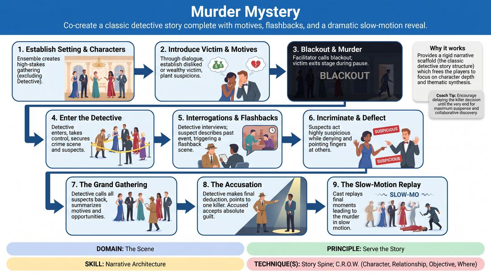

# Chamber Murder Mystery

{ .game-hero }

> Co-create a classic detective story complete with motives, flashbacks, and a dramatic slow-motion reveal.

## Overview
A structured narrative format where players establish a high-stakes social gathering, execute a sudden off-stage murder, and navigate a tense investigation. Through a series of interrogations, flashbacks, and a final grand accusation, the ensemble builds a cohesive, satisfying mystery arc.

## What It Trains
- **Domain:** D3 — The Scene
- **Principle(s):** Serve the Story; Group Mind; The Audience Is the Final Scene Partner
- **Skill(s):** Narrative Architecture; World-Building; Thematic Synthesis; Format Literacy
- **Technique(s):** Story Spine; C.R.O.W. (Character, Relationship, Objective, Where); Callbacks & Mapping; Longform vs. shortform mechanics
- **Focus:** narrative

**Objective:** Develops narrative architecture, thematic synthesis, and format literacy by structuring a multi-part story with clear exposition, rising action, and a logical climax.

## Setup
An open performance space with chairs arranged to suggest a parlor, mansion, or isolated venue. One player is designated as the Detective (and optionally one as a Sidekick), while the remaining players form the ensemble of suspects.

## How to Play
1. Establish the Setting and Characters: The ensemble (excluding the Detective) begins on stage, establishing a high-society gathering, family reunion, or professional retreat. Each player introduces a distinct character with clear relationships and potential secrets.
2. Introduce the Victim and Motives: Through natural dialogue, the players establish who among them is the most disliked, wealthy, or vulnerable, setting them up as the inevitable victim. Every other character drops subtle hints of resentment or motive.
3. The Blackout and Murder: The facilitator calls a sudden 'blackout' (or players close their eyes). During this brief pause, the designated victim quietly exits the stage or lies down 'dead'. The lights return, and the remaining characters discover the body, reacting with dramatic shock.
4. Enter the Detective: The Detective enters the scene, establishes their investigative persona, and takes control of the crime scene, securing the suspects in a common area.
5. The Interrogations and Flashbacks: The Detective interviews suspects individually or in small groups. During these interviews, when a suspect describes a past event or alibi, other players step forward to play out that scene as a brief, live flashback, validating or complicating the suspect's testimony.
6. Incriminate and Deflect: Every suspect must present themselves as highly suspicious while vehemently denying the crime, actively pointing fingers at others to weave a web of conflicting motives.
7. The Grand Gathering: The Detective calls all surviving suspects back to the main space. The Detective paces the room, summarizing each suspect's motive and opportunity, building tension.
8. The Accusation: The Detective makes their final deduction, pointing to one specific character as the killer. The accused player must accept this choice as absolute truth.
9. The Slow-Motion Replay: The scene transitions to a final flashback. The cast replays the moments leading up to the murder, culminating in the killer executing the deed in dramatic slow-motion, revealing exactly how and why it happened.

## Facilitation Notes
- Side-coach the Detective to ask open-ended questions that invite flashbacks rather than simple yes/no answers.
- Pitfall: The suspects resolve the mystery too early. Fix: Remind players that no one (including the killer) should know who the actual murderer is until the Detective makes the final accusation.
- Encourage players to jump in instantly for flashbacks. The moment a past event is mentioned, the stage should transform to show, not just tell.
- Ensure the victim remains active in the game by allowing them to play different characters in the flashback sequences.

## Variations
- The Ghost's Perspective: The victim remains on stage as a silent ghost, visible only to the audience, offering physical commentary or guiding the Detective with subtle clues.
- Unreliable Narrator: Flashbacks do not represent objective truth but rather the biased, exaggerated perspective of the suspect currently being interviewed.

## Debrief
- How did we manage the pacing to ensure the final accusation felt earned rather than random?
- What techniques did we use to build a cohesive web of motives without contradicting each other's offers?
- How did the flashbacks help ground the narrative and flesh out the world-building?

## Safety & Inclusion
Since this game deals with murder and accusation, establish boundaries during setup regarding the methods of violence. Keep physical contact minimal or entirely mimed, and ensure players are comfortable with themes of betrayal and interrogation.

## Why It Works
This format works because it provides a rigid narrative scaffold (the classic detective story structure) which frees the players to focus on character depth and thematic synthesis. By delaying the decision of who the killer is until the very end, it forces the entire cast to listen deeply and build a shared reality where any outcome could be satisfyingly justified.
