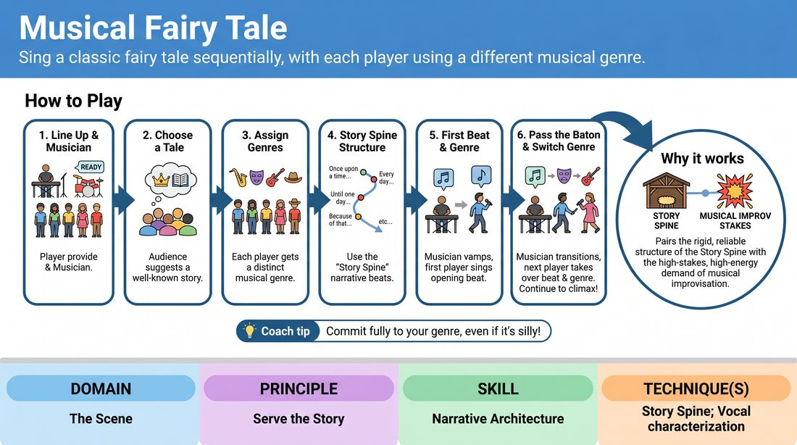

# Musical Story Spine

{ .game-hero }

> Sing a classic fairy tale sequentially, with each player using a different musical genre.

## Overview
A collaborative musical storytelling game where players reconstruct a well-known fairy tale or myth. Each performer is assigned a distinct musical genre and must sing their segment of the narrative, passing the story baton to the next player. Together, the cast uses structured narrative beats to sing a cohesive, high-energy story from beginning to end.

## What It Trains
- **Domain:** D3 — The Scene
- **Principle(s):** Serve the Story; Commit 100%; Make Your Partner a Genius; Group Mind; The Audience Is the Final Scene Partner
- **Skill(s):** Narrative Architecture; Vocal Craft; Active Listening; Pacing & Rhythm; Stage Presence & Clarity
- **Technique(s):** Story Spine; Vocal characterization; Last Word Response; Timing exercises; Projection
- **Focus:** mixed

**Objective:** To develop narrative architecture and vocal craft by using the Story Spine framework to advance a plot collaboratively while adapting to diverse musical genres and rhythms.

## Setup
An in-person performance space with a stage area and seating for an audience. A live musician (keyboardist, guitarist, or multi-instrumentalist) is positioned to accompany the players. 6 to 8 proficient players stand in a line facing the audience.

## How to Play
1. Position the 6 to 8 players in a line on stage, with the live musician ready at their instrument.
2. Ask the audience for a well-known fairy tale, folk tale, or myth to serve as the narrative foundation.
3. Ask the audience for a distinct musical genre or style for each player in the line and assign them sequentially.
4. Explain that the group will tell the chosen story from beginning to end using the Story Spine structure.
5. The musician begins playing an introductory vamp in the first player's assigned genre, and the first player steps forward to sing the opening of the story, establishing the platform.
6. Once the first player completes their narrative beat, they step back, and the musician immediately transitions the tempo and style to match the second player's genre.
7. The second player steps forward and sings the next narrative beat, building on the established world while fully committing to their musical style.
8. Play continues down the line, with each player stepping forward to sing their assigned narrative beat in their designated genre, actively listening to ensure the plot flows logically.
9. The final player sings the resolution, bringing the musical story to a satisfying, high-energy climax.

## Facilitation Notes
- Coaching Cue: 'Serve the story first, the genre second!' Remind players that a brilliant genre parody is useless if it derails the narrative progression.
- Pitfall: Players getting stuck in repetitive rhyming structures that stall the plot. Fix: Side-coach them to prioritize narrative information over perfect rhymes; a spoken-sung or free-verse delivery is completely acceptable.
- Musician Collaboration: Ensure the musician plays clear, supportive chord progressions and distinct rhythmic shifts to help the players find their vocal footing instantly.
- Active Listening: Encourage off-stage or waiting players to physically react and support the current singer, building a cohesive group mind even when not singing.

## Variations
- The Blind Genre Swap: Instead of pre-assigning genres, the musician changes the musical style mid-song, forcing the active singer to adapt their genre on the fly.
- Original Myth: Instead of a known fairy tale, get a non-traditional suggestion and build an entirely original myth using the same musical structure.
- Duet Intersections: Allow players to step forward and sing duets or harmonies during pivotal narrative moments before returning to solo verses.

## Debrief
- How did the constraints of the musical genres help or hinder your ability to advance the story?
- What did you do to ensure the transition between different musical styles felt like a single, continuous narrative?
- How did using the Story Spine framework keep the plot on track despite the high-energy musical distractions?

## Safety & Inclusion
Ensure the physical space allows all players to step forward and backward safely. For players with hearing or rhythmic processing differences, the musician can provide highly simplified, steady rhythmic pulses, or players can opt to perform rhythmic spoken-word poetry instead of melodic singing.

## Why It Works
This game works because it pairs the rigid, reliable structure of the Story Spine with the high-stakes, high-energy demand of musical improvisation. By offloading the narrative structure to a pre-set formula, players can free up cognitive bandwidth to focus on vocal commitment, active listening, and genre adaptation, resulting in a highly polished and satisfying performance.
